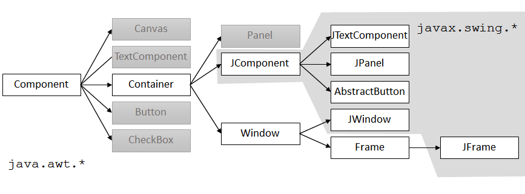

<style>
@font-face {
  font-family: 'TheRumIsGone';
  src: url('TheRumIsGone.ttf') format('truetype');
  font-weight: normal;
  font-style: normal;
}

body 
{
  counter-reset: h1;
}

h1 {
  counter-reset: h2;
  font-family: 'TheRumIsGone', serif;
  text-shadow: 2px 2px 4px #ccc;
}

h2 
{
  counter-reset: h3;
  border-bottom: 2px solid #ffa500;
}

h3 {
  counter-reset: h4;
}

h4 {
  font-size: 1.2rem;
}

h1::before {
  counter-increment: h1;
  content: counter(h1) ". ";
}
h2::before {
  counter-increment: h2;
  content: counter(h1) "." counter(h2) " ";
}
h3::before {
  counter-increment: h3;
  content: counter(h1) "." counter(h2) "." counter(h3) " ";
}
h4::before {
    counter-increment: h4;
    content: counter(h1) "." counter(h2) "." counter(h3) "." counter(h4) " ";
}
.back-home-btn {
  position: fixed;
  bottom: 1rem;
  right: 1rem;             /* or left:1rem; if you prefer */
  background-color: #c0392b; 
  color: #ffffff;
  padding: 0.5rem 0.75rem;
  font-family: Arial, sans-serif;
  font-size: 0.9rem;
  text-decoration: none;
  border-radius: 0.5rem;
  box-shadow: 0 2px 6px rgba(0,0,0,0.3);
  transition: background-color 0.2s ease, transform 0.2s ease;
  z-index: 9999;
}
.back-home-btn:hover {
  background-color: #922b21;
  transform: translateY(-2px);
}


</style>


# Table of Contents

- [Table of Contents](#table-of-contents)
- [🎨 Gestaltung von grafischen Benutzerinterfaces](#-gestaltung-von-grafischen-benutzerinterfaces)
  - [🪟 WPF Anwendungen](#-wpf-anwendungen)
    - [🧱 WPF Basics](#-wpf-basics)
      - [📦 Key Components](#-key-components)
        - [1. XAML (eXtensible Application Markup Language)](#1-xaml-extensible-application-markup-language)
        - [2. Code-Behind](#2-code-behind)
      - [🧠 Key Concepts](#-key-concepts)
        - [🎯 Data Binding](#-data-binding)
        - [📦 MVVM Pattern](#-mvvm-pattern)
        - [🎨 Styling and Templates](#-styling-and-templates)
      - [⚙️ Dependency Properties](#️-dependency-properties)
    - [🌊 Animations \& Media](#-animations--media)
      - [🛠️ Common Controls](#️-common-controls)
      - [🚀 Getting Started](#-getting-started)
    - [🎯 Event Handling](#-event-handling)
      - [🧭 Routing Strategies](#-routing-strategies)
      - [🧪 Example: Tunneling vs Bubbling](#-example-tunneling-vs-bubbling)
      - [📣 Raising Custom Routed Events](#-raising-custom-routed-events)
      - [🛑 Event Handling Options](#-event-handling-options)
        - [1. `e.Handled = true`](#1-ehandled--true)
        - [2. `AddHandler` with `handledEventsToo`](#2-addhandler-with-handledeventstoo)
      - [🧪 RoutedCommand \& InputGesture](#-routedcommand--inputgesture)
      - [🔧 Advanced Scenario: Routed Event for a Custom Control](#-advanced-scenario-routed-event-for-a-custom-control)
      - [🧰 Routed Events vs .NET Events](#-routed-events-vs-net-events)
      - [📍 When to Use What](#-when-to-use-what)
    - [✍️ XAML](#️-xaml)
      - [🛠️ Basic XAML Structure](#️-basic-xaml-structure)
    - [📦 WPF Container](#-wpf-container)
    - [🧩 WPF Controls](#-wpf-controls)
  - [☕ Java UI](#-java-ui)
    - [🖼️ Java Swing](#️-java-swing)
      - [Key Points:](#key-points)
      - [Basic Structure:](#basic-structure)
      - [Layout Managers (crucial for UI layout):](#layout-managers-crucial-for-ui-layout)
      - [Programming Basics - A Window to the World!](#programming-basics---a-window-to-the-world)
      - [Events](#events)
    - [🌟 JavaFX](#-javafx)
      - [Key Points:](#key-points-1)
      - [Basic Structure:](#basic-structure-1)
      - [Important JavaFX Concepts:](#important-javafx-concepts)
    - [Summary Table](#summary-table)


# 🎨 Gestaltung von grafischen Benutzerinterfaces

## 🪟 WPF Anwendungen

Windows Presentation Foundation (WPF) is a free and open-source user interface framework for Windows-based desktop applications. WPF applications are based in .NET, and are primarily developed using C# and XAML.

Originally developed by Microsoft, WPF was initially released as part of .NET Framework 3.0 in 2006. In 2018, Microsoft released WPF as open source under the MIT License. WPF's design and its layout language XAML have been adopted by multiple other UI frameworks, such as UWP, .NET MAUI, and Avalonia. 

---

### 🧱 WPF Basics

For MVVM see [MMVM WPF Chapter](#mvvm)


#### 📦 Key Components

##### 1. XAML (eXtensible Application Markup Language)
Used to define the UI declaratively.

```xml
<Window x:Class="MyApp.MainWindow"
        xmlns="http://schemas.microsoft.com/winfx/2006/xaml/presentation"
        Title="Hello WPF" Height="300" Width="400">
    <Grid>
        <Button Content="Click Me" Width="100" Height="30" Click="Button_Click"/>
    </Grid>
</Window>
```

##### 2. Code-Behind
C# code that runs logic behind the UI.

```csharp
private void Button_Click(object sender, RoutedEventArgs e)
{
    MessageBox.Show("Ahoy, Captain!");
}
```

---

#### 🧠 Key Concepts

##### 🎯 Data Binding

Linking UI elements to data sources (like objects or collections).

```xml
<TextBox Text="{Binding UserName}" />
```

##### 📦 MVVM Pattern

Model-View-ViewModel is the standard design pattern in WPF.

- **Model**: Business logic/data
- **View**: XAML UI
- **ViewModel**: Middle layer for binding and commands

---

##### 🎨 Styling and Templates

WPF supports custom styling using `<Style>` and templates for full control over UI appearance.

```xml
<Style TargetType="Button">
    <Setter Property="Background" Value="DarkSlateBlue"/>
    <Setter Property="Foreground" Value="White"/>
</Style>
```

---

#### ⚙️ Dependency Properties

Used for advanced features like animation, styling, and binding.

```csharp
public static readonly DependencyProperty MyProperty =
    DependencyProperty.Register("My", typeof(string), typeof(MyClass));
```

---

### 🌊 Animations & Media

WPF supports powerful animation tools.

```xml
<Button Name="MyButton" Content="Animate Me">
    <Button.Triggers>
        <EventTrigger RoutedEvent="Button.Click">
            <BeginStoryboard>
                <Storyboard>
                    <DoubleAnimation Storyboard.TargetProperty="Width" To="300" Duration="0:0:1"/>
                </Storyboard>
            </BeginStoryboard>
        </EventTrigger>
    </Button.Triggers>
</Button>
```

---

#### 🛠️ Common Controls

| Control      | Purpose                   |
|--------------|---------------------------|
| `TextBox`    | User text input           |
| `Button`     | Clickable action          |
| `ListView`   | Display a list of items   |
| `ComboBox`   | Dropdown selection        |
| `Grid`       | Layout control            |

---

#### 🚀 Getting Started

To build a WPF app:

1. Use Visual Studio
2. Create a **WPF App (.NET)** project
3. Design UI in XAML
4. Add logic in C#


### 🎯 Event Handling

Unlike traditional .NET event models, WPF introduces **Routed Events**, which traverse the visual tree using *Routing Strategies*.

*(A routed event is a type of event that can invoke handlers on multiple listeners in an element tree rather than just the object that raised the event. It is basically a CLR event that is supported by an instance of the Routed Event class. It is registered with the WPF event system. RoutedEvents have three main routing strategies which are as follows)*

#### 🧭 Routing Strategies

1. **Direct**  
   - Like traditional .NET events. Only the source element raises and handles it.

2. **Bubbling**  
   - Event starts from the source and **bubbles up** through parent elements. (To topmost, usually a window)

3. **Tunneling**  
   - Event starts at the root and **tunnels down** to the source.
     - event travels down the visual tree to all the children nodes until it reaches the element in which the event originated.
   - Prefixed with `Preview` (e.g., `PreviewMouseDown`)

In a WPF application, events are often implemented as a tunneling/bubbling pair. So, you'll have a preview `MouseDown` and then a `MouseDown` event.

---

#### 🧪 Example: Tunneling vs Bubbling

```xml
<StackPanel PreviewMouseDown="OnPreviewMouseDown"
            MouseDown="OnMouseDown">
    <Button Content="Click Me"/>
</StackPanel>
```

```csharp
private void OnPreviewMouseDown(object sender, MouseButtonEventArgs e)
{
    Console.WriteLine("TUNNEL: StackPanel saw the click first.");
}

private void OnMouseDown(object sender, MouseButtonEventArgs e)
{
    Console.WriteLine("BUBBLE: StackPanel saw the click after the Button.");
}
```

🌀 **Flow**:  
1. `PreviewMouseDown` on StackPanel (tunnel)  
2. `PreviewMouseDown` on Button  
3. `MouseDown` on Button  
4. `MouseDown` on StackPanel (bubble)

---

#### 📣 Raising Custom Routed Events

You can create your own events that participate in routing.

```csharp
public static readonly RoutedEvent WarpInitiatedEvent = EventManager.RegisterRoutedEvent(
    "WarpInitiated", RoutingStrategy.Bubble, typeof(RoutedEventHandler), typeof(ShipControl));

public event RoutedEventHandler WarpInitiated
{
    add { AddHandler(WarpInitiatedEvent, value); }
    remove { RemoveHandler(WarpInitiatedEvent, value); }
}

void RaiseWarp()
{
    RoutedEventArgs args = new RoutedEventArgs(WarpInitiatedEvent);
    RaiseEvent(args);
}
```

```xml
<local:ShipControl WarpInitiated="OnWarp"/>
```

---

#### 🛑 Event Handling Options

##### 1. `e.Handled = true`
Stops the routed event from traveling further.

```csharp
private void Button_PreviewMouseDown(object sender, MouseButtonEventArgs e)
{
    e.Handled = true; // Stops bubbling!
}
```

##### 2. `AddHandler` with `handledEventsToo`
Listens even if the event was already handled.

```csharp
button.AddHandler(Button.MouseDownEvent, new MouseButtonEventHandler(OnMouseDown), true);
```

---

#### 🧪 RoutedCommand & InputGesture

Commanding system also uses routed events internally.

```xml
<Button Command="ApplicationCommands.Save" CommandTarget="{Binding ElementName=TextBox1}" />
```

```csharp
CommandBindings.Add(new CommandBinding(ApplicationCommands.Save, OnSaveExecuted));

private void OnSaveExecuted(object sender, ExecutedRoutedEventArgs e)
{
    // Save logic
}
```

You can also define your own:

```csharp
public static RoutedCommand FireCannons = new RoutedCommand();

<Window.InputBindings>
    <KeyBinding Key="F" Modifiers="Control" Command="{x:Static local:CustomCommands.FireCannons}" />
</Window.InputBindings>
```

---

#### 🔧 Advanced Scenario: Routed Event for a Custom Control

```csharp
public class HullButton : Button
{
    public static readonly RoutedEvent HullBreachEvent = EventManager.RegisterRoutedEvent(
        "HullBreach", RoutingStrategy.Bubble, typeof(RoutedEventHandler), typeof(HullButton));

    public event RoutedEventHandler HullBreach
    {
        add => AddHandler(HullBreachEvent, value);
        remove => RemoveHandler(HullBreachEvent, value);
    }

    protected override void OnClick()
    {
        RaiseEvent(new RoutedEventArgs(HullBreachEvent));
    }
}
```

```xml
<local:HullButton HullBreach="OnHullBreachAlert"/>
```

---

#### 🧰 Routed Events vs .NET Events

| Feature             | Routed Events              | .NET Events          |
|---------------------|----------------------------|----------------------|
| Traversal           | Yes (bubble/tunnel/direct) | No                   |
| Handled Control     | Yes (`e.Handled`)          | No                   |
| Visual Tree Aware   | Yes                        | No                   |
| Declarative in XAML | Yes                        | Partially            |

---

#### 📍 When to Use What

- **Use Routed Events** when the action involves UI interaction across nested controls.
- **Use .NET events** for backend or logic-level communication.
- **Tunneling** is great for intercepting or validation before the actual action (like blocking mouse input on children).


### ✍️ XAML

**XAML (eXtensible Application Markup Language)** is the declarative markup language used in WPF to define UI elements, layout, styles, and data bindings.

#### 🛠️ Basic XAML Structure

```xml
<Window x:Class="MyApp.MainWindow"
        xmlns="http://schemas.microsoft.com/winfx/2006/xaml/presentation"
        Title="Main Window" Height="350" Width="525">
    <Grid>
        <TextBlock Text="Ahoy, Captain!" FontSize="20"/>
    </Grid>
</Window>
```

- `xmlns`: Defines namespaces for WPF controls.
- `x:Class`: Links the XAML to a C# code-behind file.
- Elements are hierarchical — parent containers hold child elements.

---

### 📦 WPF Container

| Container     | Description                                      | Example |
|---------------|--------------------------------------------------|---------|
| **Grid**      | Most flexible; rows & columns layout             | ```xml<br><Grid><Grid.RowDefinitions><RowDefinition/><RowDefinition/></Grid.RowDefinitions><Button Grid.Row="1" Content="Click"/></Grid>``` |
| **StackPanel**| Stacks children vertically or horizontally       | ```xml<br><StackPanel Orientation="Vertical"><TextBlock Text="Hello"/><Button Content="Click"/></StackPanel>``` |
| **DockPanel** | Aligns elements to edges (Top, Bottom, etc.)     | ```xml<br><DockPanel><Button DockPanel.Dock="Top" Content="Top"/></DockPanel>``` |
| **WrapPanel** | Wraps items like text wrapping                   | ```xml<br><WrapPanel><Button Content="1"/><Button Content="2"/></WrapPanel>``` |
| **Canvas**    | Absolute positioning with X/Y                    | ```xml<br><Canvas><Button Canvas.Left="50" Canvas.Top="20" Content="Fly"/></Canvas>``` |
| **UniformGrid** | Evenly distributes cells in grid               | ```xml<br><UniformGrid Rows="2" Columns="2"><Button Content="A"/><Button Content="B"/></UniformGrid>``` |

---

### 🧩 WPF Controls

| Control       | Description                                 | Example |
|---------------|---------------------------------------------|---------|
| **TextBlock** | Displays text (non-editable)                | ```xml<br><TextBlock Text="Status: All green"/>``` |
| **TextBox**   | Editable text input                         | ```xml<br><TextBox Text="Input here" Width="200"/>``` |
| **Button**    | Clickable button                            | ```xml<br><Button Content="Fire Cannons" Click="OnFire"/>``` |
| **Label**     | Text label, often paired with input         | ```xml<br><Label Content="Username:"/>``` |
| **CheckBox**  | Toggle true/false                           | ```xml<br><CheckBox Content="Enable Shield Boost"/>``` |
| **RadioButton**| Mutually exclusive options in group       | ```xml<br><RadioButton GroupName="Mode" Content="Stealth"/>``` |
| **ComboBox**  | Dropdown list                               | ```xml<br><ComboBox><ComboBoxItem Content="Option 1"/></ComboBox>``` |
| **ListBox**   | List of selectable items                    | ```xml<br><ListBox><ListBoxItem Content="Item A"/></ListBox>``` |
| **Image**     | Displays an image                           | ```xml<br><Image Source="Assets/logo.png" Width="100"/>``` |
| **Slider**    | Numeric slider input                        | ```xml<br><Slider Minimum="0" Maximum="100" Value="50"/>``` |
| **ProgressBar**| Visual progress indicator                 | ```xml<br><ProgressBar Minimum="0" Maximum="100" Value="75"/>``` |
| **TabControl**| Tabs for multiple pages/views               | ```xml<br><TabControl><TabItem Header="Nav"><TextBlock Text="Abyss Scan"/></TabItem></TabControl>``` |

---

## ☕ Java UI
---

### 🖼️ Java Swing

**Java Swing** is the long-standing, mature GUI toolkit for Java, built on top of AWT (Abstract Window Toolkit). It’s widely used for desktop applications with a rich set of widgets.

#### Key Points:
- Part of **javax.swing** package.
- **Lightweight** components (pure Java, not OS native).
- Uses **MVC (Model-View-Controller)** pattern internally.
- Supports **pluggable look-and-feels** (Metal, Nimbus, Windows style, etc.).
- Event-driven programming model with listeners.
- Threading: GUI operations must run on the **Event Dispatch Thread (EDT)** to avoid freezes.

#### Basic Structure:

```java
import javax.swing.*;

public class SwingDemo {
    public static void main(String[] args) {
        SwingUtilities.invokeLater(() -> {
            JFrame frame = new JFrame("Swing Example");
            frame.setDefaultCloseOperation(JFrame.EXIT_ON_CLOSE);
            JButton button = new JButton("Press me");
            button.addActionListener(e -> System.out.println("Button pressed!"));
            frame.add(button);
            frame.setSize(300, 200);
            frame.setVisible(true);
        });
    }
}
```

#### Layout Managers (crucial for UI layout):
- `BorderLayout` — divides container into N, S, E, W, Center.
- `FlowLayout` — simple left-to-right flow.
- `GridLayout` — equal-sized grid cells.
- `BoxLayout` — vertical or horizontal stacking.
- `GroupLayout` — used in GUI builders, supports complex layouts.

#### Programming Basics - A Window to the World!

``` java
import javax.swing.JFrame;

public class HelloSwingFrame {
    public static void main(String[] args) {
        JFrame f = new JFrame("A Window to the World!");
        f.setDefaultCloseOperation(JFrame.EXIT_ON_CLOSE);
        f.setSize(300, 200);
        f.setVisible(true);
    }
}
```




#### Events

``` java
import java.awt.event.ActionEvent;
import java.awt.event.ActionListener;
import javax.swing.JButton;
import javax.swing.JFrame;

public class ExerciseActionListener implements ActionListener {
    @Override
    public void actionPerformed(ActionEvent arg0) {
        System.out.println("You clicked: " + arg0.getActionCommand());
    }

    public static void main(String[] args) {
        JFrame jf = new JFrame("The Window to the World!");
        jf.setDefaultCloseOperation(JFrame.EXIT_ON_CLOSE);
        JButton jb = new JButton("Click Me!");
        jf.add(jb);
        
        ExerciseActionListener eal = new ExerciseActionListener();
        jb.addActionListener(eal);
        
        jf.setSize(300, 200);
        jf.pack();
        jf.setVisible(true);
    }
}
```

---

### 🌟 JavaFX

**JavaFX** is the modern, feature-rich Java UI toolkit designed to replace Swing for rich client apps.

#### Key Points:
- Part of **javafx.\*** packages.
- Hardware-accelerated graphics via **Prism** engine.
- Uses **FXML**, an XML-based UI markup language similar to XAML.
- Supports **property bindings** and **observable collections** for reactive UIs.
- Scene graph-based architecture (tree of nodes representing UI elements).
- Built-in support for **animations**, **effects**, and **media**.
- Strong separation between UI (FXML) and logic (Controller classes).
- Supports CSS-like styling for UI elements.

#### Basic Structure:

```java
import javafx.application.Application;
import javafx.scene.Scene;
import javafx.scene.control.Button;
import javafx.scene.layout.StackPane;
import javafx.stage.Stage;

public class FXDemo extends Application {
    @Override
    public void start(Stage primaryStage) {
        Button btn = new Button("Press me");
        btn.setOnAction(e -> System.out.println("Button pressed!"));
        
        StackPane root = new StackPane(btn);
        Scene scene = new Scene(root, 300, 200);
        
        primaryStage.setTitle("JavaFX Example");
        primaryStage.setScene(scene);
        primaryStage.show();
    }

    public static void main(String[] args) {
        launch(args);
    }
}
```

#### Important JavaFX Concepts:
- **Stage**: The top-level window.
- **Scene**: The container for all content inside a Stage.
- **Node**: Base class for all scene graph elements (controls, shapes, groups).
- **Properties & Bindings**: Observable variables with automatic UI updates.
- **FXML**: UI description language, loadable with `FXMLLoader`.
- **CSS Styling**: Use CSS files to style nodes (e.g., `.button { -fx-background-color: red; }`).

---

### Summary Table

| Feature                | Java Swing                         | JavaFX                              |
|------------------------|----------------------------------|-----------------------------------|
| Released               | 1997                             | 2008                              |
| UI Description         | Java code only                   | Java code + FXML (XML markup)     |
| Architecture           | Lightweight components, MVC      | Scene graph, reactive properties  |
| Graphics               | Software rendered (AWT-based)    | Hardware accelerated (Prism)      |
| Styling                | Look & Feel                      | CSS-like styling                  |
| Animation/Media        | Limited                         | Built-in rich support             |
| Threading              | Event Dispatch Thread (EDT)      | JavaFX Application Thread         |
| Learning Curve         | Moderate                        | Moderate to advanced              |


---

<p style="page-break-before: always;"></p>

<script>
  document.addEventListener("DOMContentLoaded", function() {
    // Create the button
    const btn = document.createElement("a");
    btn.href = "../index.html";  // adjust your path
    btn.textContent = "🏠 Home";
    // Style it so it truly fixes to the viewport
    Object.assign(btn.style, {
      position: "fixed",
      bottom: "1rem",
      right: "1rem",
      backgroundColor: "#c0392b",
      color: "#ffffff",
      padding: "0.5rem 0.75rem",
      fontFamily: "Arial, sans-serif",
      fontSize: "0.9rem",
      textDecoration: "none",
      borderRadius: "0.5rem",
      boxShadow: "0 2px 6px rgba(0,0,0,0.3)",
      zIndex: "9999",
      transition: "background-color 0.2s ease, transform 0.2s ease",
      display: "inline-block",
    });
    // Hover effects
    btn.addEventListener("mouseover", () => {
      btn.style.backgroundColor = "#922b21";
      btn.style.transform = "translateY(-2px)";
    });
    btn.addEventListener("mouseout", () => {
      btn.style.backgroundColor = "#c0392b";
      btn.style.transform = "none";
    });
    // Append to the real <body>
    document.body.appendChild(btn);
  });
</script>
