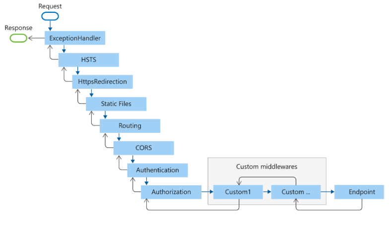
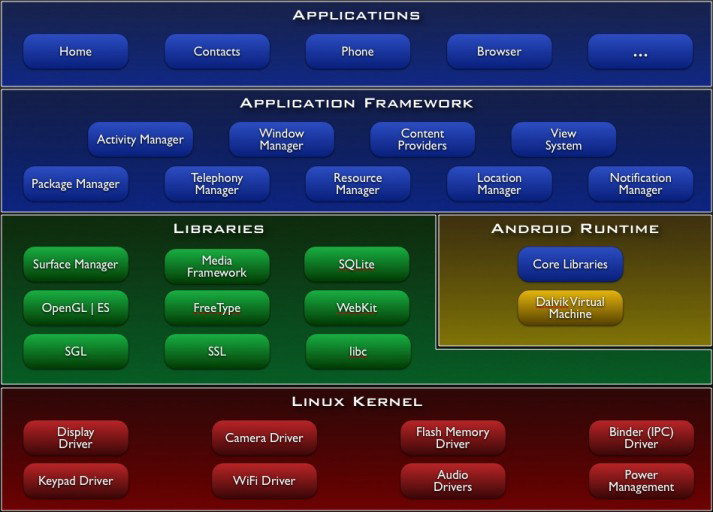
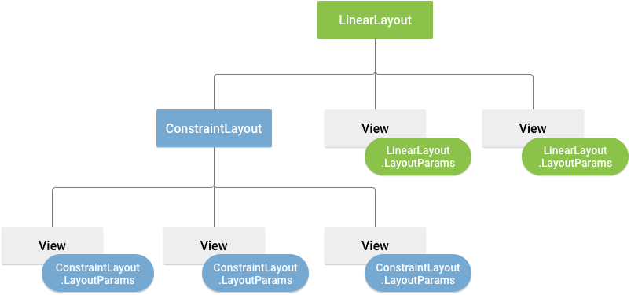
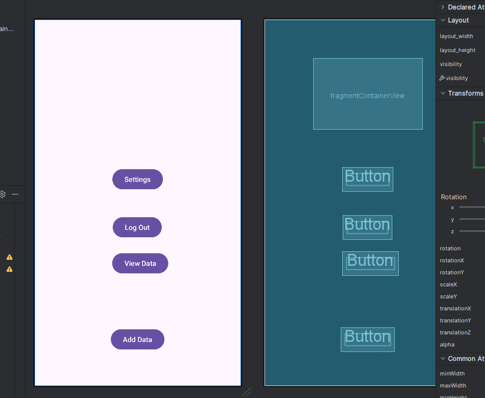
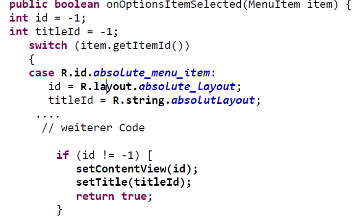
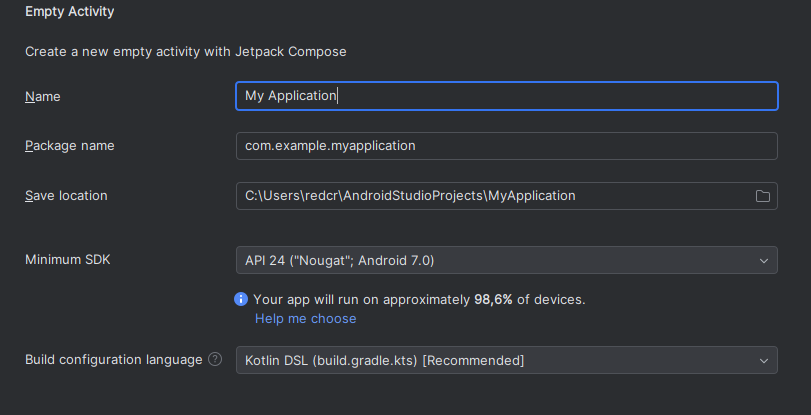
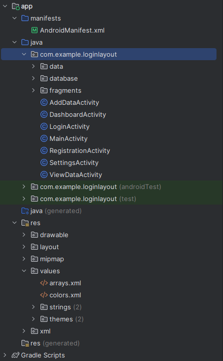

<style>

@font-face {
  font-family: 'TheRumIsGone';
  src: url('TheRumIsGone.ttf') format('truetype');
  font-weight: normal;
  font-style: normal;
}

body 
{
  counter-reset: h1;
}

h1 {
  counter-reset: h2;
  font-family: 'TheRumIsGone', serif;
  text-shadow: 2px 2px 4px #ccc;
}

h2 
{
  counter-reset: h3;
  border-bottom: 2px solid #ffa500;
}

h3 {
  counter-reset: h4;
}

h4 {
  font-size: 1.2rem;
}

h1::before {
  counter-increment: h1;
  content: counter(h1) ". ";
}
h2::before {
  counter-increment: h2;
  content: counter(h1) "." counter(h2) " ";
}
h3::before {
  counter-increment: h3;
  content: counter(h1) "." counter(h2) "." counter(h3) " ";
}
h4::before {
    counter-increment: h4;
    content: counter(h1) "." counter(h2) "." counter(h3) "." counter(h4) " ";
}
</style>

# Table of Contents

- [Table of Contents](#table-of-contents)
- [🌐 Gestaltung von Web- und Mobilen Anwendungen](#-gestaltung-von-web--und-mobilen-anwendungen)
  - [🧩 ASP.NET CORE](#-aspnet-core)
    - [📄 Project Templates \& Structure](#-project-templates--structure)
    - [🧠 Host \& Middleware Pipeline](#-host--middleware-pipeline)
    - [🔁 Routing \& Endpoints](#-routing--endpoints)
    - [🧾 Razor Pages vs. MVC vs. Blazor](#-razor-pages-vs-mvc-vs-blazor)
    - [🧾 RazorPages](#-razorpages)
      - [✒️ Razor-Syntax](#️-razor-syntax)
      - [Inline](#inline)
      - [Tag Helper](#tag-helper)
    - [🔗 Model Binding \& Data Access](#-model-binding--data-access)
      - [Binding Form Data](#binding-form-data)
        - [Razor Page](#razor-page)
        - [PageModel](#pagemodel)
    - [🧱 UserControls](#-usercontrols)
      - [1️⃣ Partial View (simple include)](#1️⃣-partial-view-simple-include)
      - [2️⃣ View Component (logic + view)](#2️⃣-view-component-logic--view)
    - [✅ Validation \& Error Handling](#-validation--error-handling)
    - [🔒 Auth \& Authorization](#-auth--authorization)
  - [⚡ Event Handling in ASP.NET Core](#-event-handling-in-aspnet-core)
    - [🖥️ Razor Pages \& MVC Handlers](#️-razor-pages--mvc-handlers)
  - [🤖 Android](#-android)
    - [🚧 Architektur](#-architektur)
      - [📱 Applications](#-applications)
      - [🧰 Application Frameworks](#-application-frameworks)
      - [📚 Libraries (Bibliotheken)](#-libraries-bibliotheken)
      - [⚙️ Android-Runtime](#️-android-runtime)
      - [🐧 Linux-Kernel](#-linux-kernel)
      - [🧩 App-Architektur](#-app-architektur)
      - [⚓ Wichtige Bestandteile einer Android-App](#-wichtige-bestandteile-einer-android-app)
    - [🎬 Activities](#-activities)
    - [🛠️ Android Layouts: Deklaration und Struktur](#️-android-layouts-deklaration-und-struktur)
      - [🧱 Was ist ein Layout?](#-was-ist-ein-layout)
      - [📝 Layout deklarieren](#-layout-deklarieren)
      - [⚙️ Layout in der Activity verwenden](#️-layout-in-der-activity-verwenden)
      - [🧭 Wichtige Layout-Typen](#-wichtige-layout-typen)
      - [🛠️ Layout Editor in Android Studio](#️-layout-editor-in-android-studio)
      - [🔄 Layouts wiederverwenden mit `<include>`](#-layouts-wiederverwenden-mit-include)
      - [📐 Responsive/Adaptive Design](#-responsiveadaptive-design)
    - [📩 Intents](#-intents)
      - [Example: Navigate to new Activity](#example-navigate-to-new-activity)
      - [Intent with Data](#intent-with-data)
    - [🧱 Fragments](#-fragments)
      - [Put data into a fragment](#put-data-into-a-fragment)
      - [Fragment Class](#fragment-class)
    - [♻️ Lifecycle von Activity und Fragmenten](#️-lifecycle-von-activity-und-fragmenten)
    - [📜 AndroidManifest.xml](#-androidmanifestxml)
      - [🆔 Applikationsidentiät](#-applikationsidentiät)
      - [⚙️ System Requirements](#️-system-requirements)
      - [🧩 Plattform Requirements](#-plattform-requirements)
      - [🔐 Erlaubnisse (Permissions)](#-erlaubnisse-permissions)
      - [📋 Activities und andere Komponenten registrieren](#-activities-und-andere-komponenten-registrieren)
    - [🎨 Ressourcen](#-ressourcen)
      - [🗂️ Ordnerstruktur für Ressourcen](#️-ordnerstruktur-für-ressourcen)
      - [🔑 Zugriff auf Ressourcen](#-zugriff-auf-ressourcen)
        - [🏷️ Referenz innerhalb der Ressourcendefinition](#️-referenz-innerhalb-der-ressourcendefinition)
        - [💻 Referenz innerhalb des Java-Codes](#-referenz-innerhalb-des-java-codes)
        - [📲 Direktzugriff innerhalb des Java-Codes](#-direktzugriff-innerhalb-des-java-codes)
      - [Ressource Folder](#ressource-folder)
      - [📂 Der `assets`-Ordner](#-der-assets-ordner)
        - [Eigenschaften des `assets`-Ordners](#eigenschaften-des-assets-ordners)
    - [🤖 What is ADB?](#-what-is-adb)
      - [Key Features of ADB](#key-features-of-adb)
    - [Parcable](#parcable)
    - [Databases](#databases)
      - [Column Constants](#column-constants)
      - [Database](#database)
      - [Display Data](#display-data)
    - [⚙️ Preferences](#️-preferences)
      - [🗂️ SharedPreferences](#️-sharedpreferences)
      - [🔧 Verwendung](#-verwendung)
        - [📌 Unterschiede: apply() vs commit()](#-unterschiede-apply-vs-commit)
      - [🧩 Preference Screen (UI)](#-preference-screen-ui)
    - [🛠️ Android-Workflow (Installation Android Studio)](#️-android-workflow-installation-android-studio)
      - [Neues Projekt erstellen](#neues-projekt-erstellen)
      - [Projektstruktur](#projektstruktur)
      - [🛰️ AVD — Android Virtual Device](#️-avd--android-virtual-device)


# 🌐 Gestaltung von Web- und Mobilen Anwendungen

## 🧩 ASP.NET CORE

ASP.NET Core is an open-source modular web-application framework. It is a redesign of ASP.NET that unites the previously separate ASP.NET MVC and ASP.NET Web API into a single programming model. Despite being a new framework, built on a new web stack, it does have a high degree of concept compatibility with ASP.NET. The ASP.NET Core framework supports side-by-side versioning so that different applications being developed on a single machine can target different versions of ASP.NET Core. This was not possible with previous versions of ASP.NET. ASP.NET Core initially ran on both the Windows-only .NET Framework and the cross-platform .NET. However, support for the .NET Framework was dropped beginning with ASP.Net Core 3.0.

Blazor is a recent (optional) component to support WebAssembly and since version 5.0, it has dropped support for some old web browsers. While current Microsoft Edge works, the legacy version of it, i.e. "Microsoft Edge Legacy" and Internet Explorer 11 was dropped when you use Blazor.

---
### 📄 Project Templates & Structure

Create with the CLI:

``` bash
dotnet new webapp -o MyRazorApp      # Razor Pages
dotnet new mvc -o MyMvcApp           # MVC + Controllers & Views
dotnet new webapi -o MyApiApp        # REST API
dotnet new blazorserver -o BlazorSrv # Blazor Server
dotnet new blazorwasm -o BlazorWasm  # Blazor WebAssembly
```

Typical folder layout:

```
/Program.cs      ← bootstraps host, DI, middleware
/Startup.cs      ← (pre-6.0) configure services & middleware
/Pages or /Controllers & /Views
/Components       ← Blazor components or ViewComponents
/appsettings.json ← config (env-overrides in appsettings.Development.json)
/Properties/launchSettings.json
```

### 🧠 Host & Middleware Pipeline

Program.cs

``` csharp
var builder = WebApplication.CreateBuilder(args);

// 1. Register services
builder.Services.AddControllersWithViews();
builder.Services.AddDbContext<AppDb>(opts => 
  opts.UseSqlServer(builder.Configuration["ConnStr"]));
builder.Services.AddAuthentication().AddCookie();

// 2. Build host
var app = builder.Build();

// 3. Middleware pipeline
if (app.Environment.IsDevelopment())
    app.UseDeveloperExceptionPage();

app.UseHttpsRedirection();
app.UseStaticFiles();
app.UseRouting();

app.UseAuthentication();
app.UseAuthorization();

app.MapControllerRoute(
  name: "default",
  pattern: "{controller=Home}/{action=Index}/{id?}");
app.Run();

```

The middleware order is defined by the Use[Feature] method execution order when
creating the ASP.NET app.



### 🔁 Routing & Endpoints

- Conventional MVC: in `MapControllerRoute`
- Attribute Routing:

``` csharp
[Route("api/books/[action]/{id?}")]
public class BooksController : ControllerBase { … }
```
- Minimal APIs

``` csharp
app.MapGet("/ping", () => Results.Ok("pong"));
app.MapPost("/todo", (Todo t, AppDb db) => {
  db.Todos.Add(t); db.SaveChanges();
  return Results.Created($"/todo/{t.Id}", t);
});
``` 

### 🧾 Razor Pages vs. MVC vs. Blazor

| Feature      | Razor Pages       | MVC Controllers | Blazor Server/WA   |
| ------------ | ----------------- | --------------- | ------------------ |
| Use case     | Page-focused apps | Complex sites   | Interactive UIs    |
| Code-behind  | `.cshtml.cs`      | Controllers     | `.razor` + `@code` |
| Statefulness | Stateless         | Stateless       | Stateful           |
| WebAssembly  | No                | No              | Yes (WASM)         |


### 🧾 RazorPages

#### ✒️ Razor-Syntax

#### Inline

``` razor
@page "/hello"
@model HelloModel
<h1>Hello, @Model.UserName!</h1>

@if(Model.Items.Any()) {
  <ul>
    @foreach(var i in Model.Items) {
      <li>@i.Name (@i.Quantity)</li>
    }
  </ul>
} else {
  <p>No items onboard.</p>
}
```

#### Tag Helper

``` razor
<form asp-page="Create" method="post">
  <input asp-for="Title" />
  <span asp-validation-for="Title"></span>
  <button type="submit">Save</button>
</form>
```
### 🔗 Model Binding & Data Access

- Binding sources: `[FromQuery]`, `[FromRoute]`, `[FromBody]`, `[FromForm]`, `[FromServices]`
  
``` csharp
public class AppDb : DbContext
{
  public DbSet<Book> Books { get; set; }
}

// In a Controller:
public async Task<IActionResult> List([FromQuery]int page = 1)
{
  var books = await _db.Books
    .Skip((page-1)*10).Take(10).ToListAsync();
  return View(books);
}
```

#### Binding Form Data

##### Razor Page

``` razor
<form method="post">
    <label>Name:</label>
    <input type="text" asp-for="UserInput.Name" />
    <label>Age:</label>
    <input type="number" asp-for="UserInput.Age" />
    <button type="submit">Submit</button>
</form>

@if (Model.Message != null)
{
    <p>@Model.Message</p>
}
```

##### PageModel

``` csharp
public class IndexModel : PageModel
{
    [BindProperty]
    public UserInputModel UserInput { get; set; }

    public string Message { get; set; }

    public void OnPost()
    {
        Message = $"Ahoy, {UserInput.Name}! You're {UserInput.Age} years old!";
    }
}

public class UserInputModel
{
    public string Name { get; set; }
    public int Age { get; set; }
}
```

### 🧱 UserControls

#### 1️⃣ Partial View (simple include)

**Create**: `/Views/Shared/_UserCard.cshtml`

``` razor
<div class="user-card">
  <h3>@Model.Name (@Model.Role)</h3>
  <p>Crew: @Model.CrewName</p>
</div>
```

``` razor
@await Html.PartialAsync("_UserCard", Model.User)
```

#### 2️⃣ View Component (logic + view)

**Component class:** `/ViewComponents/UserCardViewComponent.cs`

``` csharp
public class UserCardViewComponent : ViewComponent
{
  public IViewComponentResult Invoke(User u) =>
    View("Default", u);
}
```

**Default view:** `/Views/Shared/Components/UserCard/Default.cshtml`

``` razor
<div class="user-card">
  <strong>@Model.Name</strong><br/>
  <small>@Model.Role</small>
</div>
``` 

**Invoke in Razor:**
``` razor
@await Component.InvokeAsync("UserCard", new { u = Model.User })
``` 

### ✅ Validation & Error Handling

- Annotations

``` csharp
public class RegisterDto 
{
  [Required, EmailAddress] public string Email { get; set; }
  [Required, MinLength(6)] public string Password { get; set; }
}
```

- Client + server validation via `<partial name="_ValidationScriptsPartial" />`
- Global error handling middleware:

``` csharp
app.UseExceptionHandler("/Home/Error");
app.UseStatusCodePagesWithReExecute("/Home/Status", "?code={0}");
```

### 🔒 Auth & Authorization

- **Authentication:** Cookies, JWT, OAuth, IdentityServer4

- **ASP.NET Core Identity:**

``` csharp
builder.Services.AddIdentity<User, Role>()
  .AddEntityFrameworkStores<AppDb>()
  .AddDefaultTokenProviders();
app.UseAuthentication();
```

- **policies**
``` csharp
services.AddAuthorization(opts => {
  opts.AddPolicy("PirateOnly", p => p.RequireClaim("Role", "Captain"));
});
[Authorize(Policy="PirateOnly")]
public IActionResult Secret() => View();
```

## ⚡ Event Handling in ASP.NET Core

Event handling in ASP.NET Core spans from simple request-based handlers in Razor/MVC to real-time hubs with SignalR and rich interactivity in Blazor. Let’s plunder each layer, Captain!

---

### 🖥️ Razor Pages & MVC Handlers

Razor Pages and MVC use _handler methods_ in the PageModel or Controller:

```csharp
// Razor Page: Pages/Tasks/Edit.cshtml.cs
public class EditModel : PageModel
{
    [BindProperty] public TaskItem Task { get; set; }

    public void OnGet(int id) 
        => Task = _db.Tasks.Find(id);

    public IActionResult OnPostSave()  // handler for <button asp-page-handler="Save">
    {
        if (!ModelState.IsValid) return Page();
        _db.Update(Task);
        _db.SaveChanges();
        return RedirectToPage("Index");
    }
}
```

``` razor
<form method="post">
  <input asp-for="Task.Name" />
  <button asp-page-handler="Save">Save</button>
</form>
```

---

## 🤖 Android

Android is an operating system based on a modified version of the Linux kernel and other open-source software, designed primarily for touchscreen-based mobile devices such as smartphones and tablets. Android has historically been developed by a consortium of developers known as the Open Handset Alliance, but its most widely used version is primarily developed by Google. First released in 2008, Android is the world's most widely used operating system; the latest version, released on October 15, 2024, is Android 15.


---

### 🚧 Architektur



#### 📱 Applications

- **Verschiedene fertige Kernanwendungen** *(z. B. Home, Browser, Telefon, Kontakte usw.)*
- **Java**
- **Android SDK nötig**
- **Java-Quelltext wird von einem Cross-Assembler für die Dalvik-VM angepasst**
  - *Ab **Android 5** wird der **Bytecode in Maschinencode** bei der **Installation der App kompiliert***
    - → **Maschinenunabhängigkeit bleibt erhalten**
    - → App muss **nicht mehr zur Laufzeit** umgewandelt werden
    - → **Bessere Performance**

#### 🧰 Application Frameworks

- **Activity Manager**
  - Kontrolliert den **Lebenszyklus der Apps**
  - Verwaltet das **Navigieren zwischen Apps**

- **Content Providers**
  - Versorgen Apps mit **gemeinsamen Daten** (z. B. Fotos, Musik-Sammlungen, Kontakte)

- **Location Manager**
  - Liefert die **Position des Geräts**

- **Notification Manager**
  - Informiert Benutzer über **signifikante Ereignisse**
  - Jeder Event besitzt eine **eindeutige ID**

- **Package Manager**
  - Verwaltet **installierte Packages**

- **Resource Manager**
  - Zur **Verwaltung und Zugriffen von Ressourcen** (z. B. Strings, Grafiken, XML-Dateien usw.)

- **Telephony Manager**
  - Zuständig für **Telefon-Services**

- **View System**
  - Komponente, die **UI-Elemente verwaltet** und **Ereignisse generiert**

- **Window Manager**
  - Zur **Verwaltung des Bildschirms**

#### 📚 Libraries (Bibliotheken)

- **FreeType**
  - Für **Bitmap** und **Fonts**

- **(Bionic) libc**
  - Angepasste und **optimierte BSD-Implementierung**

- **LibWebCore**
  - Basiert auf **WebKit** *(Web Browser Engine, auch in Google Chrome und Apple Safari verwendet)*

- **Media Framework**
  - Basiert auf **OpenCORE** von PacketVideo
  - Unterstützt: **MPEG4, H.264, MP3, AAC, AMR, JPEG, PNG**

- **OpenGL|ES**
  - Für **3D-Grafiken** auf **Embedded-Systemen**

- **SGL**
  - **2D Grafik-Engine**

- **SQLite**
  - **Schlankes, relationales Datenbanksystem**

- **SSL**
  - Für **SSL-basierte Sicherheit** bei der **Netzwerkkommunikation**

- **Surface Manager**
  - Verwaltung des **Zugriffs auf das Display-Subsystem**

#### ⚙️ Android-Runtime

- **Kernbibliotheken** für die Laufzeitumgebung  
  - Teilmenge der **Apache Harmony Java 5 Implementierung**

- **Dalvik Virtuelle Maschine (DVM)** → ab **Android Lollipop: Android-Runtime (ART)**
  - **Registerbasierte Maschine**
  - DVM: **interpretiert** Dateien im **Dalvik Executable (DEX)**-Format
  - ART: **kompiliert Bytecode bei der Installation** in **nativen Binärcode (ODEX)**  
    → **Schnellere Ausführung**

- **Jede Applikation läuft in einem separaten Prozess**  
  - Hat ihre **eigene DVM bzw. ART**

- Nutzt das **Thread-Modell** und die **Low-Memory-Verwaltung von Linux**

#### 🐧 Linux-Kernel

- Dient als **Abstraktionsschicht** zwischen der **Android-Welt** und der **Hardware**

- Stellt bereit:
  - **Sicherheitsmodell**
  - **Prozess- und Speicherverwaltung**
  - **Netzwerkstack**
  - **Treiber**

#### 🧩 App-Architektur

- Die **Android-App-Architektur** basiert auf **Komponenten**, die über sogenannte **Intents** miteinander kommunizieren.

- Eine App besteht aus einer **Sammlung von Komponenten**:
  - **Activities**
  - **Services**
  - **Content Providers**
  - **Broadcast Receivers**  
  → **Nicht alle Komponenten** müssen in jeder App enthalten sein.

- **Jede App läuft in einem eigenen Linux-Prozess**  
  - Android startet den Prozess **erst, wenn eine Komponente benötigt wird**  
  - Es gibt **keine klassische `main()`-Methode** wie in Java oder C/C++
    - Im Manifest wird eine Start-Activity festgelegt

- Komponenten einer App **teilen gemeinsame Ressourcen**, z. B.:
  - **Datenbanken**
  - **Shared Preferences**
  - **Dateisystem**

#### ⚓ Wichtige Bestandteile einer Android-App

- **Activity**  
  - Sichtbarer Teil der Anwendung zur **Interaktion mit dem Benutzer**  
  - Besitzt einen eigenen **Lebenszyklus**  
  - Eine App enthält meist **mehrere Activities**

- **Service**  
  - Läuft im **Hintergrund** (ähnlich wie Windows-Service oder Linux-Dämon)  
  - **Local Service:** Läuft im **gleichen Prozess** wie die App  
  - **Remote Service:** Läuft in einem **separaten Prozess** und kommuniziert über **Interprozesskommunikation**

- **Content Providers**  
  - Stellen **Daten für andere Apps** bereit

- **Broadcast Receivers**  
  - Empfangen **Systemereignisse** und reagieren darauf


### 🎬 Activities

Activities sind eigene Klassen die eine Seite auf der App repräsentieren.

``` java
public class MainActivity extends AppCompatActivity
{
    private Button mainLoginButton;

    @Override
    protected void onCreate(Bundle savedInstanceState)
    {
        super.onCreate(savedInstanceState);
        EdgeToEdge.enable(this);
        setContentView(R.layout.activity_main);
        ViewCompat.setOnApplyWindowInsetsListener(findViewById(R.id.main), (v, insets) -> {
            Insets systemBars = insets.getInsets(WindowInsetsCompat.Type.systemBars());
            v.setPadding(systemBars.left, systemBars.top, systemBars.right, systemBars.bottom);
            return insets;
        });

        mainLoginButton = findViewById(R.id.mainLoginButton);

        mainLoginButton.setOnClickListener(v -> {
           Intent intent = new Intent(MainActivity.this, LoginActivity.class);
           startActivity(intent);
        });
    }
}
```

In Java und XML Files geteilt.


### 🛠️ Android Layouts: Deklaration und Struktur




#### 🧱 Was ist ein Layout?

Ein Layout definiert die Struktur der Benutzeroberfläche (UI) deiner App, z. B. in einer Activity. Alle Elemente im Layout werden durch eine Hierarchie von `View`- und `ViewGroup`-Objekten aufgebaut:

- **`View`**: Sichtbare UI-Elemente wie `Button`, `TextView`, `ImageView`.
- **`ViewGroup`**: Unsichtbare Container, die die Struktur für `View`- und andere `ViewGroup`-Objekte festlegen, z. B. `LinearLayout`, `RelativeLayout`, `ConstraintLayout`.

#### 📝 Layout deklarieren

Layouts werden in XML-Dateien im Verzeichnis `res/layout/` gespeichert. Jede Layout-Datei muss genau ein Root-Element enthalten, das ein `View` oder `ViewGroup` ist. Beispiel:

```xml
<?xml version="1.0" encoding="utf-8"?>
<LinearLayout xmlns:android="http://schemas.android.com/apk/res/android"
              android:layout_width="match_parent"
              android:layout_height="match_parent"
              android:orientation="vertical">
    <TextView android:id="@+id/text"
              android:layout_width="wrap_content"
              android:layout_height="wrap_content"
              android:text="Hallo, ich bin ein TextView" />
    <Button android:id="@+id/button"
            android:layout_width="wrap_content"
            android:layout_height="wrap_content"
            android:text="Hallo, ich bin ein Button" />
</LinearLayout>
```

#### ⚙️ Layout in der Activity verwenden

``` kotlin
fun onCreate(savedInstanceState: Bundle) {
    super.onCreate(savedInstanceState)
    setContentView(R.layout.main_layout)
}
```

#### 🧭 Wichtige Layout-Typen

- **LinearLayout:** Ordnet Kinder in einer Richtung an (vertikal oder horizontal).

- **RelativeLayout:** Positioniert Kinder relativ zueinander oder zum Eltern-Layout.

- **ConstraintLayout:** Bietet flexible Positionierung und Größenanpassung basierend auf Constraints. Empfohlen für komplexe Layouts.

- **FrameLayout:** Zeigt ein einzelnes Element an, ideal für einfache UI-Komponenten.

- **TableLayout:** Anordnung von Kindern in Zeilen und Spalten.

- **GridLayout:** Erweitert TableLayout mit flexiblerer Zellenanordnung.

---

#### 🛠️ Layout Editor in Android Studio

Der Layout Editor ermöglicht das schnelle Erstellen von Layouts durch Ziehen von UI-Elementen in einen visuellen Design-Editor. Er bietet eine Vorschau des Layouts auf verschiedenen Android-Geräten und -Versionen und ermöglicht das dynamische Anpassen der Layoutgröße, um sicherzustellen, dass es auf verschiedenen Bildschirmgrößen richtig funktioniert.

---

#### 🔄 Layouts wiederverwenden mit `<include>`

Um Layouts effizient wiederzuverwenden, kannst du die Tags `<include>` und `<merge>` verwenden, um ein Layout in ein anderes einzubetten. Dies ermöglicht das Erstellen komplexer Layouts und das Verwalten gemeinsamer Elemente über mehrere Layouts hinweg.

---

#### 📐 Responsive/Adaptive Design

Um deine App auf verschiedenen Bildschirmgrößen, -orientierungen und -konfigurationen zu unterstützen, implementiere responsive/adaptive Layouts. Dies sorgt für eine optimierte Benutzererfahrung, unabhängig von der Gerätekonfiguration.


### 📩 Intents

Intents are messaging Objects

- Activities
- Services
- Broadcast Delivery

#### Example: Navigate to new Activity

``` java
mainLoginButton = findViewById(R.id.mainLoginButton);

mainLoginButton.setOnClickListener(v -> {
    Intent intent = new Intent(MainActivity.this, LoginActivity.class);
    startActivity(intent);
});
```

#### Intent with Data

``` java
Intent intent = new Intent(this, DashboardActivity.class);
intent.putExtra("user", user);
startActivity(intent);
```

``` java
User user;
Bundle bundle = getIntent().getExtras();

if (bundle != null)
{
    user = bundle.getParcelable("user", User.class);
}
else
{
    user = new User("empty", "empty", "empty");
}
```

### 🧱 Fragments




#### Put data into a fragment

``` java
dashboardDataFragment = (DashboardDataFragment) getSupportFragmentManager().findFragmentById(R.id.fragmentContainerView);
dashboardDataFragment.setUser(user);
```

#### Fragment Class

``` java
/**
 * A simple {@link Fragment} subclass.
 * Use the {@link DashboardDataFragment#newInstance} factory method to
 * create an instance of this fragment.
 */
public class DashboardDataFragment extends Fragment {

    // TODO: Rename parameter arguments, choose names that match
    // the fragment initialization parameters, e.g. ARG_ITEM_NUMBER
    private static final String ARG_PARAM1 = "param1";
    private static final String ARG_PARAM2 = "param2";

    // TODO: Rename and change types of parameters
    private String mParam1;
    private String mParam2;

    TextView dashboardUsernameText;
    TextView dashboardEmailText;
    TextView dashboardPasswordText;

    public User getUser() {
        return user;
    }

    public void setUser(User user) {
        this.user = user;
    }

    User user;

    public DashboardDataFragment() {
        // Required empty public constructor
    }

    /**
     * Use this factory method to create a new instance of
     * this fragment using the provided parameters.
     *
     * @param param1 Parameter 1.
     * @param param2 Parameter 2.
     * @return A new instance of fragment DashboardDataFragment.
     */
    // TODO: Rename and change types and number of parameters
    public static DashboardDataFragment newInstance(String param1, String param2) {
        DashboardDataFragment fragment = new DashboardDataFragment();
        Bundle args = new Bundle();
        args.putString(ARG_PARAM1, param1);
        args.putString(ARG_PARAM2, param2);
        fragment.setArguments(args);
        return fragment;
    }

    @Override
    public void onCreate(Bundle savedInstanceState) {
        super.onCreate(savedInstanceState);
        if (getArguments() != null) {
            mParam1 = getArguments().getString(ARG_PARAM1);
            mParam2 = getArguments().getString(ARG_PARAM2);
        }
    }

    @Override
    public View onCreateView(LayoutInflater inflater, ViewGroup container,
                             Bundle savedInstanceState) {
        // Inflate the layout for this fragment
        View view = inflater.inflate(R.layout.fragment_dashboard_data, container, false);

        dashboardUsernameText = view.findViewById(R.id.dashboardUsernameText);
        dashboardEmailText = view.findViewById(R.id.dashboardEmailText);
        dashboardPasswordText = view.findViewById(R.id.dashboardPasswordText);

        dashboardUsernameText.setText("Username: " + user.getUsername());
        dashboardEmailText.setText("E-Mail: " + user.getEmail());
        dashboardPasswordText.setText("Password: " + user.getPassword());


        return view;
    }
}
```

### ♻️ Lifecycle von Activity und Fragmenten


### 📜 AndroidManifest.xml

- Beschreibt die Andwendung
- **Gradle Scripts**
  - werden automatisch erzeugt, für die verschiedenen Plattformen, Abhängigkeiten.

``` xml
<?xml version="1.0" encoding="utf-8"?>
<manifest xmlns:android="http://schemas.android.com/apk/res/android"
    xmlns:tools="http://schemas.android.com/tools">

    <application
        android:allowBackup="true"
        android:dataExtractionRules="@xml/data_extraction_rules"
        android:fullBackupContent="@xml/backup_rules"
        android:icon="@mipmap/ic_launcher"
        android:label="@string/app_name"
        android:roundIcon="@mipmap/ic_launcher_round"
        android:supportsRtl="true"
        android:theme="@style/Theme.LoginLayout"
        tools:targetApi="31">
        <activity
            android:name=".ViewDataActivity"
            android:exported="false" />
        <activity
            android:name=".AddDataActivity"
            android:exported="false" />
        <activity
            android:name=".SettingsActivity"
            android:exported="false"
            android:label="@string/title_activity_settings" />
        <activity
            android:name=".DashboardActivity"
            android:exported="false" />
        <activity
            android:name=".RegistrationActivity"
            android:exported="false" />
        <activity
            android:name=".LoginActivity"
            android:exported="false" />
        <activity
            android:name=".MainActivity"
            android:exported="true">
            <intent-filter>
                <action android:name="android.intent.action.MAIN" />

                <category android:name="android.intent.category.LAUNCHER" />
            </intent-filter>
        </activity>
    </application>

</manifest>
```

- Jede Android-Anwendung benötigt eine **AndroidManifest.xml**-Datei, die wichtige Informationen enthält, wie:  
  - **Anwendungsidentität**  
  - **Name der App**  
  - **Versionsnummer**  
  - **Beschreibung der Komponenten** (Activities, Services, etc.)  
  - **Erlaubnisse** (Permissions)  

- Das **Laufzeitsystem** nutzt die Manifest-Datei, um:  
  - Die Anwendung zu **installieren** und **upzudaten**  
  - Anwendungsdetails wie **Name**, **Icon** und **Beschreibung** anzuzeigen  
  - **Erlaubnisse zu überwachen** und zu verwalten  
  - **Activities der Anwendung zu starten**  
  - Entwicklern das **Debugging** der App zu ermöglichen

#### 🆔 Applikationsidentiät

- **Paketname**  
  - Eindeutige Identifikation der App  
  - Muss **sorgfältig gewählt** werden, da er nach Veröffentlichung **nicht mehr änderbar** ist  

- **Versionscode**  
  - Wird für **Updates** verwendet  
  - Interner Wert, der beim Update erhöht wird  

- **Versionsname**  
  - Wird den **Benutzern angezeigt**  
  - Menschlich lesbar, z.B. "1.0", "2.1 Beta"  


```xml
<manifest
  xmlns:android="http://schemas.android.com/apk/res/android"
  package="de.hs_kl.tran"
  android:versionCode="1"
  android:versionName="1.0" >
```

#### ⚙️ System Requirements

- **SDK-Versionen:**  
  - **minSdkVersion:** Kleinster unterstützter API-Level (Mindestanforderung)  
  - **targetSdkVersion** *(optional):* Optimal unterstützter API-Level (für Kompatibilität)  
  - **maxSdkVersion** *(optional):* Größter unterstützter API-Level (Begrenzung)  

- **Anwendungsdetails:**  
  - **Name** und **Icon** für die Anzeige  
  - Optionale **Beschreibung**  
  - **Debugging** kann ein- oder ausgeschaltet werden  


```xml
<application
  android:icon="@drawable/ic_launcher"
  android:label="@string/app_name"
  android:description="@string/app_desc"
  android:debuggable="true" >
```
#### 🧩 Plattform Requirements

- **Externe Bibliotheken:**  
  - Standardmäßig sind folgende Pakete enthalten:  
    - `android.app`  
    - `android.content`  
    - `android.view`  
    - `android.widget`  
  - Wenn die App spezielle Pakete braucht (z.B. Google Maps), muss die passende Bibliothek eingebunden und angegeben werden.  

```xml
<application ...>
  ...
  <uses-library android:name="com.google.android.maps" />
  ...
</application>
```

#### 🔐 Erlaubnisse (Permissions)

- Android-Anwendungen haben **standardmäßig keinen Zugriff** auf geschützte Ressourcen anderer Apps oder Systemfunktionen.

- **Zugriffe müssen explizit angefragt werden**, und der Benutzer muss **bei der Installation zustimmen**.

- Geforderte Erlaubnisse werden in der **Manifest-Datei** angegeben. Beispiel:

```xml
<activity
    android:name=".ManifestDemoActivity"
    android:label="@string/app_name" >
    <intent-filter>
        <action android:name="android.intent.action.MAIN" />
        <category android:name="android.intent.category.LAUNCHER" />
    </intent-filter>
</activity>

<permission android:name="android.permission.CAMERA" />
<permission android:name="android.permission.READ_CONTACTS" />
<permission android:name="android.permission.WRITE_CONTACTS" />
```

#### 📋 Activities und andere Komponenten registrieren

- **Liste von Komponenten:**  
  - Activities  
  - Services  
  - Content Providers  
  - Broadcast Receivers  

- **Wichtig:** Alle Komponenten **müssen registriert** sein, sonst werden sie nicht gestartet!  

- **Activities, die nur innerhalb der App verwendet werden:**  
  - Haben eine einfache Beschreibung  
  - Der Punkt vor dem Namen kann entfallen, er zeigt nur, dass die Activity zum Paket gehört  

- **Components (Activities, Services, Broadcast Receivers), die von anderen Apps oder vom System gestartet werden sollen:**  
  - Benötigen zusätzliche Angaben im Block `<intent-filter> ... </intent-filter>` (kommt später noch)  

-  Eine Activity muss als Eintrittspunkt der Anwendung definiert werden.
  

``` xml
<activity
    android:name=".ManifestDemoActivity"
    android:label="@string/app_name" >
    <intent-filter>
        <action android:name="android.intent.action.MAIN" />
        <category android:name="android.intent.category.LAUNCHER" />
    </intent-filter>
</activity>
```
### 🎨 Ressourcen

- Zum Programm gehören auch **Grafiken, Icons, Klangdateien, Videos, Texte in verschiedenen Sprachen**.  
- **Farbdefinitionen, Menüeinträge, Listen, Layouts usw.** werden in Android häufig **nicht im Code definiert**, sondern in **XML als Ressourcen** hinterlegt.


#### 🗂️ Ordnerstruktur für Ressourcen

- **Alle Ressourcen liegen in einem Unterordner von `/res`**.  
- Für **Ordner- und Dateinamen** darf nur **Kleinschreibung oder Unterstrich** verwendet werden  
  (Ausnahme: **Länderkürzel** wie z.B. DE, US).  
- **Verschiedene Ressourcen müssen in verschiedenen Unterordnern liegen**.  
- Mit Ausnahme vom Ordner **`assets`** dürfen andere Unterordner **keinen Unterordner** beinhalten.

#### 🔑 Zugriff auf Ressourcen

- Ressourcen (Ausnahme: Daten in **`assets`**) werden **kompiliert** und können über **ID angesprochen** werden.

Es gibt **3 Möglichkeiten**, auf Ressourcen zuzugreifen:  
- **per Referenz innerhalb der Ressourcendefinition**  
- **per Referenz im Code**  
- **per Direktzugriff im Code**

---

##### 🏷️ Referenz innerhalb der Ressourcendefinition

Zugriff mit dem **@-Zeichen** über einen Ressourcenschlüssel der Form:  
`@[package:]ressourcenart/ressourcenname`

Beispiel in der Manifest-Datei:  
```xml
<application
  android:debuggable="true"
  android:description="@string/app_desc"
  android:icon="@drawable/ic_launcher"
  android:label="@string/app_name"
  android:theme="@android:style/Theme.Light" >
```

##### 💻 Referenz innerhalb des Java-Codes

Zugriff über Konstanten aus `R.java`.
**Vorsicht**: Konsistenz (richtige ID für das richtige Objekt) kann erst zur Laufzeit geprüft werden – Absturz möglich!



##### 📲 Direktzugriff innerhalb des Java-Codes

Zugriff über `getResources()` und `R.java`, zum Beispiel:

```java
String title = getResources().getString(R.layout.absolute_layout);
Drawable logo = getResources().getDrawable(R.drawable.robot);
```

#### Ressource Folder

- **values**
  - einfache werte
- **drawable**
  - komplexe formen
  - Bilder
- **raw**
  - rohe daten
    - videos
    - XML, dass nicht kompiliert werden soll
  
#### 📂 Der `assets`-Ordner

Der **`assets`-Ordner** wird **selten verwendet**. Hier können **Ressourcen aller Art** abgelegt werden.

##### Eigenschaften des `assets`-Ordners

- **variable Ordnerstruktur**  
- **keine Indizierung der Ressourcen**  
- Zugriff nur über den **Dateipfad** (man öffnet dafür einen **InputStream**) 

``` java
InputStream f = null;

try
{
    f = getAssets().open("/data/text.txt");
}
catch (IOException ex) {}
```

- Ressourcen werden **nicht vor-kompiliert**

### 🤖 What is ADB?

**ADB** stands for **Android Debug Bridge**.  

It's a **command-line tool** that lets you communicate with and control an Android device (emulator or physical device) from your computer.

---

#### Key Features of ADB

- **Install and debug apps** directly on your device  
- Access **device shell** to run commands  
- Transfer files between your computer and the device  
- View device logs and system info  
- Control the device remotely (like rebooting, installing updates)

---

ADB is essential for **Android development and troubleshooting** — your go-to pirate tool for navigating the Android seas! ⚓

### Parcable

- Data Class Implements Parcable
  
``` java
User user;
Bundle bundle = getIntent().getExtras();

if (bundle != null)
{
    user = bundle.getParcelable("user", User.class);
}
else
{
    user = new User("empty", "empty", "empty");
}
```
### Databases

#### Column Constants

``` java
public interface CatColumnConstants extends BaseColumns
{
    public static final String CAT_TABLE = "cats";
    public static final String CAT_NAME_COLUMN = "cat_name";
    public static final String CAT_AGE_COLUMN = "cat_age";
    public static final String USER_ID = "user_id";
}
```

#### Database

``` java
public class CatDatabase extends SQLiteOpenHelper
{
    private static final String DATABASE_NAME = "cat.db";
    private static final int DATABASE_VERSION = 1;

    private static final String CREATE_USERS_TABLE =
            "CREATE TABLE " + UserColumnConstants.USER_TABLE + " (" +
                    UserColumnConstants._ID + " INTEGER PRIMARY KEY AUTOINCREMENT, " +
                    UserColumnConstants.USERNAME_COLUMN + " TEXT NOT NULL, " +
                    UserColumnConstants.EMAIL_COLUMN + " TEXT NOT NULL UNIQUE, " +
                    UserColumnConstants.PASSWORD_COLUMN + " TEXT NOT NULL);";

    private static final String CREATE_CATS_TABLE =
            "CREATE TABLE " + CatColumnConstants.CAT_TABLE + " (" +
                    CatColumnConstants._ID + " INTEGER PRIMARY KEY AUTOINCREMENT, " +
                    CatColumnConstants.CAT_NAME_COLUMN + " TEXT NOT NULL, " +
                    CatColumnConstants.CAT_AGE_COLUMN + " INTEGER NOT NULL);";

    public CatDatabase(Context context)
    {
        super(context, "DATABASE_NAME", null, DATABASE_VERSION);
    }

    public CatDatabase(@Nullable Context context, @Nullable String name, @Nullable SQLiteDatabase.CursorFactory factory, int version) {
        super(context, name, factory, version);
    }

    @Override
    public void onCreate(SQLiteDatabase db)
    {
        db.execSQL(CREATE_USERS_TABLE);
        db.execSQL(CREATE_CATS_TABLE);
    }

    @Override
    public void onUpgrade(SQLiteDatabase db, int oldVersion, int newVersion)
    {
        db.execSQL("DROP TABLE IF EXISTS " + UserColumnConstants.USER_TABLE);
        db.execSQL("DROP TABLE IF EXISTS " + CatColumnConstants.CAT_TABLE);
        onCreate(db);
    }
}
```

#### Display Data

``` java
private void displayCatData() {
    SQLiteDatabase db = catDatabase.getReadableDatabase();
    Cursor cursor = db.rawQuery("SELECT * FROM " + CatColumnConstants.CAT_TABLE, null);

    StringBuilder dataBuilder = new StringBuilder();

    if (cursor.moveToFirst()) {
        do {
            int id = cursor.getInt(cursor.getColumnIndexOrThrow(CatColumnConstants._ID));
            String name = cursor.getString(cursor.getColumnIndexOrThrow(CatColumnConstants.CAT_NAME_COLUMN));
            int age = cursor.getInt(cursor.getColumnIndexOrThrow(CatColumnConstants.CAT_AGE_COLUMN));

            dataBuilder.append("🐱 ID: ").append(id)
                    .append("\n📛 Name: ").append(name)
                    .append("\n🎂 Age: ").append(age).append(" years\n\n");
        } while (cursor.moveToNext());
    } else {
        dataBuilder.append("No cat data found! 🐾");
    }

    textOutput.setText(dataBuilder.toString());
    cursor.close();
    db.close();
}
```

### ⚙️ Preferences

**Preferences** sind eine einfache Möglichkeit, kleine Mengen an Daten persistent zu speichern, typischerweise für Benutzereinstellungen. Android bietet dafür die `SharedPreferences`-API.

---

#### 🗂️ SharedPreferences

- Speichert Key-Value-Paare.
- Ideal für einfache Daten wie Einstellungen, Flags oder Konfigurationen.
- Daten werden als XML-Datei im privaten App-Speicher gespeichert.

---

#### 🔧 Verwendung

**1. Zugriff auf die Preferences:**

```java
SharedPreferences prefs = getSharedPreferences("EINSTELLUNGEN", MODE_PRIVATE);
```

**2. Lesen von Daten:**

``` java
boolean darkMode = prefs.getBoolean("dark_mode", false);
```

**3. Schreiben von Daten:**

``` java
SharedPreferences.Editor editor = prefs.edit();
editor.putBoolean("dark_mode", true);
editor.apply(); // oder commit()
```

##### 📌 Unterschiede: apply() vs commit()

- `apply()` speichert asynchron (empfohlen).
- `commit()` speichert synchron und gibt einen booleschen Wert zurück.

#### 🧩 Preference Screen (UI)

Für benutzerfreundliche Einstellungen kannst du PreferenceFragmentCompat verwenden:

``` java
public class SettingsFragment extends PreferenceFragmentCompat {
    @Override
    public void onCreatePreferences(Bundle savedInstanceState, String rootKey) {
        setPreferencesFromResource(R.xml.preferences, rootKey);
    }
}
```
``` xml
<PreferenceScreen xmlns:android="http://schemas.android.com/apk/res/android">
    <SwitchPreferenceCompat
        android:key="dark_mode"
        android:title="Dark Mode aktivieren"
        android:defaultValue="false" />
</PreferenceScreen>
```

### 🛠️ Android-Workflow (Installation Android Studio)

#### Neues Projekt erstellen




#### Projektstruktur

- **java**
  - Erstellte Klassen
- **res**
  - Ressourcen, wie zb
    - Strings
    - Grafiken
    - Layouts
    - ...



#### 🛰️ AVD — Android Virtual Device

- **What it is:**  
  AVD is an **emulator configuration** that simulates a real Android device on your computer.

- **Purpose:**  
  Allows developers to **test and debug Android apps** without needing physical hardware.

- **Features:**  
  - Emulates various device types (phones, tablets, TVs, wearables)  
  - Supports different Android versions and system images  
  - Configurable hardware profiles (RAM, CPU, screen size, resolution, sensors)  
  - Network and GPS simulation  
  - Snapshot support for quick booting

- **Usage:**  
  Run your app inside the AVD from Android Studio or command line to simulate how it behaves on different devices and Android versions.

- **Why it matters:**  
  Saves time and credits by avoiding the need for multiple physical test devices, essential for compatibility testing across the vast Android ecosystem.


---

<p style="page-break-before: always;"></p>

<script>
  document.addEventListener("DOMContentLoaded", function() {
    // Create the button
    const btn = document.createElement("a");
    btn.href = "../index.html";  // adjust your path
    btn.textContent = "🏠 Home";
    // Style it so it truly fixes to the viewport
    Object.assign(btn.style, {
      position: "fixed",
      bottom: "1rem",
      right: "1rem",
      backgroundColor: "#c0392b",
      color: "#ffffff",
      padding: "0.5rem 0.75rem",
      fontFamily: "Arial, sans-serif",
      fontSize: "0.9rem",
      textDecoration: "none",
      borderRadius: "0.5rem",
      boxShadow: "0 2px 6px rgba(0,0,0,0.3)",
      zIndex: "9999",
      transition: "background-color 0.2s ease, transform 0.2s ease",
      display: "inline-block",
    });
    // Hover effects
    btn.addEventListener("mouseover", () => {
      btn.style.backgroundColor = "#922b21";
      btn.style.transform = "translateY(-2px)";
    });
    btn.addEventListener("mouseout", () => {
      btn.style.backgroundColor = "#c0392b";
      btn.style.transform = "none";
    });
    // Append to the real <body>
    document.body.appendChild(btn);
  });
</script>