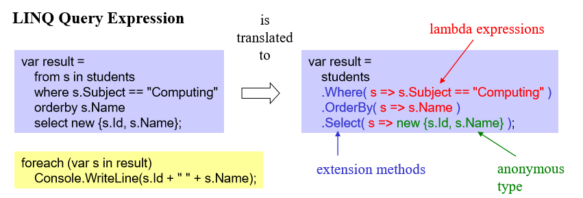
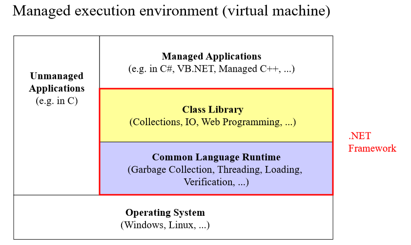
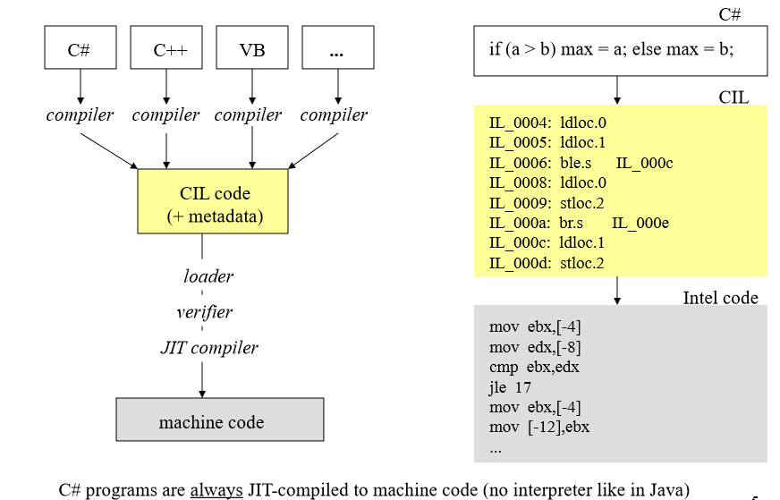
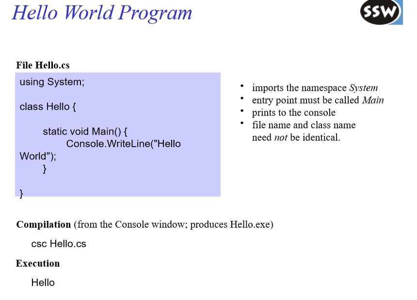
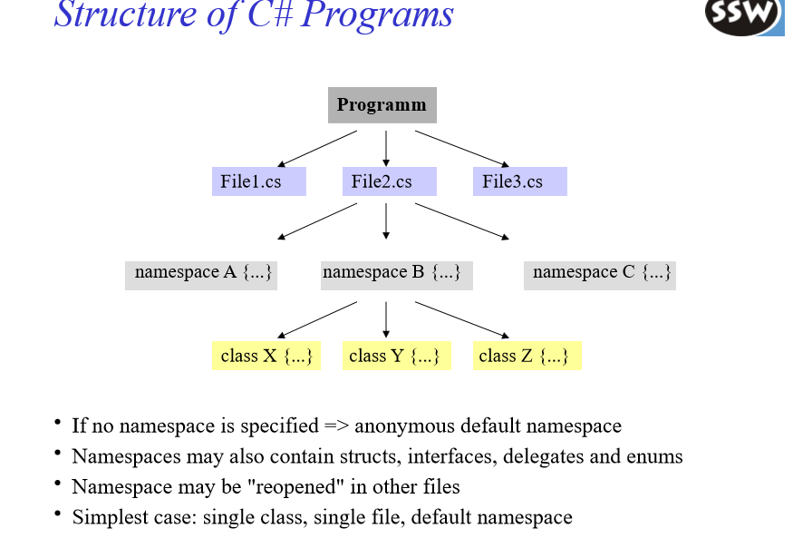
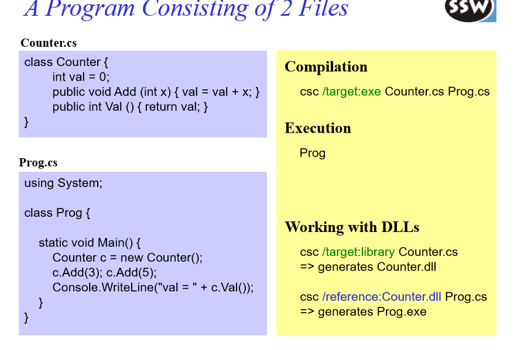

<style>

@font-face {
  font-family: 'TheRumIsGone';
  src: url('TheRumIsGone.ttf') format('truetype');
  font-weight: normal;
  font-style: normal;
}

body 
{
  counter-reset: h1;
}

h1 {
  counter-reset: h2;
  font-family: 'TheRumIsGone', serif;
  text-shadow: 2px 2px 4px #ccc;
}

h2 
{
  counter-reset: h3;
  border-bottom: 2px solid #ffa500;
}

h3 {
  counter-reset: h4;
}

h4 {
  font-size: 1.2rem;
}

h1::before {
  counter-increment: h1;
  content: counter(h1) ". ";
}
h2::before {
  counter-increment: h2;
  content: counter(h1) "." counter(h2) " ";
}
h3::before {
  counter-increment: h3;
  content: counter(h1) "." counter(h2) "." counter(h3) " ";
}
h4::before {
    counter-increment: h4;
    content: counter(h1) "." counter(h2) "." counter(h3) "." counter(h4) " ";
}
</style>

# Table of Contents

- [Table of Contents](#table-of-contents)
- [💾 Konzepte moderner Datenspeicherung](#-konzepte-moderner-datenspeicherung)
  - [🏗️ Entity Framework](#️-entity-framework)
    - [🧩 Basics](#-basics)
    - [🔍 LINQ](#-linq)
      - [LINQ on Objects](#linq-on-objects)
      - [Translation](#translation)
      - [Query Syntax](#query-syntax)
        - [7 Main LINQ Query Clauses](#7-main-linq-query-clauses)
    - [🧠 Lambda](#-lambda)
      - [Example](#example)
    - [📚 Collections](#-collections)
      - [Common Collection Types:](#common-collection-types)
      - [Why Use Collections?](#why-use-collections)
    - [🧰 Generics](#-generics)
      - [Why Use Generics?](#why-use-generics)
      - [Example: Generic List](#example-generic-list)
      - [Generic Class](#generic-class)
    - [⚔️ .NET vs .NET CORE](#️-net-vs-net-core)
      - [.NET Basics](#net-basics)
      - [🔍 Differences Between .NET Framework and .NET Core](#-differences-between-net-framework-and-net-core)
      - [🌐 Transition to .NET 5/6/7+](#-transition-to-net-567)
    - [🖨️ ORM Mapping](#️-orm-mapping)
      - [What is ORM?](#what-is-orm)
      - [Why Use ORM?](#why-use-orm)
      - [Example Mapping: Pirate Class to Table](#example-mapping-pirate-class-to-table)
      - [Common ORM Features](#common-orm-features)
  - [📦 Serialization](#-serialization)
    - [🔹 Serialization in C#](#-serialization-in-c)
      - [✅ Example: JSON Serialization using `System.Text.Json`](#-example-json-serialization-using-systemtextjson)
    - [🔸 Serialization in Java](#-serialization-in-java)
      - [✅ Example: JSON Serialization with Gson](#-example-json-serialization-with-gson)
    - [🔁 Comparison Table](#-comparison-table)
  - [XML](#xml)
    - [Markup](#markup)
    - [DTD and XML Schema](#dtd-and-xml-schema)
    - [XSL](#xsl)
    - [DOM](#dom)
    - [XML Parser](#xml-parser)
    - [Example XML Document](#example-xml-document)
    - [XML Declaration](#xml-declaration)
    - [Document Type Declaration (DTD)](#document-type-declaration-dtd)
    - [Elements](#elements)
    - [Attributes](#attributes)
    - [Entities](#entities)
    - [Comments](#comments)
    - [Namespaces](#namespaces)
    - [Well-Formed vs. Valid](#well-formed-vs-valid)
    - [DTD – Document Type Definition](#dtd--document-type-definition)
      - [Elemente](#elemente)
      - [Attribute](#attribute)
    - [XML Schema](#xml-schema)
      - [Grundlagen](#grundlagen)
      - [Schemadateien referenzieren](#schemadateien-referenzieren)
        - [Mit Namespaces](#mit-namespaces)
        - [Ohne Namespaces](#ohne-namespaces)
    - [Vergleich DTD vs. XML Schema](#vergleich-dtd-vs-xml-schema)
  - [Android Persistence](#android-persistence)


# 💾 Konzepte moderner Datenspeicherung

## 🏗️ Entity Framework

Entity Framework (EF) is an open source object–relational mapping (ORM) framework for ADO.NET. It was originally shipped as an integral part of .NET Framework, however starting with Entity Framework version 6.0 it has been delivered separately from the .NET Framework. 

---

### 🧩 Basics

- **ORM (Object-Relational Mapping):** Maps database tables to .NET classes and rows to objects.
- **DbContext:** The main class for interacting with the database, managing entity objects during runtime.
- **Entities:** Classes that represent tables in the database.
- **LINQ Queries:** Write queries using LINQ (Language Integrated Query) instead of SQL.
- **Migrations:** Track and apply database schema changes based on your model classes.

Entity Framework simplifies database operations and helps maintain a clean separation between your application code and database logic.

### 🔍 LINQ

Allows SQL-like queries in C#

- LINQ to **objects**
- LINQ to **XML**
- LINQ to **SQL**

LINQ is fully type checked!

#### LINQ on Objects

- Queries on Collections

``` csharp
// Example LINQ query on a collection of pirates
List<string> pirates = new List<string> { "Zoe", "Jack", "William", "Florence" };

// Query: select all pirates whose name starts with 'J'
var jPirates = from pirate in pirates
               where pirate.StartsWith("J")
               select pirate;

// Output the results
foreach (var pirate in jPirates)
{
    Console.WriteLine(pirate); // Output: Jack
}
```

#### Translation



#### Query Syntax

LINQ query syntax in C# is a declarative way to query collections (like arrays, lists, or databases). It resembles SQL and makes queries readable and expressive.

The basic structure of a LINQ query is:

```csharp
var result = from <range variable> in <data source>
             <query clauses>
             select <result>;
```

- **from:** Specifies the data source and introduces a range variable to iterate over it.
- **where:** Filters elements based on a condition.
- **select:** Projects each element into a new form (like picking fields or transforming data).

##### 7 Main LINQ Query Clauses

| Clause      | Description                                          | Example                                |
| ----------- | ---------------------------------------------------- | -------------------------------------- |
| **from**    | Introduces the data source and range variable        | `from p in pirates`                    |
| **where**   | Filters elements by a condition                      | `where p.StartsWith("J")`              |
| **select**  | Projects the result into a new form                  | `select p`                             |
| **orderby** | Sorts the elements by one or more keys               | `orderby p.Length descending`          |
| **group**   | Groups elements by a key                             | `group p by p[0] into g`               |
| **join**    | Joins two data sources based on matching keys        | `join b in bList on a.Id equals b.AId` |
| **let**     | Introduces a new range variable for a sub-expression | `let nameLength = p.Length`            |


### 🧠 Lambda

In C#, LINQ queries can also be written using **lambda expressions** and **method syntax**, which is often more concise and preferred for complex queries.

Instead of the SQL-like query syntax, you chain methods like `.Where()`, `.Select()`, `.OrderBy()`, etc., passing **lambda expressions** as arguments.

---

#### Example

Using the earlier example of pirates whose names start with "J":

```csharp
List<string> pirates = new List<string> { "Zoe", "Jack", "William", "Florence" };

var jPirates = pirates.Where(p => p.StartsWith("J"))
                      .Select(p => p);

foreach (var pirate in jPirates)
{
    Console.WriteLine(pirate);
}
```

### 📚 Collections

Collections in C# are data structures used to store, manage, and manipulate groups of related objects. They come in various forms to suit different needs—like lists, arrays, dictionaries, sets, and queues.

#### Common Collection Types:

| Collection      | Description                                          | Example Use Case                           |
|-----------------|------------------------------------------------------|--------------------------------------------|
| **Array**       | Fixed-size, strongly typed sequence of elements      | Storing a fixed number of crew members    |
| **List<T>**     | Dynamic array that can grow or shrink at runtime     | Managing your crew roster                   |
| **Dictionary<TKey, TValue>** | Key-value pairs for fast lookup               | Mapping ship parts to their specifications |
| **HashSet<T>**  | Collection of unique elements                         | Keeping track of unique bounty targets      |
| **Queue<T>**    | FIFO (First-In, First-Out) collection                 | Managing tasks or orders in sequence        |
| **Stack<T>**    | LIFO (Last-In, First-Out) collection                  | Undo operations or backtracking actions     |

#### Why Use Collections?

- Organize data logically and efficiently
- Support powerful operations (searching, sorting, filtering)
- Enable easy data manipulation and iteration

### 🧰 Generics

Generics in C# let you create flexible, reusable classes, methods, and data structures that work with any data type while maintaining type safety. Instead of writing separate code for each type (like `int`, `string`, or your custom `Laikan` classes), generics let you define a template that adapts to the type you specify.

#### Why Use Generics?

- **Type Safety:** Catch type errors at compile time, avoiding runtime surprises.
- **Code Reusability:** Write once, use for many types without duplication.
- **Performance:** Avoid boxing/unboxing with value types, leading to faster code.

---

#### Example: Generic List

```csharp
List<string> crewNames = new List<string>();
crewNames.Add("Zoe");
crewNames.Add("Jack");
```

#### Generic Class

``` csharp
public class CargoHold<T>
{
    private List<T> items = new List<T>();

    public void AddItem(T item)
    {
        items.Add(item);
    }

    public T GetItem(int index)
    {
        return items[index];
    }
}
```
You can create a `CargoHold` for any type:
``` csharp
CargoHold<string> foodHold = new CargoHold<string>();
CargoHold<int> ammoHold = new CargoHold<int>();
```

### ⚔️ .NET vs .NET CORE

#### .NET Basics


The **.NET Framework** and **.NET Core** are both development platforms from Microsoft used to build and run apps, but they target different needs and environments.

- **.NET Framework**: Released in the early 2000s, it is Windows-only and designed for building desktop and web applications.
- **.NET Core**: A cross-platform, open-source, and modernized version of .NET introduced in 2016. It is designed for performance, scalability, and cloud-based solutions.

With the release of **.NET 5+**, Microsoft unified the two into one platform — simply called **.NET** — carrying forward the best parts of both worlds.













#### 🔍 Differences Between .NET Framework and .NET Core

| Feature                  | .NET Framework                   | .NET Core                         |
|--------------------------|----------------------------------|----------------------------------|
| **Platform**             | Windows-only                     | Cross-platform (Windows, Linux, macOS) |
| **Open Source**          | Partially                        | Fully open-source (MIT/Apache)   |
| **Performance**          | Slower in some areas             | High-performance, optimized for modern workloads |
| **App Types**            | WinForms, WPF, ASP.NET           | Console, ASP.NET Core, Web APIs, Microservices |
| **Deployment**           | System-wide only                 | Can be self-contained or system-wide |
| **Versioning**           | Global install, version conflicts| Side-by-side installation supported |
| **Support**              | Long-term support for legacy apps| Active development and future-focused |
| **Unified Platform**     | No                               | Yes (from .NET 5 onward)         |

---

#### 🌐 Transition to .NET 5/6/7+

With the advent of **.NET 5 and later**, .NET Core became the **main** development platform, absorbing and improving upon the old framework. All new apps should target the latest .NET (now just ".NET"), unless there’s a legacy need to stick with the older Framework.


### 🖨️ ORM Mapping


#### What is ORM?

**ORM (Object-Relational Mapping)** is a programming technique used to convert data between incompatible systems — specifically between **object-oriented code** (like C# classes) and **relational databases** (like SQL tables).

ORM lets you work with your database using high-level objects instead of raw SQL queries. It simplifies data access and boosts productivity, especially in large applications.

---

#### Why Use ORM?

- 🔄 **Automatic Mapping**: Classes ↔ Tables, Properties ↔ Columns
- 🔐 **Type Safety**: Avoid SQL injection and data conversion errors
- 🚀 **Rapid Development**: Focus on code, not queries
- 🧰 **Maintainability**: Centralized models are easier to update

---

#### Example Mapping: Pirate Class to Table

```csharp
public class Pirate
{
    public int Id { get; set; }
    public string Name { get; set; }
    public string Ship { get; set; }
}
```
This might map to a SQL table like:

``` sql
CREATE TABLE Pirates 
(
    Id INT PRIMARY KEY,
    Name NVARCHAR(100),
    Ship NVARCHAR(100)
);
```

ORM frameworks (like Entity Framework) handle this conversion automatically.

#### Common ORM Features

| Feature             | Description                                     |
| ------------------- | ----------------------------------------------- |
| **Entity Mapping**  | Maps classes to database tables                 |
| **Change Tracking** | Detects changes to objects for database updates |
| **Lazy Loading**    | Loads related data only when accessed           |
| **Relationships**   | Handles foreign keys, navigation properties     |
| **Migrations**      | Tracks and applies schema changes over time     |


---

## 📦 Serialization

**Serialization** is the process of converting an object into a format that can be stored (like on disk) or transferred (like over a network). Common formats include **JSON**, **XML**, or **binary**.  
**Deserialization** is the reverse — turning that format back into a usable object in your code.

---

### 🔹 Serialization in C#

C# offers several ways to serialize data: `System.Text.Json`, `Newtonsoft.Json`, `XmlSerializer`, and the older `BinaryFormatter`.

#### ✅ Example: JSON Serialization using `System.Text.Json`

```csharp
using System.Text.Json;

public class Pirate
{
    public string Name { get; set; }
    public string Ship { get; set; }
}

// Serialize
Pirate p = new Pirate { Name = "Zoe", Ship = "DSS Hootsforce" };
string json = JsonSerializer.Serialize(p);

// Deserialize
Pirate deserialized = JsonSerializer.Deserialize<Pirate>(json);
```

``` json
{
  "Name":"Zoe",
  "Ship":"DSS Hootsforce"
}
```

### 🔸 Serialization in Java

Java uses ```ObjectOutputStream``` and the ```Serializable``` interface for binary serialization, or libraries like Gson and Jackson for JSON.

#### ✅ Example: JSON Serialization with Gson

``` java
import com.google.gson.Gson;

class Pirate {
    String name;
    String ship;
}

// Serialize
Gson gson = new Gson();
Pirate p = new Pirate();
p.name = "Zoe";
p.ship = "DSS Hootsforce";
String json = gson.toJson(p);

// Deserialize
Pirate deserialized = gson.fromJson(json, Pirate.class);
```

### 🔁 Comparison Table

| Feature            | C#                                        | Java                                   |
| ------------------ | ----------------------------------------- | -------------------------------------- |
| Built-in JSON libs | `System.Text.Json`, `Newtonsoft.Json`     | None by default (Gson, Jackson common) |
| XML Support        | `XmlSerializer`, `DataContractSerializer` | JAXB, XMLEncoder                       |
| Binary Format      | `BinaryFormatter` (obsolete)              | `ObjectOutputStream`, `Serializable`   |
| Needs Interface?   | No (for JSON/XML)                         | Yes (for binary: `Serializable`)       |
| Common JSON lib    | `Newtonsoft.Json`, `System.Text.Json`     | Gson, Jackson                          |


---

## XML

### Markup
Markup is information added to a document to enhance its semantic content, by tagging individual parts and defining how they relate to each other.  
_Source: http://www.wikipedia.org_

### DTD and XML Schema
Beyond the basic syntax rules of the markup language, you can require that documents conform to custom structural rules. XML first adopted the Document Type Definition (DTD) from SGML. Later, XML Schema Definitions (XSD) were introduced to provide stronger typing, namespaces, and richer validation.

### XSL
The Extensible Stylesheet Language (XSL) consists of three main parts:
- **XSLT (XSL Transformations):** Defines transformations from XML documents into other XML-based or text-based formats (e.g. HTML, plain text).
- **XSL-FO (Formatting Objects):** A formatting vocabulary (PDF-like) for paged output.
- **XPath:** A query language used by XSLT to navigate and select nodes in an XML document.

### DOM
The Document Object Model (DOM) is a tree-like in-memory representation of an XML (or HTML) document. The DOM API allows applications to dynamically read, modify, and navigate the document structure in a non-sequential way.

### XML Parser
An XML parser is a program that checks XML documents for syntactic correctness. A *validating* XML parser additionally checks against a DTD or XML Schema.

---

### Example XML Document

```xml
<?xml version="1.0" encoding="ISO-8859-1"?>
<!DOCTYPE TeilnehmerS SYSTEM "teilnehmer0.dtd">
<TeilnehmerS vorlesung="Einführung in XML">
  <Teilnehmer matrNr="4711">
    <nachname>Kulator</nachname>
    <vorname>Karl</vorname>
    <semester>6</semester>
    <fachb>16</fachb>
  </Teilnehmer>
  <Teilnehmer matrNr="4722">
    <nachname>Ralwasser</nachname>
    <vorname>Mina</vorname>
    <semester>8</semester>
    <fachb>17</fachb>
  </Teilnehmer>
</TeilnehmerS>
```

The first line is the XML declaration, indicating XML version 1.0 and character encoding ISO-8859-1.

`<TeilnehmerS>` and `<Teilnehmer>` are structural elements; `<nachname>` holds text content.

Attributes like `matrNr="..."` and `vorlesung="..."` provide additional information about elements.

### XML Declaration

The XML declaration (first line) should appear in every XML document. It may include:

- **version** (e.g. `"1.0"`) — specifies the XML version.
- **encoding** (e.g. `"UTF-8"`, `"ISO-8859-1"`) — specifies character encoding; defaults to UTF-8 if omitted.
- **standalone** (`"yes"` or `"no"`) — indicates whether external DTDs or schemas must be loaded.  
  If omitted and external declarations exist, it defaults to `"no"`.

### Document Type Declaration (DTD)

To use a DTD, declare it with one of these forms:

```xml
<!DOCTYPE root-element PUBLIC "name" "URL-of-DTD">
<!DOCTYPE root-element SYSTEM "URL-of-DTD">
```

Or embed the DTD inline:

```xml
<?xml version="1.0"?>
<!DOCTYPE root-element [
  <!ELEMENT root-element (child1, child2*)>
  <!ELEMENT child1 (#PCDATA)>
  <!ELEMENT child2 EMPTY>
]>
```

### Elements

- **Element names**: Can include letters, digits, hyphens (`-`), dots (`.`), and underscores (`_`).  
  **Must not** begin with a digit, hyphen, or dot.  
  Colons (`:`) are used to separate namespace prefixes.

- **Start tag**:  
  ```xml
  <elementName>
  ```

- **End tag**:  
  ```xml
  </elementName>
  ```

- **Empty elements** (self-closing):  
  ```xml
  <elementName/>
  ```

- **Content**: Can be plain text, child elements, or a mix of both.

- **Character data**: Special characters must be escaped using entities:  
  - `<` → `&lt;`  
  - `>` → `&gt;`  
  - `&` → `&amp;`

### Attributes

Attributes add metadata to elements. Syntax:

``` xml
<elementName attr1="value1" attr2='value2'/>
```

- Must use either single or double quotes.
- Provide identifiers, properties, or configuration for the element.

### Entities

- Like macros, **entities** let you assign identifiers to common strings.  
- **Predefined XML entities** include:  
  - `&lt;` for `<`  
  - `&gt;` for `>`  
  - `&amp;` for `&`  
  - `&quot;` for `"`  
  - `&apos;` for `'`  
- Custom entities can be defined in DTDs.

---

### Comments

- Comments are ignored by parsers and take this form:  
  ```xml
  <!-- This is a comment -->
  ```

---

### Namespaces

- Namespaces allow mixing elements from different vocabularies (e.g., MathML in HTML).  
- Declare a namespace with `xmlns`:  
  ```xml
  <bestellung
    xmlns:produkt="http://example.com/XML/produkt"
    xmlns:kunde="http://example.com/XML/kunde">
    <produkt:nummer>p49393</produkt:nummer>
    <kunde:name>Meier, Fritz</kunde:name>
  </bestellung>
  ```
- Elements in a namespace use the `prefix:localName` syntax.  
- The `xmlns:prefix="URI"` attribute binds the prefix to a namespace URI.

---

### Well-Formed vs. Valid

- **Well-formed**: The document follows XML syntax rules (properly nested tags, single root element, valid characters, etc.).  
- **Valid**: A well-formed document that also conforms to a DTD or XML Schema.  
- A **validating parser** checks both well-formedness and schema/DTD rules.  
- A **non-validating parser** checks only well-formedness.  
- XML documents that are **not well-formed** cannot be processed by most parsers.

### DTD – Document Type Definition

In einer DTD wird mit Hilfe einer erweiterten Backus-Naur-Form beschrieben, wie der Dokumentkörper eines XML-Dokuments aufgebaut sein muss – also welche Tag-Namen erlaubt sind, welche Elemente wie geschachtelt sein dürfen, welche Elemente welche Attribute haben dürfen usw.

---

#### Elemente

Das entscheidende Strukturprinzip in XML bilden die Elemente. Ein Element wird über seinen Namen identifiziert und hat einen definierten Inhalt:

```xml
<!ELEMENT Name Inhalt>
```

Der Inhalt eines Elements kann aus einer Kombination von anderen Elementen und/oder Text bestehen oder leer sein. Mögliche Kombinationen:

- **Sequenz**  
  ```xml
  <!ELEMENT Nachricht (Absender, Empfänger, Nachrichtentext)>
  ```
- **Option**  
  ```xml
  <!ELEMENT Nachrichtentext (Betreff?, Textkörper)>
  ```
- **Alternative**  
  ```xml
  <!ELEMENT Block (PARA | TABLE | IMG)>
  ```
- **Iteration**  
  ```xml
  <!ELEMENT Liste (Name, Item+)>
  <!ELEMENT Bus (Fahrgast*)>
  ```
- **Text-Inhalt**  
  ```xml
  <!ELEMENT Name (#PCDATA)>
  ```
- **Gemischter Inhalt**  
  ```xml
  <!ELEMENT PARA (#PCDATA | I | B | A)*>
  ```
- **Beliebiger Inhalt**  
  ```xml
  <!ELEMENT Divers ANY>
  ```
- **Leere Elemente**  
  ```xml
  <!ELEMENT BR EMPTY>
  ```

---

####  Attribute

Neben Inhalten können Elemente mit Attributen versehen werden. In der DTD definiert man Attributlisten so:

```xml
<!ATTLIST Bus
    Fahrzeugtyp CDATA #IMPLIED
    Kennzeichen  CDATA #REQUIRED>
```

Beispiel mit weiterem Element:

```xml
<!ATTLIST Fahrgast
    id          ID     #REQUIRED
    stammkunde  (ja | nein) "nein">
```

- **ID-Attribute**: Müssen eindeutig sein – keine zwei Fahrgast-Elemente dürfen dieselbe `id` haben.  
- **CDATA vs. PCDATA**:  
  - `CDATA` (character data) wird vom Parser **nicht** weiter analysiert (Markup-Zeichen in Attributwerten werden ignoriert).  
  - `#PCDATA` (parsable character data) wird im Element-Inhalt geparst und kann Entities enthalten.

### XML Schema

Die Nachteile von DTDs sind:  
- Keine Unterstützung von Namespaces  
- Sehr begrenzte Datentypen (z. B. keine Zahl-, Datumstypen)  
- DTDs sind selbst keine XML-Dokumente  

**XML Schema** (XSD) ist eine XML-basierte Sprache des W3C, die DTDs ablösen soll. Da XSD-Dokumente selbst XML sind, können sie mit denselben Werkzeugen verarbeitet werden (Parser, DOM, etc.).

---

#### Grundlagen

XSD-Dateien haben üblicherweise die Endung `.xsd`. Ein einfaches Schema sieht so aus:

```xml
<xsd:schema xmlns:xsd="http://www.w3.org/2001/XMLSchema">

  <xsd:annotation>
    <xsd:documentation xml:lang="de-DE">
      Dokumentation über das Schema
    </xsd:documentation>
  </xsd:annotation>

  <xsd:element name="x" type="xType"/>
  <!-- weitere Definitionen hier -->

</xsd:schema>
```

- `<xsd:annotation>` ist optional und enthält allgemeine Informationen zum Schema.  
- Der Namespace `http://www.w3.org/2001/XMLSchema` ist zwingend für alle XSD-Elemente.

---

#### Schemadateien referenzieren

##### Mit Namespaces

```xml
<?xml version="1.0"?>
<person 
  xmlns="http://www.mysite.com"
  xmlns:xsi="http://www.w3.org/2001/XMLSchema-instance"
  xsi:schemaLocation="http://www.mysite.com person.xsd">
  
  <fullname>Andreas Brachinger</fullname>
  <tel>+43 7412 52575513</tel>
</person>
```

- `xmlns` definiert den Standard-Namespace der Dokumentelemente.  
- `xmlns:xsi` bindet das Schema-Instance-Namespace.  
- `xsi:schemaLocation` ordnet Namespace und Schema-Datei-Pfad zu.

##### Ohne Namespaces

```xml
<?xml version="1.0"?>
<person 
  xmlns:xsi="http://www.w3.org/2001/XMLSchema-instance"
  xsi:noNamespaceSchemaLocation="person.xsd">
  
  <fullname>Andreas Brachinger</fullname>
  <tel>+43 7412 52575513</tel>
</person>
```

- `xsi:noNamespaceSchemaLocation` wird verwendet, wenn kein Namespace definiert ist.

---

### Vergleich DTD vs. XML Schema

**DTD-Definition:**

```xml
<!ELEMENT note     (to, from, heading, body)>
<!ELEMENT to       (#PCDATA)>
<!ELEMENT from     (#PCDATA)>
<!ELEMENT heading  (#PCDATA)>
<!ELEMENT body     (#PCDATA)>
```

**XSD-Definition:**

```xml
<?xml version="1.0"?>
<xs:schema 
    xmlns:xs="http://www.w3.org/2001/XMLSchema"
    targetNamespace="http://www.w3schools.com"
    xmlns="http://www.w3schools.com"
    elementFormDefault="qualified">

  <xs:element name="note">
    <xs:complexType>
      <xs:sequence>
        <xs:element name="to"      type="xs:string"/>
        <xs:element name="from"    type="xs:string"/>
        <xs:element name="heading" type="xs:string"/>
        <xs:element name="body"    type="xs:string"/>
      </xs:sequence>
    </xs:complexType>
  </xs:element>

</xs:schema>
```

**Erklärung:**  
- `xmlns:xs="http://www.w3.org/2001/XMLSchema"`: alle XSD-Elemente stammen aus diesem Namespace.  
- `targetNamespace="http://www.w3schools.com"`: Elemente im Schema gehören zu diesem Namespace.  
- `elementFormDefault="qualified"`: lokal definierte Elemente müssen das Schema-Namespace-Präfix verwenden (qualified).  

---

**Weitere Informationen und Beispiele** findest du unter:  
https://www.w3schools.com/xml/schema_intro.asp  


---

## Android Persistence

[View This Page](../Gestaltung%20von%20Web-%20und%20Mobilen%20Anwendungen/Gestaltung%20von%20Web-%20und%20Mobilen%20Anwendungen.html#databases)


<p style="page-break-before: always;"></p>
<script>
  document.addEventListener("DOMContentLoaded", function() {
    // Create the button
    const btn = document.createElement("a");
    btn.href = "../index.html";  // adjust your path
    btn.textContent = "🏠 Home";
    // Style it so it truly fixes to the viewport
    Object.assign(btn.style, {
      position: "fixed",
      bottom: "1rem",
      right: "1rem",
      backgroundColor: "#c0392b",
      color: "#ffffff",
      padding: "0.5rem 0.75rem",
      fontFamily: "Arial, sans-serif",
      fontSize: "0.9rem",
      textDecoration: "none",
      borderRadius: "0.5rem",
      boxShadow: "0 2px 6px rgba(0,0,0,0.3)",
      zIndex: "9999",
      transition: "background-color 0.2s ease, transform 0.2s ease",
      display: "inline-block",
    });
    // Hover effects
    btn.addEventListener("mouseover", () => {
      btn.style.backgroundColor = "#922b21";
      btn.style.transform = "translateY(-2px)";
    });
    btn.addEventListener("mouseout", () => {
      btn.style.backgroundColor = "#c0392b";
      btn.style.transform = "none";
    });
    // Append to the real <body>
    document.body.appendChild(btn);
  });
</script>