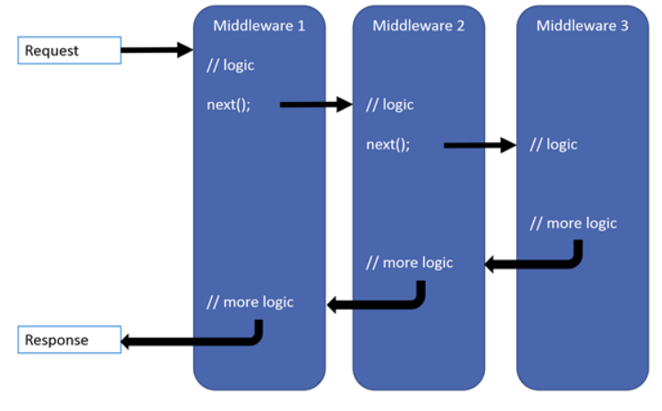
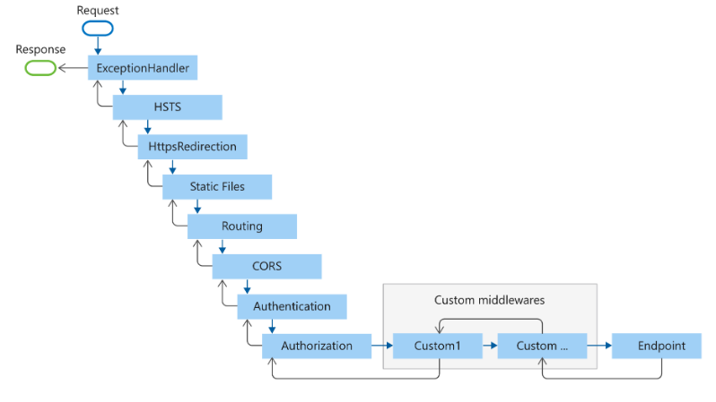
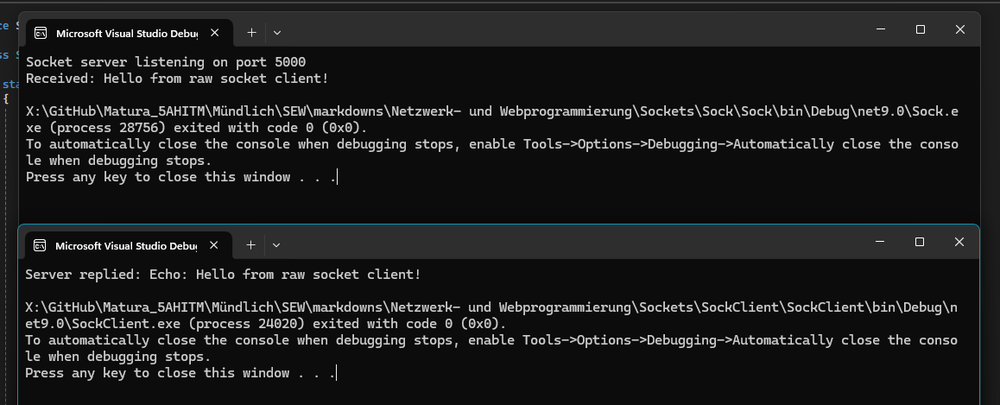
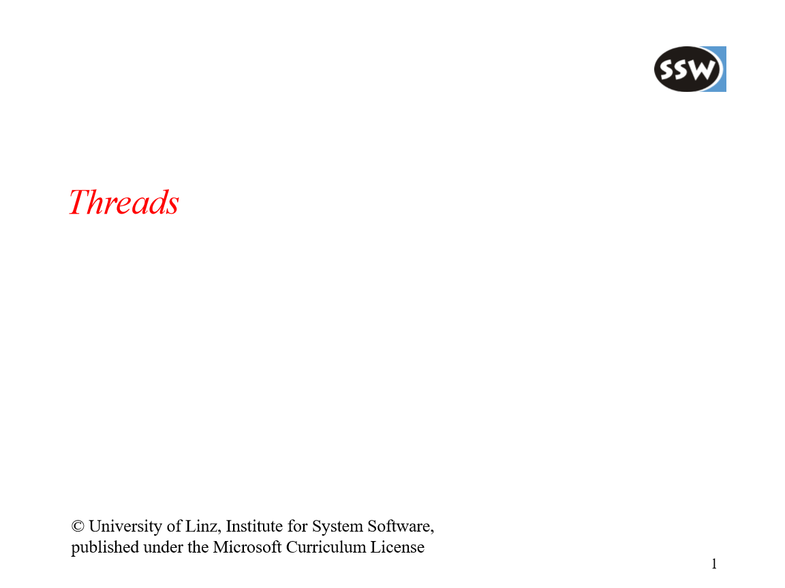
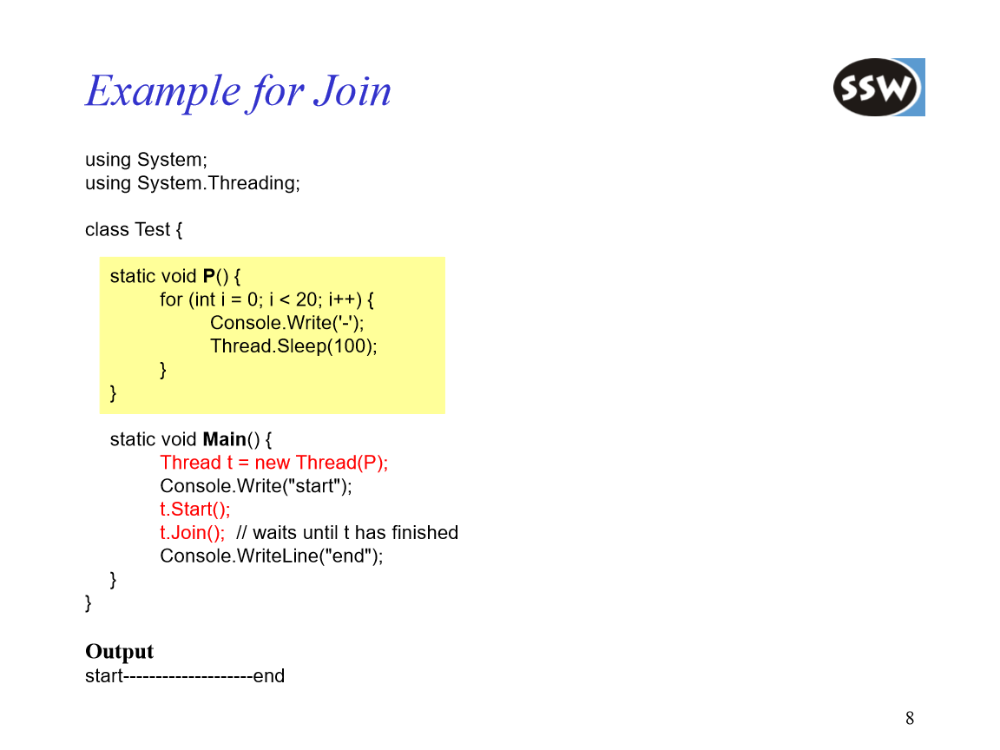
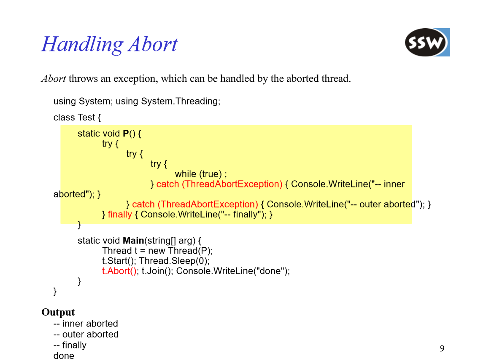
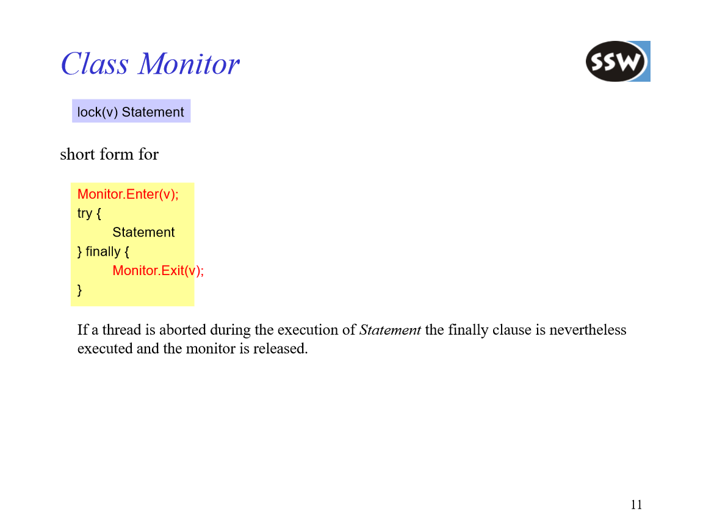
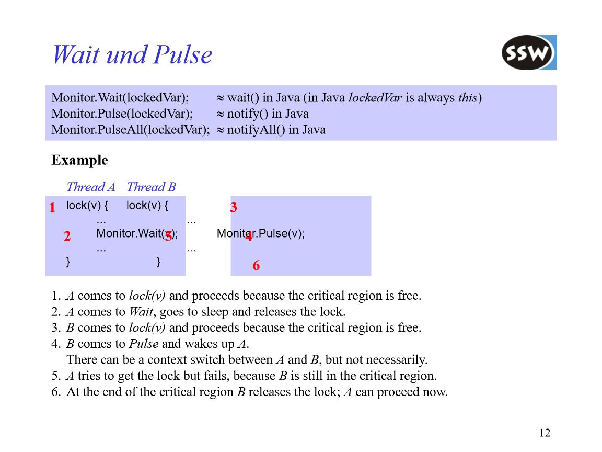
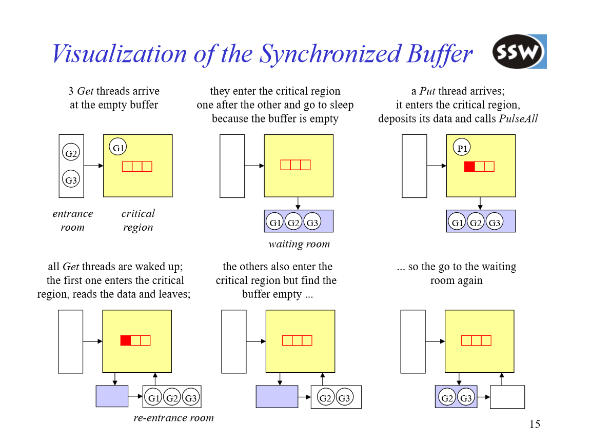

<style>

@font-face {
  font-family: 'TheRumIsGone';
  src: url('TheRumIsGone.ttf') format('truetype');
  font-weight: normal;
  font-style: normal;
}

body 
{
  counter-reset: h1;
}

h1 {
  counter-reset: h2;
  font-family: 'TheRumIsGone', serif;
  text-shadow: 2px 2px 4px #ccc;
}

h2 
{
  counter-reset: h3;
  border-bottom: 2px solid #ffa500;
}

h3 {
  counter-reset: h4;
}

h4 {
  font-size: 1.2rem;
}

h1::before {
  counter-increment: h1;
  content: counter(h1) ". ";
}
h2::before {
  counter-increment: h2;
  content: counter(h1) "." counter(h2) " ";
}
h3::before {
  counter-increment: h3;
  content: counter(h1) "." counter(h2) "." counter(h3) " ";
}
h4::before {
    counter-increment: h4;
    content: counter(h1) "." counter(h2) "." counter(h3) "." counter(h4) " ";
}

</style>

# Table of Contents

- [Table of Contents](#table-of-contents)
- [🌐 Netzwerk und Webprogrammierung](#-netzwerk-und-webprogrammierung)
  - [🖥️ Client–Server Model: Foundations of Modern Networking](#️-clientserver-model-foundations-of-modern-networking)
    - [🔄 Request–Response Pattern](#-requestresponse-pattern)
    - [🌐 Common Protocols \& Ports](#-common-protocols--ports)
    - [🏗️ Architecture Variants](#️-architecture-variants)
    - [✅ Advantages \& ❌ Disadvantages](#-advantages---disadvantages)
    - [🔐 Security \& Authentication](#-security--authentication)
    - [⚙️ Real-World Examples](#️-real-world-examples)
    - [🚀 Scaling \& Performance Optimization](#-scaling--performance-optimization)
    - [🔮 Future Trends: Microservices \& Serverless](#-future-trends-microservices--serverless)
  - [📡 REST API](#-rest-api)
    - [⚙️ Designing a RESTful Web Service](#️-designing-a-restful-web-service)
    - [🔄 SOAP vs. RESTful Web Services](#-soap-vs-restful-web-services)
  - [🌐 ASP.NET Core API](#-aspnet-core-api)
    - [📡 RestAPI](#-restapi)
      - [Terms](#terms)
      - [🔧 Common Attribute Examples](#-common-attribute-examples)
      - [🕹️ Controllers](#️-controllers)
        - [💡 Controller Example](#-controller-example)
      - [🔗 Dependency Injection in ASP.NET Core](#-dependency-injection-in-aspnet-core)
        - [⚙️ Registering Framework Services](#️-registering-framework-services)
        - [🛠️ Registering Custom Dependencies](#️-registering-custom-dependencies)
      - [🔄 Middleware Pipeline](#-middleware-pipeline)
        - [🚀 Adding Middleware](#-adding-middleware)
      - [🏠 Host in ASP.NET Core](#-host-in-aspnet-core)
      - [🛠️ Host / WebApplication Example](#️-host--webapplication-example)
      - [🚀 WebApplication Features](#-webapplication-features)
      - [📝 Logging in ASP.NET Core](#-logging-in-aspnet-core)
    - [⚙️ WebServer Configuration](#️-webserver-configuration)
      - [ASP.NET Core](#aspnet-core)
      - [XAMPP (Apache + PHP + MySQL)](#xampp-apache--php--mysql)
      - [General Web Server Essentials](#general-web-server-essentials)
    - [🧪 API Testing](#-api-testing)
      - [🧰 Postman](#-postman)
      - [🧭 Swagger / OpenAPI](#-swagger--openapi)
  - [🔌 Sockets](#-sockets)
    - [🟢 Java Sockets](#-java-sockets)
      - [TCP Server Example](#tcp-server-example)
      - [TCP Client Example](#tcp-client-example)
    - [🔵 C# Sockets](#-c-sockets)
      - [TCP Server Example (TcpListener)](#tcp-server-example-tcplistener)
      - [TCP Client Example (TcpClient)](#tcp-client-example-tcpclient)
      - [Low-Level: `Socket`](#low-level-socket)
        - [Raw Socket Server Example](#raw-socket-server-example)
        - [Raw Socket Client Example](#raw-socket-client-example)
  - [🧵 Threads](#-threads)
    - [🧠 Threading in C#](#-threading-in-c)
      - [🔄 Synchronization](#-synchronization)
      - [⏳ Tasks](#-tasks)
    - [☕ Threading in Java](#-threading-in-java)
      - [BankAccount with synchronized](#bankaccount-with-synchronized)
      - [Worker Runnables](#worker-runnables)
      - [Orchestrating in `main`](#orchestrating-in-main)
    - [⚙️ Thread Lifecycle](#️-thread-lifecycle)
    - [🔀 Concurrency vs. Parallelism](#-concurrency-vs-parallelism)
    - [🛡️ Thread Safety](#️-thread-safety)
    - [🔒 Synchronization Primitives](#-synchronization-primitives)
    - [🏊 Thread Pools \& Executors](#-thread-pools--executors)
    - [⏳ Asynchronous Programming](#-asynchronous-programming)
    - [📈 Parallel Libraries](#-parallel-libraries)
    - [💡 Best Practices](#-best-practices)
    - [⚠️ Common Pitfalls](#️-common-pitfalls)
    - [🧰 Diagnostics \& Profiling](#-diagnostics--profiling)
    - [🧵 Threads (Hofer)](#-threads-hofer)


# 🌐 Netzwerk und Webprogrammierung

## 🖥️ Client–Server Model: Foundations of Modern Networking

The Client–Server model underpins most network architectures today. Two primary roles exist:
1. **Client**  
   - **Initiator** of requests  
   - Frontend application (web browser, mobile app, desktop client)  
   - Sends requests and awaits responses  

2. **Server**  
   - **Listener** for incoming connections  
   - Hosts services, data, and resources  
   - Can handle many clients concurrently  

---

### 🔄 Request–Response Pattern

```text
                                          Client                 Server
                                            | —— (1) Request  ——> |
                                            |                     |
                                            | <—— (2) Response —— |
```
---

### 🌐 Common Protocols & Ports

| Protocol       | Default Port | Use Case                         |
|----------------|--------------|----------------------------------|
| HTTP / HTTPS   | 80 / 443     | Web pages, REST APIs             |
| FTP            | 21           | File transfer                    |
| SMTP           | 25           | Outgoing email                   |
| DNS            | 53           | Domain name resolution           |
| SSH            | 22           | Secure shell access              |
| MQTT           | 1883 / 8883  | IoT publish/subscribe messaging  |

---

### 🏗️ Architecture Variants

1. **Single-Threaded Server**  
   - Processes one request at a time.  
   - Simple, minimal resource use—but poor under heavy load.

2. **Multi-Threaded / Multi-Process**  
   - Spawns threads or processes per client.  
   - Improves parallelism; higher memory and context-switch cost.

3. **Event-Driven / Asynchronous**  
   - Uses a single thread with non-blocking I/O (e.g., Node.js, Nginx).  
   - Scales efficiently to thousands of small requests.

4. **Load Balancing & Clustering**  
   - Distributes traffic across multiple server instances.  
   - Provides high availability and horizontal scalability.

---

### ✅ Advantages & ❌ Disadvantages

| Advantages                                | Disadvantages                                    |
|-------------------------------------------|--------------------------------------------------|
| Clear separation of concerns              | Single point of failure (if unclustered)         |
| Centralized updates & maintenance         | Network latency can affect performance           |
| Vertical & horizontal scaling possible    | Complexity in clustering and data synchronization |
| Strong security controls (firewalls, ACLs)| Potential bottlenecks (DB, bandwidth)            |

---

### 🔐 Security & Authentication

- **TLS/SSL (e.g., TLS 1.2, TLS 1.3)**  
  Encrypts data in transit to prevent eavesdropping and tampering.  
- **OAuth 2.0 / JWT**  
  - OAuth 2.0 for delegated authorization.  
  - JSON Web Tokens carry signed payloads; stateless and scalable.  
- **API Keys / Basic Auth**  
  Simple but less secure—best for “trusted” internal clients.  
- **CORS (Cross-Origin Resource Sharing)**  
  Browser-enforced rules determining which domains may access APIs.

---

### ⚙️ Real-World Examples

- **Web Browser ↔ Web Server**  
  Apache, Nginx serving HTML/CSS/JS over HTTPS.  
- **Mobile App ↔ REST Backend**  
  JSON payloads via HTTPS; often paired with OAuth 2.0.  
- **IoT Sensor ↔ MQTT Broker**  
  Publish/Subscribe replace direct request–response for telemetry.  
- **Database Client ↔ DB Server**  
  JDBC/ODBC connections to SQL or NoSQL databases.

---

### 🚀 Scaling & Performance Optimization

1. **Vertical Scaling**  
   Increase CPU, RAM, or I/O capacity on a single server.  
2. **Horizontal Scaling**  
   Add more server instances behind a load balancer.  
3. **Caching Layers**  
   Use Redis or Memcached to store frequent query results.  
4. **Content Delivery Network (CDN)**  
   Distribute static assets geographically closer to clients.

---

### 🔮 Future Trends: Microservices & Serverless

- **Microservices**  
  Many small, domain-specific services communicate via lightweight protocols (e.g., gRPC, REST).  
- **Serverless (FaaS)**  
  Developers deploy functions; cloud provider auto-scales and bills per execution.

---

## 📡 REST API

Roy Fielding identified five architectural constraints in his 2000 dissertation, collectively known as Representational State Transfer (REST):

1. **Addressable Resources**  
   - Every resource is uniquely addressable via a URI (e.g., `/employees`, `/orders/123`).

2. **Uniform, Constrained Interface**  
   - A limited, standardized set of operations (HTTP methods) for manipulating resources:
     - **GET** 
       - Retrieve a resource
       - Safe and idempotent (does not change state)
     - **PUT** 
       - Create or update a resource at the given URI
       - Idempotent (multiple identical requests yield the same state) 
     - **POST** 
       - Create a new subordinate resource under the target URI
       - Not idempotent (each request creates a new resource).  
     - **DELETE** 
       - Remove a resource.  
     - **HEAD** 
       - Same as GET, but only returns headers and status codes.  
     - **OPTIONS**
       -  Returns the HTTP methods supported by a resource.

3. **Representation-Oriented**  
   - Clients and servers exchange representations of resources (not the raw objects themselves).  
   - Common formats include JSON, XML, and YAML.  
   - The `Content-Type` header indicates the format of the response; the `Accept` header lets clients request a preferred format.

4. **Stateless Communication**  
   - Each request from client to server must contain all the information needed to understand and process the request.  
   - No client session state is stored on the server between requests, which improves scalability and simplifies recovery.

5. **Hypermedia As The Engine Of Application State (HATEOAS)**  
   - Resource representations include hyperlinks to related resources and allowable operations, guiding clients through application workflows.

---

### ⚙️ Designing a RESTful Web Service

1. **Define Your Domain Model**  
   - Identify the key entities (e.g., Employees, LogbookEntries, Orders).

2. **Model Your URIs**  
   - Collection endpoints:  
     - `/employees` → all employees  
     - `/logbookentries` → all logbook entries  
   - Item endpoints:  
     - `/employees/{id}` → a single employee  
     - `/logbookentries/{id}` → a single logbook entry  
   - Nested relationships:  
     - `/employees/{id}/logbookentries` → all logbook entries for a specific employee

---

### 🔄 SOAP vs. RESTful Web Services

**Advantages of RESTful Services**  
- Simpler to implement—no heavy WSDL or SOAP stacks.  
- Clients need only a basic HTTP library.  
- Multiple representations supported (JSON, XML, etc.).  
- Responses can be cached (via HTTP caching mechanisms).

**Disadvantages of RESTful Services**  
- No standardized data representation, leading to custom parsing/generation.  
- Lacks built-in WS-* standards (WS-Security, WS-Transactions).  
- Complex payloads may require extra handling on client and server sides.

Choosing between SOAP and REST depends on the use case:  
- Use SOAP when you need formal contracts, built-in WS-* support, and strict enterprise features.  
- Use REST when you prioritize simplicity, scalability, and lightweight clients.


## 🌐 ASP.NET Core API


### 📡 RestAPI

#### Terms

- **Controller**
  - handles multiple requests/actions in a specific domain e.g. `WeatherForecastController`
- **Action**
  - is a single endpoint that can handle requests
- Typically a **Controller** includes **multiple actions**

---

#### 🔧 Common Attribute Examples

- `[HttpPost]`  
  - Configures an action method to handle HTTP POST requests.
- `[Route("...")]`  
  - Defines the URL pattern for a controller or its action.
- `[Consumes("...")]`  
  - Specifies which content types an action can accept (e.g., `application/xml`, `application/x-www-form-urlencoded`).

---

#### 🕹️ Controllers

- Controller classes **must** end with the `Controller` suffix (e.g., `WeatherController`).
- They **inherit** from `ControllerBase` (or `Controller` for MVC with views).
- Contain action methods mapped to different HTTP endpoints.
- Typically organized around a specific domain or resource set.

---

##### 💡 Controller Example

```csharp
[ApiController]
[Route("[controller]")]
public class WeatherForecastController : ControllerBase
{
    // GET /WeatherForecast
    [HttpGet]
    public IEnumerable<WeatherForecast> Get() { … }

    // POST /WeatherForecast
    [HttpPost]
    public IActionResult Create([FromBody] WeatherForecast forecast) { … }
}
```

- `[ApiController]` enables API-specific behaviors:
  
- Attribute routing is required (no UseMvc attribute routing).

- Automatic` HTTP 400` responses for model validation failures.

- Binding source inference for action parameters (e.g., ``[FromBody]``, ``[FromForm]``, `[FromHeader]`,` [FromServices]`).

- `[Route("[controller]")]` exposes the controller at `/WeatherForecast` (controller name minus “Controller”).

#### 🔗 Dependency Injection in ASP.NET Core

ASP.NET Core relies on a built-in DI container to manage services and their lifetimes. During startup, you configure services using the `builder.Services` collection.

##### ⚙️ Registering Framework Services
```csharp
var builder = WebApplication.CreateBuilder(args);

// Adds controller support
builder.Services.AddControllers();

// Adds EF Core DbContext
builder.Services.AddDbContext<MyDbContext>(options => …);
```

##### 🛠️ Registering Custom Dependencies
1. Define an interface and concrete implementation:
   ```csharp
   public interface IMyDependency { /* … */ }
   public class MyDependency : IMyDependency { /* … */ }
   ```
2. Register in the DI container with the desired lifetime:
   ```csharp
   // Transient: a new instance every time it’s requested
   builder.Services.AddTransient<IMyDependency, MyDependency>();

   // Scoped: one instance per HTTP request
   builder.Services.AddScoped<IMyDependency, MyDependency>();

   // Singleton: one instance for the application’s lifetime
   builder.Services.AddSingleton<IMyDependency, MyDependency>();
   ```

---

#### 🔄 Middleware Pipeline

ASP.NET Core processes each incoming HTTP request through a chain of **middleware** components. Each middleware can either:

1. Perform work **before** and/or **after** invoking the next component  
2. Short-circuit and terminate the pipeline

##### 🚀 Adding Middleware
```csharp
var app = builder.Build();

app.UseHttpsRedirection();    // Redirect HTTP → HTTPS
app.UseRouting();             // Route matching
app.UseAuthentication();      // Authenticate users
app.UseAuthorization();       // Enforce authorization policies

app.MapControllers();         // Map controller endpoints

app.Run();
```

Each `Use…` call inserts a middleware into the pipeline in the defined order.




#### 🏠 Host in ASP.NET Core

The **Host** encapsulates all core resources and services required to run an ASP.NET Core application:
- **HTTP server implementation** (Kestrel, IIS integration)  
- **Middleware pipeline**  
- **Logging**  
- **Dependency Injection services**  
- **Configuration** sources  

Most commonly you use the **WebApplication** host.

---

#### 🛠️ Host / WebApplication Example

```csharp
using Microsoft.AspNetCore.Mvc;

var builder = WebApplication.CreateBuilder(args);

// Register services
builder.Services.AddControllers();

var app = builder.Build();

// Configure middleware
app.UseHttpsRedirection();
app.UseAuthorization();

// Map endpoints
app.MapControllers();

// Start the app
app.Run();
```

---

#### 🚀 WebApplication Features

- **Web server**: Kestrel by default, with optional IIS integration  
- **Configuration sources** (in precedence order):  
  - `appsettings.json`  
  - Environment variables  
  - Command-line arguments  

---

#### 📝 Logging in ASP.NET Core

ASP.NET Core includes a built-in logging API that works with multiple providers (Console, Debug, Azure, Windows, etc.). Configure during host build:

```csharp
var builder = WebApplication.CreateBuilder(args);
builder.Logging.AddConsole();
```

This enables structured logging throughout your application via `ILogger<T>`.

---

### ⚙️ WebServer Configuration

#### ASP.NET Core
- **Kestrel Server**  
    - Default cross-platform HTTP server.  
    - Configure endpoints in `appsettings.json` or code:
      
        ```json
        // appsettings.json
        {
          "Kestrel": {
            "Endpoints": {
              "Http": { "Url": "http://*:5000" },
              "Https": { "Url": "https://*:5001", "Certificate": { "Path": "cert.pfx", "Password": "…" } }
            }
          }
        }
        ```
    - Or in code:
      
        ```csharp
        builder.WebHost.ConfigureKestrel(options =>
        {
            options.ListenAnyIP(5000);
            options.ListenAnyIP(5001, listenOptions =>
                listenOptions.UseHttps("cert.pfx", "password"));
        });
        ```

- **IIS Integration**  
    - Install the ASP.NET Core Hosting Bundle.  
    - `web.config` auto-generated to forward to Kestrel.

- **Launch Settings**  
    - `Properties/launchSettings.json` defines profiles, application URLs, environment variables.

- **Reverse Proxy**  
    - Often fronted by Nginx or Apache.  
    - Example Nginx block:
      
        ```nginx
        server {
            listen 80;
            server_name example.com;
            location / {
                proxy_pass         http://localhost:5000;
                proxy_http_version 1.1;
                proxy_set_header   Upgrade $http_upgrade;
                proxy_set_header   Connection keep-alive;
                proxy_set_header   Host $host;
            }
        }
        ```

---

#### XAMPP (Apache + PHP + MySQL)
- **Apache Configuration (`httpd.conf`)**  
    - `Listen 80` (or custom port).  
    - `DocumentRoot "C:/xampp/htdocs"` and `<Directory>` settings for permissions.  
- **Virtual Hosts (`extra/httpd-vhosts.conf`)**  
    - Define `<VirtualHost *:80>` blocks for multiple sites.  
- **PHP (`php.ini`)**  
    - Enable/disable extensions, adjust `memory_limit`, `upload_max_filesize`.  
- **MySQL (`my.ini`)**  
    - Port, buffer sizes, character sets.  
- **Control Panel**  
    - Start/stop Apache, MySQL, manage ports and services.

---

#### General Web Server Essentials
- **Virtual Hosting**  
    - Host multiple domains on one IP via name-based or IP-based vhosts.
- **Firewalls & Ports**  
    - Open only required ports (e.g., 80, 443).  
    - Use `ufw`/`firewalld` or cloud security groups.
- **SSL/TLS**  
    - Obtain certificates from Let’s Encrypt or a CA.  
    - Automate renewal (Certbot, ACME clients).
- **Performance Tuning**  
    - Enable Keep-Alive, gzip/deflate compression.  
    - Use HTTP/2 where supported.  
    - Implement caching headers (Cache-Control, ETag).
- **Security Best Practices**  
    - Disable directory listing.  
    - Harden headers (HSTS, X-Frame-Options, Content-Security-Policy).  
    - Regularly update server software.
- **Logging & Monitoring**  
    - Access/error logs (rotate with `logrotate`).  
    - Use tools like Prometheus, Grafana, ELK stack for metrics and alerts.

---

### 🧪 API Testing

#### 🧰 Postman  
- **Environment Management**  
  - Create named environments (e.g., Development, Staging, Production) with variable sets (`{{baseUrl}}`, `{{authToken}}`).  
- **Collections & Folders**  
  - Group related requests into Collections and Folders for organization and sharing.  
- **Request Building**  
  - Define method, URL, headers, query params, body (raw JSON, form-data, x-www-form-urlencoded).  
  - Use pre-request scripts (JavaScript) to set variables, generate tokens, or compute timestamps.  
  - Use test scripts to validate responses (status codes, JSON schema, value assertions).  
- **Automation & CI**  
  - Export Collections/Environments as JSON and run via Newman CLI in pipelines.  
  - Generate detailed HTML/JSON reports.  

#### 🧭 Swagger / OpenAPI  
- **API Documentation**  
  - Use Swashbuckle in ASP.NET Core:  
    ```csharp
    builder.Services.AddSwaggerGen(c =>
    {
        c.SwaggerDoc("v1", new() { Title = "My API", Version = "v1" });
    });
    ```
  - In `Program.cs`:  
    ```csharp
    app.UseSwagger();
    app.UseSwaggerUI(c =>
    {
        c.SwaggerEndpoint("/swagger/v1/swagger.json", "My API v1");
        c.RoutePrefix = ""; // serve UI at root
    });
    ```  
- **Interactive Console**  
  - Automatically generate UI at `/swagger` or `/` for exploring endpoints, schemas, and example payloads.  
- **Contract-First / Code-First**  
  - **Code-First**: Decorate controllers/models with attributes (`[ApiController]`, XML comments).  
  - **Contract-First**: Import a pre-defined OpenAPI spec file.  
- **Client Generation**  
  - Generate strongly-typed client SDKs (C#, TypeScript, Java) via `NSwag` or `AutoRest`.  
- **Versioning**  
  - Support multiple API versions (`/swagger/v1/swagger.json`, `/swagger/v2/swagger.json`).  


---

## 🔌 Sockets

Sockets provide low-level network communication over TCP/UDP. 

### 🟢 Java Sockets

Java’s `java.net` package offers `ServerSocket`/`Socket` for TCP. A server listens on a port and accepts incoming connections; a client connects and exchanges streams.

#### TCP Server Example

```java
import java.io.*;
import java.net.*;

public class TcpServer
{
    public static void main(String[] args)
    {
        int port = 5000;
        try
        {
            ServerSocket serverSocket = new ServerSocket(port);
            System.out.println("Server listening on port " + port);

            Socket clientSocket = serverSocket.accept();
            BufferedReader in = new BufferedReader(
                new InputStreamReader(clientSocket.getInputStream()));
            PrintWriter out = new PrintWriter(
                clientSocket.getOutputStream(), true);

            String msg;
            while ((msg = in.readLine()) != null)
            {
                System.out.println("Received: " + msg);
                out.println("Echo: " + msg);
            }

            in.close();
            out.close();
            clientSocket.close();
            serverSocket.close();
        }
        catch (IOException e)
        {
            e.printStackTrace();
        }
    }
}
```

- **ServerSocket** binds to `port` and waits in `accept()`.  
- **BufferedReader/PrintWriter** wrap the socket’s I/O streams for line-based communication.  
- The loop reads each line, prints it, and echoes it back until the client disconnects.

#### TCP Client Example

```java
import java.io.*;
import java.net.*;

public class TcpClient
{
    public static void main(String[] args)
    {
        String host = "localhost";
        int port = 5000;

        try
        {
            Socket socket = new Socket(host, port);
            BufferedReader in = new BufferedReader(
                new InputStreamReader(socket.getInputStream()));
            PrintWriter out = new PrintWriter(
                socket.getOutputStream(), true);

            out.println("Hello from client!");
            System.out.println("Server replied: " + in.readLine());

            in.close();
            out.close();
            socket.close();
        }
        catch (IOException e)
        {
            e.printStackTrace();
        }
    }
}
```

- **Socket** connects to server’s `host` and `port`.  
- Sends a line with `println()`, then reads the server’s response.

---

### 🔵 C# Sockets

C#’s `System.Net.Sockets` namespace provides both low-level `Socket` and higher-level `TcpListener`/`TcpClient` classes. Below using `TcpListener` and `TcpClient`.

#### TCP Server Example (TcpListener)

```csharp
using System;
using System.Net;
using System.Net.Sockets;
using System.Text;

class TcpServer
{
    static void Main()
    {
        int port = 5000;
        TcpListener listener = new TcpListener(IPAddress.Any, port);
        listener.Start();
        Console.WriteLine($"Server listening on port {port}");

        TcpClient client = listener.AcceptTcpClient();
        NetworkStream stream = client.GetStream();

        byte[] buffer = new byte[1024];
        int bytesRead = stream.Read(buffer, 0, buffer.Length);
        string msg = Encoding.UTF8.GetString(buffer, 0, bytesRead);
        Console.WriteLine("Received: " + msg);

        byte[] response = Encoding.UTF8.GetBytes("Echo: " + msg);
        stream.Write(response, 0, response.Length);

        stream.Close();
        client.Close();
        listener.Stop();
    }
}
```

- **TcpListener** listens on the specified port and accepts one client.  
- **NetworkStream** reads raw bytes into a buffer, then writes the echo response.

#### TCP Client Example (TcpClient)

```csharp
using System;
using System.Net.Sockets;
using System.Text;

class TcpClientDemo
{
    static void Main()
    {
        string host = "localhost";
        int port = 5000;

        TcpClient client = new TcpClient(host, port);
        NetworkStream stream = client.GetStream();

        byte[] data = Encoding.UTF8.GetBytes("Hello from client!");
        stream.Write(data, 0, data.Length);

        byte[] buffer = new byte[1024];
        int bytesRead = stream.Read(buffer, 0, buffer.Length);
        Console.WriteLine("Server replied: " + Encoding.UTF8.GetString(buffer, 0, bytesRead));

        stream.Close();
        client.Close();
    }
}
```

- **TcpClient** connects to the server; **NetworkStream** handles sending and receiving raw byte arrays.  
- Always close streams and clients to free resources.


#### Low-Level: `Socket`

For finer control, use the `Socket` class directly.

##### Raw Socket Server Example

```csharp
using System;
using System.Net;
using System.Net.Sockets;
using System.Text;

class SocketServer
{
    static void Main()
    {
        IPAddress ip = IPAddress.Any;
        int port = 5000;

        Socket listener = new Socket(
            AddressFamily.InterNetwork,
            SocketType.Stream,
            ProtocolType.Tcp
        );
        listener.Bind(new IPEndPoint(ip, port));
        listener.Listen(5);
        Console.WriteLine($"Socket server listening on port {port}");

        Socket client = listener.Accept();
        byte[] buffer = new byte[1024];
        int received = client.Receive(buffer);
        string msg = Encoding.UTF8.GetString(buffer, 0, received);
        Console.WriteLine("Received: " + msg);

        byte[] response = Encoding.UTF8.GetBytes("Echo: " + msg);
        client.Send(response);

        client.Close();
        listener.Close();
    }
}
```

##### Raw Socket Client Example

```csharp
using System;
using System.Net;
using System.Net.Sockets;
using System.Text;

class SocketClient
{
    static void Main()
    {
        IPAddress ip = IPAddress.Loopback;
        int port = 5000;

        Socket client = new Socket(
            AddressFamily.InterNetwork,
            SocketType.Stream,
            ProtocolType.Tcp
        );
        client.Connect(new IPEndPoint(ip, port));

        byte[] data = Encoding.UTF8.GetBytes("Hello from raw socket client!");
        client.Send(data);

        byte[] buffer = new byte[1024];
        int received = client.Receive(buffer);
        Console.WriteLine("Server replied: " + Encoding.UTF8.GetString(buffer, 0, received));

        client.Close();
    }
}
```

- **TcpListener/TcpClient** simplify setup by wrapping `Socket`.  
- **Socket** gives full control: you manually bind, listen, accept, connect, send, and receive raw byte arrays.  
- Always close sockets/streams to free resources.




---

## 🧵 Threads

### 🧠 Threading in C#

In C#, you can use both low-level `Thread` or the higher-level `Task`/async model. In our **BuchiBank** example, we leverage `async Task` combined with locks for safe concurrency.

#### 🔄 Synchronization

We use a private lock object to guard critical sections in `BankAccount`:

```csharp
public class BankAccount
{
    private readonly object _lock = new();

    public async Task Deposit(double amount)
    {
        await Task.Run(() =>
        {
            lock (_lock)
            {
                Balance += amount;
                TransactionHistory.Add(
                    new Transaction(DateTime.UtcNow, amount, TransactionType.Incoming));
            }
        });
    }

    public async Task<bool> Withdraw(double amount)
    {
        return await Task.Run(() =>
        {
            lock (_lock)
            {
                if (amount > Balance)
                {
                    return false;
                }

                Balance -= amount;
                TransactionHistory.Add(
                    new Transaction(DateTime.UtcNow, amount, TransactionType.Outgoing));
                return true;
            }
        });
    }
}
```

- `lock (_lock)` ensures only one thread mutates `Balance` or `TransactionHistory` at a time.
- Without it, two workers could interleave and corrupt the account state.

#### ⏳ Tasks

Workers inherit from an abstract `Worker` and run repeatedly via `Task`:

```csharp
public abstract class Worker
{
    public BankAccount Account { get; }
    public int WaitTime { get; }

    public Worker(BankAccount account, int waitTime)
    {
        Account   = account;
        WaitTime  = waitTime;
    }

    public async Task RunForDurationAsync(int seconds)
    {
        var stopwatch = Stopwatch.StartNew();

        while (stopwatch.Elapsed.TotalSeconds < seconds)
        {
            await Action();
            await Task.Delay(WaitTime * 1000);
        }
    }

    public abstract Task Action();
}
```

- `RunForDurationAsync` spins until the elapsed time exceeds the target.
- `Action()` is implemented by `Depositer` and `Withdrawer`, using `await Account.Deposit(...)` or `await Account.Withdraw(...)`.
- `Task.WhenAll(...)` in `Main` runs both workers concurrently and waits for them to finish.

---

### ☕ Threading in Java

In Java you can use `Thread` or `ExecutorService`. Here’s an analogous bank-account example with `synchronized` methods and `Runnable` workers.

#### BankAccount with synchronized

```java
public class BankAccount
{
    private double balance = 0.0;

    public synchronized void deposit(double amount)
    {
        balance += amount;
        System.out.println("Deposited " + amount + ", balance is now " + balance);
    }

    public synchronized boolean withdraw(double amount)
    {
        if (amount > balance)
        {
            System.out.println("Withdraw failed: " + amount + ", balance is " + balance);
            return false;
        }

        balance -= amount;
        System.out.println("Withdrew " + amount + ", balance is now " + balance);
        return true;
    }

    public double getBalance()
    {
        return balance;
    }
}
```

#### Worker Runnables

```java
public class Depositer implements Runnable
{
    private final BankAccount account;
    private final int waitMillis;

    public Depositer(BankAccount account, int waitMillis)
    {
        this.account    = account;
        this.waitMillis = waitMillis;
    }

    @Override
    public void run()
    {
        long end = System.currentTimeMillis() + 10_000;
        while (System.currentTimeMillis() < end)
        {
            double amount = Math.random() * 100;
            account.deposit(amount);
            try
            {
                Thread.sleep(waitMillis);
            }
            catch (InterruptedException e)
            {
                Thread.currentThread().interrupt();
            }
        }
    }
}

public class Withdrawer implements Runnable
{
    private final BankAccount account;
    private final int waitMillis;

    public Withdrawer(BankAccount account, int waitMillis)
    {
        this.account    = account;
        this.waitMillis = waitMillis;
    }

    @Override
    public void run()
    {
        long end = System.currentTimeMillis() + 10_000;
        while (System.currentTimeMillis() < end)
        {
            double amount = Math.random() * 100;
            account.withdraw(amount);
            try
            {
                Thread.sleep(waitMillis);
            }
            catch (InterruptedException e)
            {
                Thread.currentThread().interrupt();
            }
        }
    }
}
```

#### Orchestrating in `main`

```java
public class Main
{
    public static void main(String[] args)
    {
        BankAccount account = new BankAccount();

        Thread t1 = new Thread(new Depositer(account, 2000));
        Thread t2 = new Thread(new Withdrawer(account, 1000));

        t1.start();
        t2.start();

        try
        {
            t1.join();
            t2.join();
        }
        catch (InterruptedException e)
        {
            Thread.currentThread().interrupt();
        }

        System.out.println("Final balance: " + account.getBalance());
    }
}
```

- `synchronized` ensures only one thread can enter the deposit/withdraw method at a time.
- `Thread.sleep(...)` simulates work delay.
- `join()` waits for both threads to complete before printing the final balance.


### ⚙️ Thread Lifecycle
- States: New, Runnable, Running, Blocked/Waiting, Terminated

### 🔀 Concurrency vs. Parallelism
- Concurrency: interleaving tasks on one or more cores  
- Parallelism: truly simultaneous execution on multiple cores

### 🛡️ Thread Safety
- Race conditions, deadlocks, livelocks  
- Immutability and reentrancy  

### 🔒 Synchronization Primitives
- Locks (`lock`/`Monitor`, `synchronized`)  
- Mutexes, Semaphores, ReaderWriterLock  
- `volatile`, `Interlocked` operations

### 🏊 Thread Pools & Executors
- .NET `ThreadPool` / `TaskScheduler`  
- Java `ExecutorService`, `ForkJoinPool`

### ⏳ Asynchronous Programming
- `async`/`await` (C#) vs. `CompletableFuture` / `Future` (Java)  
- Event-driven callbacks, reactive streams

### 📈 Parallel Libraries
- .NET Parallel LINQ (PLINQ), `Parallel.For`  
- Java `Stream.parallel()`, `ForkJoinTask`

### 💡 Best Practices
- Keep tasks small and stateless  
- Prefer high-level abstractions (`Task`/`ExecutorService`)  
- Always clean up threads/tasks

### ⚠️ Common Pitfalls
- Thread starvation, priority inversion  
- Blocking in async code  
- Over-threading vs. under-threading

### 🧰 Diagnostics & Profiling
- .NET `dotnet-trace`, Visual Studio Concurrency Visualizer  
- Java Flight Recorder, Thread Dump analysis

### 🧵 Threads (Hofer)














---

<p style="page-break-before: always;"></p>
<script>
  document.addEventListener("DOMContentLoaded", function() {
    // Create the button
    const btn = document.createElement("a");
    btn.href = "../index.html";  // adjust your path
    btn.textContent = "🏠 Home";
    // Style it so it truly fixes to the viewport
    Object.assign(btn.style, {
      position: "fixed",
      bottom: "1rem",
      right: "1rem",
      backgroundColor: "#c0392b",
      color: "#ffffff",
      padding: "0.5rem 0.75rem",
      fontFamily: "Arial, sans-serif",
      fontSize: "0.9rem",
      textDecoration: "none",
      borderRadius: "0.5rem",
      boxShadow: "0 2px 6px rgba(0,0,0,0.3)",
      zIndex: "9999",
      transition: "background-color 0.2s ease, transform 0.2s ease",
      display: "inline-block",
    });
    // Hover effects
    btn.addEventListener("mouseover", () => {
      btn.style.backgroundColor = "#922b21";
      btn.style.transform = "translateY(-2px)";
    });
    btn.addEventListener("mouseout", () => {
      btn.style.backgroundColor = "#c0392b";
      btn.style.transform = "none";
    });
    // Append to the real <body>
    document.body.appendChild(btn);
  });
</script>