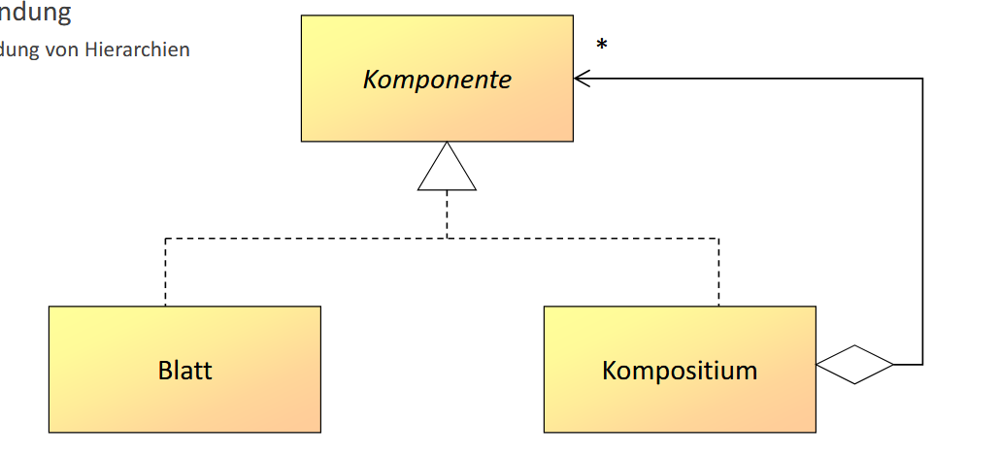
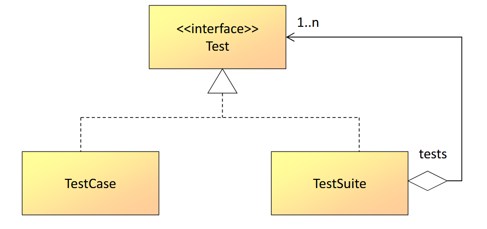
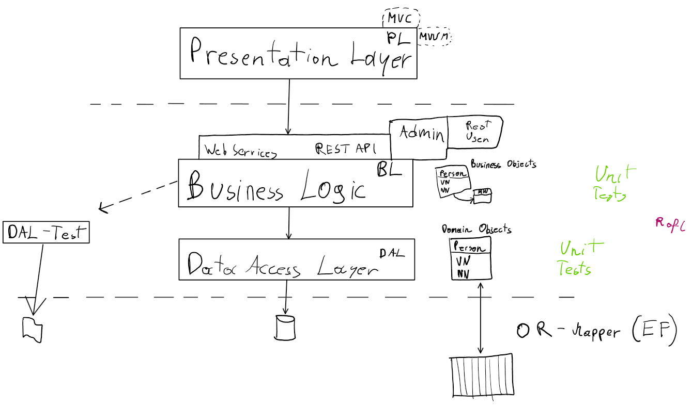

<style>

@font-face {
  font-family: 'TheRumIsGone';
  src: url('TheRumIsGone.ttf') format('truetype');
  font-weight: normal;
  font-style: normal;
}

body 
{
  counter-reset: h1;
}

h1 {
  counter-reset: h2;
  font-family: 'TheRumIsGone', serif;
  text-shadow: 2px 2px 4px #ccc;
}

h2 
{
  counter-reset: h3;
  border-bottom: 2px solid #ffa500;
}

h3 {
  counter-reset: h4;
}

h4 {
  font-size: 1.2rem;
}

h1::before {
  counter-increment: h1;
  content: counter(h1) ". ";
}
h2::before {
  counter-increment: h2;
  content: counter(h1) "." counter(h2) " ";
}
h3::before {
  counter-increment: h3;
  content: counter(h1) "." counter(h2) "." counter(h3) " ";
}
h4::before {
    counter-increment: h4;
    content: counter(h1) "." counter(h2) "." counter(h3) "." counter(h4) " ";
}


</style>

# Table of Contents

- [Table of Contents](#table-of-contents)
- [🏛️ Softwarearchitektur und Design Patterns](#️-softwarearchitektur-und-design-patterns)
  - [🧠 Design Patterns](#-design-patterns)
    - [Why Design Patterns?](#why-design-patterns)
    - [GoF – Gang of Four](#gof--gang-of-four)
    - [Structural Patterns](#structural-patterns)
      - [Composite Pattern](#composite-pattern)
        - [Application](#application)
        - [Composite Pattern – Unit Test Example](#composite-pattern--unit-test-example)
    - [Design Pattern](#design-pattern)
      - [Singleton](#singleton)
    - [⚙️ C# – Commonly Used Design Patterns](#️-c--commonly-used-design-patterns)
    - [☕ Java – Commonly Used Design Patterns](#-java--commonly-used-design-patterns)
    - [📱 Android – Commonly Used Design Patterns](#-android--commonly-used-design-patterns)
  - [🧭 MVVM WPF](#-mvvm-wpf)
    - [MVVM](#mvvm)
    - [View](#view)
    - [ViewModel](#viewmodel)
    - [Model](#model)
    - [Example](#example)
  - [🏗️ 3 Schichten Architektur](#️-3-schichten-architektur)

# 🏛️ Softwarearchitektur und Design Patterns

## 🧠 Design Patterns

### Why Design Patterns?

- Recurring design problems  
- Proven solution templates  
- Improve/simplify communication between developers  
- Elements of reusable object-oriented software  

**Disadvantage:**  
- “Fixation” on design patterns

---

### GoF – Gang of Four

- *Design Patterns: Elements of Reusable Object-Oriented Software* (book)  
- Authors: Erich Gamma, Richard Helm, Ralph Johnson, John Vlissides  
- Patterns are grouped into:  
  - Creational patterns  
  - Structural patterns  
  - Behavioral patterns

---

### Structural Patterns

#### Composite Pattern

##### Application  
- Mapping hierarchies

```
Component
  ├── Leaf
  └── Composite
      └── * (multiple children)
```



---

##### Composite Pattern – Unit Test Example

```
<<interface>>
Test
 ├── TestCase
 └── TestSuite
      └── 1..n tests
```



---

### Design Pattern

#### Singleton

- Creates and manages exactly **one** instance  
- Provides global access via `getInstance()`

```
Singleton
- Singleton : Singleton
- Singleton()
+ getInstance() : Singleton
```


### ⚙️ C# – Commonly Used Design Patterns

| Pattern           | Use Case                                                                 |
|-------------------|--------------------------------------------------------------------------|
| Singleton         | Global logging, configuration access, dependency injection containers   |
| Factory           | Creation of objects without exposing instantiation logic                |
| Strategy          | Swap out algorithms (e.g., different sorting or validation strategies)  |
| Observer          | Event-driven systems, UI updates (e.g., INotifyPropertyChanged)         |
| Repository        | Data access layer abstraction                                            |
| Dependency Injection | Used heavily with ASP.NET Core and Unity container                  |
| Adapter           | Wrapping legacy interfaces                                               |
| Mediator          | Event messaging (e.g., with MediatR in ASP.NET Core)                    |
| Decorator         | Extending functionality of services (e.g., adding logging)              |

---

### ☕ Java – Commonly Used Design Patterns

| Pattern           | Use Case                                                                 |
|-------------------|--------------------------------------------------------------------------|
| Singleton         | Configuration managers, connection pools                                |
| Factory / Abstract Factory | For UI toolkit object creation (Swing, JavaFX), plugin loaders |
| Builder           | Building complex objects (like HTTP requests or documents)              |
| Observer          | UI frameworks (Swing, JavaFX), event systems                            |
| DAO (Data Access Object) | Separating business logic from data persistence                  |
| MVC (Model-View-Controller) | Used in Spring MVC, JavaFX architecture                       |
| Command           | Undo operations, GUI actions                                             |
| Proxy             | Lazy loading, access control                                             |

---

### 📱 Android – Commonly Used Design Patterns

| Pattern           | Use Case                                                                 |
|-------------------|--------------------------------------------------------------------------|
| Singleton         | Application-wide services (e.g., Retrofit, Room, App context)            |
| MVP / MVVM        | Used in UI architecture (Jetpack libraries use MVVM heavily)             |
| Observer (LiveData) | React to lifecycle-aware data changes                                 |
| Factory           | ViewModelProviders, RecyclerView Adapter creation                        |
| Repository        | Abstracting data sources (Room + Retrofit + Cache)                       |
| Command           | Button click actions, animations                                         |
| Builder           | AlertDialog, Retrofit requests                                           |
| Decorator         | View modifications, or extending functionality of UI components          |

---

⭐ **Note:** Many Android apps use a combination of **MVVM + Repository + Singleton + Observer**, especially when using Jetpack, Room, and LiveData.

```kotlin
// Example of MVVM + Repository pattern in Android (Kotlin)
class UserViewModel(private val repo: UserRepository) : ViewModel()
{
    val users: LiveData<List<User>> = repo.getAllUsers()
}
```


---

## 🧭 MVVM WPF

WPF is kinda cringe ngl

---

### MVVM 


### View

- Visual Element
- View Model
  - Data Context
- Controls
  - Data Bound to Properties and Commands in the View Model
- Code Behind
  - Only UI Logic

### ViewModel

- non visual
- presentation logic
- independent of view and model
- doesnt reference the view
- properties and commands
- **INotifyPropertyChanged** / **INotifyCollectionChanged**
- view interaction

### Model

- non-visual 
- business logic
- application data
- no reference on the view or viewmodel
- used with sql, xml or other data stuff

### Example


---


## 🏗️ 3 Schichten Architektur



<script>
  document.addEventListener("DOMContentLoaded", function() {
    // Create the button
    const btn = document.createElement("a");
    btn.href = "../index.html";  // adjust your path
    btn.textContent = "🏠 Home";
    // Style it so it truly fixes to the viewport
    Object.assign(btn.style, {
      position: "fixed",
      bottom: "1rem",
      right: "1rem",
      backgroundColor: "#c0392b",
      color: "#ffffff",
      padding: "0.5rem 0.75rem",
      fontFamily: "Arial, sans-serif",
      fontSize: "0.9rem",
      textDecoration: "none",
      borderRadius: "0.5rem",
      boxShadow: "0 2px 6px rgba(0,0,0,0.3)",
      zIndex: "9999",
      transition: "background-color 0.2s ease, transform 0.2s ease",
      display: "inline-block",
    });
    // Hover effects
    btn.addEventListener("mouseover", () => {
      btn.style.backgroundColor = "#922b21";
      btn.style.transform = "translateY(-2px)";
    });
    btn.addEventListener("mouseout", () => {
      btn.style.backgroundColor = "#c0392b";
      btn.style.transform = "none";
    });
    // Append to the real <body>
    document.body.appendChild(btn);
  });
</script>