<style>

@font-face {
  font-family: 'TheRumIsGone';
  src: url('TheRumIsGone.ttf') format('truetype');
  font-weight: normal;
  font-style: normal;
}

body 
{
  counter-reset: h1;
}

h1 {
  counter-reset: h2;
  font-family: 'TheRumIsGone', serif;
  text-shadow: 2px 2px 4px #ccc;
}

h2 
{
  counter-reset: h3;
  border-bottom: 2px solid #ffa500;
}

h3 {
  counter-reset: h4;
}

h4 {
  font-size: 1.2rem;
}

h1::before {
  counter-increment: h1;
  content: counter(h1) ". ";
}
h2::before {
  counter-increment: h2;
  content: counter(h1) "." counter(h2) " ";
}
h3::before {
  counter-increment: h3;
  content: counter(h1) "." counter(h2) "." counter(h3) " ";
}
h4::before {
    counter-increment: h4;
    content: counter(h1) "." counter(h2) "." counter(h3) "." counter(h4) " ";
}

</style>

# Table of Contents

- [Table of Contents](#table-of-contents)
- [Algorithmen und Datenstrukturen](#algorithmen-und-datenstrukturen)
  - [OOP Programmierung (c#, java)](#oop-programmierung-c-java)
    - [Pros](#pros)
    - [Cons](#cons)
    - [Compared to Procedural / Functional](#compared-to-procedural--functional)
  - [Vererbung - Inheritance](#vererbung---inheritance)
    - [C#](#c)
    - [Java](#java)
  - [🧩 Interfaces](#-interfaces)
    - [⚙️ C#](#️-c)
    - [🔧 Java](#-java)
  - [🌀 Polymorphie](#-polymorphie)
    - [⚙️ C# Beispiel](#️-c-beispiel)
    - [Java](#java-1)
  - [📡 Delegates](#-delegates)
    - [⚙️ C# Beispiel](#️-c-beispiel-1)
      - [Multicast](#multicast)
    - [🔧 Java Vergleich (Functional Interface + Lambda)](#-java-vergleich-functional-interface--lambda)
      - [Other examples](#other-examples)
  - [Datenkapselung (Encapsulation)](#datenkapselung-encapsulation)
    - [Vorteile](#vorteile)
    - [⚙️ C# Beispiel](#️-c-beispiel-2)
    - [🔧 Java Beispiel](#-java-beispiel)
  - [Structs](#structs)
    - [When to Use Structs](#when-to-use-structs)
    - [C# Example](#c-example)
  - [Java](#java-2)
  - [Abstract Classes](#abstract-classes)
    - [When to Use Abstract Classes](#when-to-use-abstract-classes)
    - [⚙️ C# Example](#️-c-example)
    - [🔧 Java Example](#-java-example)
  - [Exception Handling](#exception-handling)
    - [Key Concepts](#key-concepts)
    - [⚙️ C# Example](#️-c-example-1)
    - [🔧 Java Example](#-java-example-1)
  - [Generics](#generics)
    - [Vorteile](#vorteile-1)
    - [⚙️ C# Example](#️-c-example-2)
    - [🔧 Java Example](#-java-example-2)
  - [OOP Concepts](#oop-concepts)
    - [Example: Tying Them Together in C#](#example-tying-them-together-in-c)
  - [Clean Code](#clean-code)
  - [🧠 Big O Notation](#-big-o-notation)
    - [⚙️ Common Types of Big O](#️-common-types-of-big-o)
    - [🪜 Comparison (From Fastest to Slowest)](#-comparison-from-fastest-to-slowest)
    - [🏴‍☠️ Pirate Tips](#️-pirate-tips)
    - [🔀 Common Sorting Algorithms](#-common-sorting-algorithms)
    - [🧭 Quick Guide to Use 'Em](#-quick-guide-to-use-em)
  - [⚔️ Common Data Structures with Code Examples](#️-common-data-structures-with-code-examples)
    - [📦 Array (List in Python)](#-array-list-in-python)
    - [🔗 Linked List (Manually)](#-linked-list-manually)
    - [🧠 Stack (Using list)](#-stack-using-list)
    - [📬 Queue (Using `collections.deque`)](#-queue-using-collectionsdeque)
    - [🗺️ Hash Map (Dictionary in Python)](#️-hash-map-dictionary-in-python)
    - [🎯 Set](#-set)
    - [🌲 Binary Search Tree (Simple version)](#-binary-search-tree-simple-version)
    - [🔺 Heap (Min-Heap using `heapq`)](#-heap-min-heap-using-heapq)
    - [🔤 Trie (Prefix Tree)](#-trie-prefix-tree)
    - [🌌 Graph (Adjacency List)](#-graph-adjacency-list)
  - [Dining philosophers problem](#dining-philosophers-problem)
    - [Problems](#problems)
    - [Dijkstra's solution](#dijkstras-solution)
    - [Resource hierarchy solution](#resource-hierarchy-solution)
    - [Arbitrator solution](#arbitrator-solution)
- [🎨 Gestaltung von grafischen Benutzerinterfaces](#-gestaltung-von-grafischen-benutzerinterfaces)
  - [🪟 WPF Anwendungen](#-wpf-anwendungen)
    - [🧱 WPF Basics](#-wpf-basics)
      - [📦 Key Components](#-key-components)
        - [1. XAML (eXtensible Application Markup Language)](#1-xaml-extensible-application-markup-language)
        - [2. Code-Behind](#2-code-behind)
      - [🧠 Key Concepts](#-key-concepts)
        - [🎯 Data Binding](#-data-binding)
        - [📦 MVVM Pattern](#-mvvm-pattern)
        - [🎨 Styling and Templates](#-styling-and-templates)
      - [⚙️ Dependency Properties](#️-dependency-properties)
    - [🌊 Animations \& Media](#-animations--media)
      - [🛠️ Common Controls](#️-common-controls)
      - [🚀 Getting Started](#-getting-started)
    - [🎯 Event Handling](#-event-handling)
      - [🧭 Routing Strategies](#-routing-strategies)
      - [🧪 Example: Tunneling vs Bubbling](#-example-tunneling-vs-bubbling)
      - [📣 Raising Custom Routed Events](#-raising-custom-routed-events)
      - [🛑 Event Handling Options](#-event-handling-options)
        - [1. `e.Handled = true`](#1-ehandled--true)
        - [2. `AddHandler` with `handledEventsToo`](#2-addhandler-with-handledeventstoo)
      - [🧪 RoutedCommand \& InputGesture](#-routedcommand--inputgesture)
      - [🔧 Advanced Scenario: Routed Event for a Custom Control](#-advanced-scenario-routed-event-for-a-custom-control)
      - [🧰 Routed Events vs .NET Events](#-routed-events-vs-net-events)
      - [📍 When to Use What](#-when-to-use-what)
    - [✍️ XAML](#️-xaml)
      - [🛠️ Basic XAML Structure](#️-basic-xaml-structure)
    - [📦 WPF Container](#-wpf-container)
    - [🧩 WPF Controls](#-wpf-controls)
  - [☕ Java UI](#-java-ui)
    - [🖼️ Java Swing](#️-java-swing)
      - [Key Points:](#key-points)
      - [Basic Structure:](#basic-structure)
      - [Layout Managers (crucial for UI layout):](#layout-managers-crucial-for-ui-layout)
      - [Programming Basics - A Window to the World!](#programming-basics---a-window-to-the-world)
      - [Events](#events)
    - [🌟 JavaFX](#-javafx)
      - [Key Points:](#key-points-1)
      - [Basic Structure:](#basic-structure-1)
      - [Important JavaFX Concepts:](#important-javafx-concepts)
    - [Summary Table](#summary-table)
- [🌐 Gestaltung von Web- und Mobilen Anwendungen](#-gestaltung-von-web--und-mobilen-anwendungen)
  - [🧩 ASP.NET CORE](#-aspnet-core)
    - [📄 Project Templates \& Structure](#-project-templates--structure)
    - [🧠 Host \& Middleware Pipeline](#-host--middleware-pipeline)
    - [🔁 Routing \& Endpoints](#-routing--endpoints)
    - [🧾 Razor Pages vs. MVC vs. Blazor](#-razor-pages-vs-mvc-vs-blazor)
    - [🧾 RazorPages](#-razorpages)
      - [✒️ Razor-Syntax](#️-razor-syntax)
      - [Inline](#inline)
      - [Tag Helper](#tag-helper)
    - [🔗 Model Binding \& Data Access](#-model-binding--data-access)
      - [Binding Form Data](#binding-form-data)
        - [Razor Page](#razor-page)
        - [PageModel](#pagemodel)
    - [🧱 UserControls](#-usercontrols)
      - [1️⃣ Partial View (simple include)](#1️⃣-partial-view-simple-include)
      - [2️⃣ View Component (logic + view)](#2️⃣-view-component-logic--view)
    - [✅ Validation \& Error Handling](#-validation--error-handling)
    - [🔒 Auth \& Authorization](#-auth--authorization)
  - [⚡ Event Handling in ASP.NET Core](#-event-handling-in-aspnet-core)
    - [🖥️ Razor Pages \& MVC Handlers](#️-razor-pages--mvc-handlers)
  - [🤖 Android](#-android)
    - [🚧 Architektur](#-architektur)
      - [📱 Applications](#-applications)
      - [🧰 Application Frameworks](#-application-frameworks)
      - [📚 Libraries (Bibliotheken)](#-libraries-bibliotheken)
      - [⚙️ Android-Runtime](#️-android-runtime)
      - [🐧 Linux-Kernel](#-linux-kernel)
      - [🧩 App-Architektur](#-app-architektur)
      - [⚓ Wichtige Bestandteile einer Android-App](#-wichtige-bestandteile-einer-android-app)
    - [🎬 Activities](#-activities)
    - [🛠️ Android Layouts: Deklaration und Struktur](#️-android-layouts-deklaration-und-struktur)
      - [🧱 Was ist ein Layout?](#-was-ist-ein-layout)
      - [📝 Layout deklarieren](#-layout-deklarieren)
      - [⚙️ Layout in der Activity verwenden](#️-layout-in-der-activity-verwenden)
      - [🧭 Wichtige Layout-Typen](#-wichtige-layout-typen)
      - [🛠️ Layout Editor in Android Studio](#️-layout-editor-in-android-studio)
      - [🔄 Layouts wiederverwenden mit `<include>`](#-layouts-wiederverwenden-mit-include)
      - [📐 Responsive/Adaptive Design](#-responsiveadaptive-design)
    - [📩 Intents](#-intents)
      - [Example: Navigate to new Activity](#example-navigate-to-new-activity)
      - [Intent with Data](#intent-with-data)
    - [🧱 Fragments](#-fragments)
      - [Put data into a fragment](#put-data-into-a-fragment)
      - [Fragment Class](#fragment-class)
    - [♻️ Lifecycle von Activity und Fragmenten](#️-lifecycle-von-activity-und-fragmenten)
    - [📜 AndroidManifest.xml](#-androidmanifestxml)
      - [🆔 Applikationsidentiät](#-applikationsidentiät)
      - [⚙️ System Requirements](#️-system-requirements)
      - [🧩 Plattform Requirements](#-plattform-requirements)
      - [🔐 Erlaubnisse (Permissions)](#-erlaubnisse-permissions)
      - [📋 Activities und andere Komponenten registrieren](#-activities-und-andere-komponenten-registrieren)
    - [🎨 Ressourcen](#-ressourcen)
      - [🗂️ Ordnerstruktur für Ressourcen](#️-ordnerstruktur-für-ressourcen)
      - [🔑 Zugriff auf Ressourcen](#-zugriff-auf-ressourcen)
        - [🏷️ Referenz innerhalb der Ressourcendefinition](#️-referenz-innerhalb-der-ressourcendefinition)
        - [💻 Referenz innerhalb des Java-Codes](#-referenz-innerhalb-des-java-codes)
        - [📲 Direktzugriff innerhalb des Java-Codes](#-direktzugriff-innerhalb-des-java-codes)
      - [Ressource Folder](#ressource-folder)
      - [📂 Der `assets`-Ordner](#-der-assets-ordner)
        - [Eigenschaften des `assets`-Ordners](#eigenschaften-des-assets-ordners)
    - [🤖 What is ADB?](#-what-is-adb)
      - [Key Features of ADB](#key-features-of-adb)
    - [🛠️ Android-Workflow (Installation Android Studio)](#️-android-workflow-installation-android-studio)
      - [Neues Projekt erstellen](#neues-projekt-erstellen)
      - [Projektstruktur](#projektstruktur)
      - [🛰️ AVD — Android Virtual Device](#️-avd--android-virtual-device)
- [🌐 Netzwerk und Webprogrammierung](#-netzwerk-und-webprogrammierung)
  - [🧑‍🤝‍🧑 Client - Server Konzept](#-client---server-konzept)
  - [🌐 ASP.NET Core API](#-aspnet-core-api)
    - [📡 RestAPI](#-restapi)
    - [⚙️ WebServer Configuration](#️-webserver-configuration)
    - [🧪 API Testen](#-api-testen)
      - [🧰 Postman](#-postman)
      - [🧭 Swagger](#-swagger)
  - [🔌 Sockets](#-sockets)
  - [🧵 Threads](#-threads)
    - [🧠 Threading in C#](#-threading-in-c)
      - [🔄 Synchronisation](#-synchronisation)
      - [⏳ Tasks](#-tasks)
    - [☕ Threading in Java](#-threading-in-java)
- [💾 Konzepte moderner Datenspeicherung](#-konzepte-moderner-datenspeicherung)
  - [🏗️ Entity Framework](#️-entity-framework)
    - [🧩 Basics](#-basics)
    - [🔍 LINQ](#-linq)
    - [🧠 Lambda](#-lambda)
    - [📚 Collections](#-collections)
    - [🧰 Generics](#-generics)
    - [⚔️ .NET vs .NET CORE](#️-net-vs-net-core)
  - [📦 Serialisierung](#-serialisierung)
- [🏛️ Softwarearchitektur und Design Patterns](#️-softwarearchitektur-und-design-patterns)
  - [🧠 Design Patterns](#-design-patterns)
    - [⚙️ C#](#️-c-1)
    - [☕ Java](#-java-1)
    - [📱 Android](#-android-1)
  - [🧭 MVVM WPF](#-mvvm-wpf)
    - [MVVM](#mvvm)
    - [View](#view)
    - [ViewModel](#viewmodel)
    - [Model](#model)
    - [Example](#example)
  - [🏗️ MVC](#️-mvc)
  - [📱 Android](#-android-2)
  - [🏗️ 3 Schichten Architektur](#️-3-schichten-architektur)

---

# Algorithmen und Datenstrukturen
## OOP Programmierung (c#, java)

**What is OOP?**

Object Oriented Programming

### Pros

- Modular
- problems can be broken down into smaller bits
- multiple instances of objects
- data hiding
- eliminating redundant code
- data centered

### Cons

- longer
- not always applicable

---

### Compared to Procedural / Functional

| Feature            | OOP                                    | Procedural                         |
| ------------------ | -------------------------------------- | ---------------------------------- |
| **Focus**          | Objects (data + behavior)              | Procedures/functions               |
| **Data Handling**  | Encapsulated within objects            | Global or passed between functions |
| **Modularity**     | High – via classes and objects         | Moderate – via functions           |
| **Reusability**    | High – inheritance, polymorphism       | Low – copying or re-writing code   |
| **Best For**       | Complex systems, GUI apps, simulations | Simple scripts, linear processes   |
| **Code Structure** | More structured and hierarchical       | More linear and flat               |

| Feature            | OOP                                 | Functional                         |
| ------------------ | ----------------------------------- | ---------------------------------- |
| **Focus**          | Objects and classes                 | Functions and immutability         |
| **State**          | Objects maintain state              | Avoids state / uses immutable data |
| **Side Effects**   | Common and accepted                 | Avoided (pure functions)           |
| **Concurrency**    | More challenging                    | Easier due to immutability         |
| **Reusability**    | Through inheritance and composition | Through higher-order functions     |
| **Best For**       | Stateful applications, simulations  | Data transformation, concurrency   |
| **Learning Curve** | Moderate (if procedural background) | Steeper (especially for OOP devs)  |

<hr>

## Vererbung - Inheritance

Eine Klasse kann von einer anderen erben

- Properties
- Methods

---

### C#

In C# mit `NewClass : BaseClass`

``` csharp
// Basisklasse
public class Schiff
{
    public string Name { get; set; }

    public void Fahren()
    {
        Console.WriteLine($"{Name} fährt durch den Kosmos.");
    }
}

// Abgeleitete Klasse
public class Kampfschiff : Schiff
{
    public void Feuern()
    {
        Console.WriteLine($"{Name} feuert mit den Plasma-Kanonen!");
    }
}

// Verwendung
var hootsforce = new Kampfschiff();
hootsforce.Name = "DSS Hootsforce";
hootsforce.Fahren(); // DSS Hootsforce fährt durch den Kosmos.
hootsforce.Feuern(); // DSS Hootsforce feuert mit den Plasma-Kanonen!
```

### Java

In Java mit `NewClass extends BaseClass`

``` Java
// Basisklasse
public class Schiff
 {
    public String name;

    public void fahren() 
    {
        System.out.println(name + " fährt durch den Kosmos.");
    }
}

// Abgeleitete Klasse
public class Kampfschiff extends Schiff 
{
    public void feuern()
    {
        System.out.println(name + " feuert mit den Plasma-Kanonen!");
    }
}

// Verwendung
public class Main
{
    public static void main(String[] args)
    {
        Kampfschiff hootsforce = new Kampfschiff();
        hootsforce.name = "DSS Hootsforce";
        hootsforce.fahren(); // DSS Hootsforce fährt durch den Kosmos.
        hootsforce.feuern(); // DSS Hootsforce feuert mit den Plasma-Kanonen!
    }
}


```

<hr>

## 🧩 Interfaces

Interfaces stellen **Schnittstellen** bereit – sie definieren **leere Methoden und Properties**, die eine Klasse **implementieren muss**.  
Sie dienen der **Abstraktion** und sorgen für **einheitliches Verhalten** bei verschiedenen Klassen.

---

### ⚙️ C#

```csharp
// Interface
public interface IFlugfaehig
{
    void Fliegen();
    string Antrieb { get; }
}

// Implementierende Klasse
public class Drohne : IFlugfaehig
{
    public string Antrieb => "Rotoren";

    public void Fliegen()
    {
        Console.WriteLine("Die Drohne hebt ab!");
    }
}

// Verwendung
var drohne = new Drohne();
drohne.Fliegen(); // Die Drohne hebt ab!
Console.WriteLine(drohne.Antrieb); // Rotoren
```

### 🔧 Java

``` Java
// Interface
public interface IFlugfaehig
 {
    void fliegen();
    String getAntrieb();
}

// Implementierende Klasse
public class Drohne implements IFlugfaehig 
{
    public String getAntrieb() 
    {
        return "Rotoren";
    }

    public void fliegen() 
    {
        System.out.println("Die Drohne hebt ab!");
    }
}

// Verwendung
public class Main
 {
    public static void main(String[] args)
    {
        Drohne drohne = new Drohne();
        drohne.fliegen(); // Die Drohne hebt ab!
        System.out.println(drohne.getAntrieb()); // Rotoren
    }
}
```

---

## 🌀 Polymorphie

**Polymorphie** bedeutet, dass **eine Methode mehrere Formen annehmen kann**.  
Ein Objekt kann auf unterschiedliche Weise reagieren – abhängig vom **konkreten Typ**, der dahintersteckt.  
Das funktioniert oft über **Vererbung** oder **Interfaces**.

---

### ⚙️ C# Beispiel

```csharp
// Basisklasse
public class Schiff
{
    public virtual void Begrüßen()
    {
        Console.WriteLine("Willkommen an Bord.");
    }
}

// Abgeleitete Klasse
public class Piratenschiff : Schiff
{
    public override void Begrüßen()
    {
        Console.WriteLine("Arrr! Willkommen auf dem Piratenschiff!");
    }
}

// Verwendung (Polymorphie)
List<Schiff> flotte = new List<Schiff>
{
    new Schiff(),
    new Piratenschiff()
};

foreach (var schiff in flotte)
{
    schiff.Begrüßen();
}

// Output:
// Willkommen an Bord.
// Arrr! Willkommen auf dem Piratenschiff!

```

### Java

``` java
// Basisklasse
public class Schiff 
{
    public void begrüßen() 
    {
        System.out.println("Willkommen an Bord.");
    }
}

// Abgeleitete Klasse
public class Piratenschiff extends Schiff 
{
    @Override
    public void begrüßen() 
    {
        System.out.println("Arrr! Willkommen auf dem Piratenschiff!");
    }
}

// Verwendung (Polymorphie)
public class Main
{
    public static void main(String[] args) 
    {
        Schiff[] flotte = {
            new Schiff(),
            new Piratenschiff()
        };

        for (Schiff schiff : flotte) 
        {
            schiff.begrüßen();
        }
    }
}

// Output:
// Willkommen an Bord.
// Arrr! Willkommen auf dem Piratenschiff!
```

---

## 📡 Delegates

Ein **Delegate** ist ein **Typ**, der einen Verweis auf eine Methode speichert.  
Er erlaubt es, Methoden **wie Variablen** zu behandeln – man kann sie übergeben, speichern und später aufrufen.

---

### ⚙️ C# Beispiel

```csharp
// Delegate definieren
public delegate void MeldungDelegate(string text);

// Methoden, die dem Delegate-Signatur entsprechen
public class Funk
{
    public void Senden(string text)
    {
        Console.WriteLine($"Sende über Funk: {text}");
    }

    public void Rufen(string text)
    {
        Console.WriteLine($"Rufe laut: {text}");
    }
}

// Verwendung
var funker = new Funk();

MeldungDelegate meldung = funker.Senden;
meldung("Feindliches Schiff voraus!"); 
// Sende über Funk: Feindliches Schiff voraus!

meldung = funker.Rufen;
meldung("Alle Mann an Deck!");
// Rufe laut: Alle Mann an Deck!
```

#### Multicast

``` csharp

Notifier greetings;

greetings = SayHello;

greetings += SayGoodBye;

greetings("John");

// Hello from John
// Goodbye from John

greetings -= SayHello;

greetings("John");

// Goodbye from John

```

### 🔧 Java Vergleich (Functional Interface + Lambda)

Java kennt keine echten Delegates, aber man erreicht Ähnliches mit Functional Interfaces und Lambdas:

A **functional interface** in Java is an interface that contains only one abstract method. Functional interfaces can have **multiple default or static methods**, but **only one abstract method**. Runnable, ActionListener, and Comparator are common examples of Java functional interfaces. From Java 8 onwards, lambda expressions and method references can be used to represent the instance of a functional interface. 

``` java
// Functional Interface
@FunctionalInterface
interface Meldung 
{
    void senden(String text);
}

// Methoden
public class Funk 
{
    public void senden(String text) 
    {
        System.out.println("Sende über Funk: " + text);
    }

    public void rufen(String text) 
    {
        System.out.println("Rufe laut: " + text);
    }
}

// Verwendung
public class Main 
{
    public static void main(String[] args) 
    {
        Funk funker = new Funk();

        Meldung meldung = funker::senden;
        meldung.senden("Feindliches Schiff voraus!");
        // Sende über Funk: Feindliches Schiff voraus!

        meldung = funker::rufen;
        meldung.senden("Alle Mann an Deck!");
        // Rufe laut: Alle Mann an Deck!
    }
}
```

#### Other examples

``` java
// Define a functional interface
@FunctionalInterface

interface Square 
{
    int calculate(int x);
}

class Geeks 
{
    public static void main(String args[]) 
    {
        int a = 5;

        // lambda expression to 
        // define the calculate method
        Square s = (int x) -> x * x;

        // parameter passed and return type must be
        // same as defined in the prototype
        int ans = s.calculate(a);
        System.out.println(ans);
    }
}
```

---


## Datenkapselung (Encapsulation)

**Datenkapselung** bedeutet, dass die internen Daten eines Objekts (z. B. Felder/Variablen) *privat* gehalten werden und nur über **öffentliche Methoden** (z. B. Getters und Setters) zugänglich sind.  
Dadurch schützt man den internen Zustand vor unkontrollierten Zugriffen und kann Validierungen oder Logik in den Zugriffs-Methoden unterbringen.

### Vorteile

- **Schutz der Integrität**: Externe Klassen können die privaten Variablen nicht direkt manipulieren.
- **Kontrollierter Zugriff**: Man kann prüfen, ob neue Werte gültig sind oder notwendige Aktionen ausführen.
- **Flexibilität**: Die interne Implementierung kann sich ändern, ohne dass der öffentliche Vertrag (die Methoden/Properties) angepasst werden muss.
- **Lesbarkeit und Wartbarkeit**: Man weiß genau, über welche Schnittstellen Daten verändert oder abgefragt werden.

---

### ⚙️ C# Beispiel

``` csharp
using System;

public class EscortShip
{
    // Private field: cannot be accessed directly from outside
    private string name;

    // Public property with getter and setter
    public string Name
    {
        get 
        {
            return name;
        }
        set
        {
            if (string.IsNullOrWhiteSpace(value))
            {
                throw new ArgumentException("Name cannot be empty or whitespace.");
            }
            name = value;
        }
    }

    // Private field: shield strength points
    private int shieldStrength;

    // Public method to set shield strength with validation
    public void SetShieldStrength(int strength)
    {
        if (strength < 0)
        {
            throw new ArgumentOutOfRangeException(nameof(strength), "Shield strength must be non-negative.");
        }
        shieldStrength = strength;
    }

    // Public method to get the current shield strength
    public int GetShieldStrength()
    {
        return shieldStrength;
    }

    public void PrintStatus()
    {
        Console.WriteLine($"Ship \"{Name}\" has {shieldStrength} shield points.");
    }
}

// Verwendung
public class Program
{
    public static void Main(string[] args)
    {
        EscortShip ship = new EscortShip();

        // Zugriff über Property (Setter mit Validierung)
        ship.Name = "HMS Blackfang";
        
        // Zugriff über Methoden (ebenfalls validiert)
        ship.SetShieldStrength(150);

        ship.PrintStatus();
        // Output: Ship "HMS Blackfang" has 150 shield points.

        // Folgender Zugriff wirft eine Exception, da der Name leer ist:
        // ship.Name = "";
    }
}

``` 


### 🔧 Java Beispiel

``` java
public class EscortShip 
{
    // Private field: cannot be accessed directly from outside
    private String name;

    // Private field: shield strength points
    private int shieldStrength;

    // Public getter for name
    public String getName() 
    {
        return name;
    }

    // Public setter for name with validation
    public void setName(String name) 
    {
        if (name == null || name.trim().isEmpty()) 
        {
            throw new IllegalArgumentException("Name cannot be empty or whitespace.");
        }
        this.name = name;
    }

    // Public setter for shieldStrength with validation
    public void setShieldStrength(int strength) 
    {
        if (strength < 0)
        {
            throw new IllegalArgumentException("Shield strength must be non-negative.");
        }

        this.shieldStrength = strength;
    }

    // Public getter for shieldStrength
    public int getShieldStrength()
    {
        return shieldStrength;
    }

    // Helper method to print status
    public void printStatus()
    {
        System.out.println("Ship \"" + name + "\" has " + shieldStrength + " shield points.");
    }
}

// Verwendung
public class Main 
{
    public static void main(String[] args) 
    {
        EscortShip ship = new EscortShip();

        // Zugriff über Setter (mit Validierung)
        ship.setName("HMS Blackfang");
        ship.setShieldStrength(150);

        ship.printStatus();
        // Output: Ship "HMS Blackfang" has 150 shield points.

        // Folgender Aufruf wirft eine IllegalArgumentException, da der Name leer ist:
        // ship.setName("");
    }
}


``` 


---


## Structs

**Structs** are value types that allow you to create small, lightweight objects.  
They are typically used for simple data containers and can offer performance benefits because they are stored on the stack (when used locally) rather than the heap.

### When to Use Structs
- You need a small data structure to hold related values (e.g., a 2D point, RGB color, or complex number).
- The type will be immutable or have very simple behavior.
- Instances are short-lived and frequently created/destroyed.
- You want to avoid the overhead of heap allocation for many small objects.

### C# Example

```csharp
using System;

// Define a struct to represent a 2D point
public struct Point2D
{
    // Public fields (or you can use properties)
    public int X { get; }
    public int Y { get; }

    // Constructor to initialize fields
    public Point2D(int x, int y)
    {
        X = x;
        Y = y;
    }

    // Method to calculate distance from origin
    public double DistanceFromOrigin()
    {
        return Math.Sqrt(X * X + Y * Y);
    }

    // Override ToString for easy printing
    public override string ToString()
    {
        return $"({X}, {Y})";
    }
}

public class Program
{
    public static void Main(string[] args)
    {
        // Create two Point2D structs
        Point2D p1 = new Point2D(3, 4);
        Point2D p2 = new Point2D(0, 0);

        Console.WriteLine($"Point p1: {p1}");                   
        // Output: Point p1: (3, 4)

        Console.WriteLine($"Distance of p1 from origin: {p1.DistanceFromOrigin()}");  
        // Output: Distance of p1 from origin: 5

        Console.WriteLine($"Point p2: {p2}");                   
        // Output: Point p2: (0, 0)
    }
}
``` 

**Notes:**

- Structs in C# are declared with the struct keyword.
- Fields or automatic properties can be included, but they should be simple.
- You can define methods, constructors, and even override methods like ToString().
- Structs are value types, so assigning one struct to another copies all fields (no shared reference).

## Java

Java doesn't have any structs

``` Java
// A record automatically creates private final fields, constructor, getters, 
// equals(), hashCode(), and toString() for you.
public record Point2D(int x, int y) {
    // You can add additional methods if needed
    public double distanceFromOrigin() {
        return Math.sqrt(x * x + y * y);
    }
}

// Usage
public class Main {
    public static void main(String[] args) {
        Point2D p1 = new Point2D(3, 4);
        Point2D p2 = new Point2D(0, 0);

        System.out.println("Point p1: " + p1);
        // Output: Point p1: Point2D[x=3, y=4]

        System.out.println("Distance of p1 from origin: " + p1.distanceFromOrigin());
        // Output: Distance of p1 from origin: 5.0

        System.out.println("Point p2: " + p2);
        // Output: Point p2: Point2D[x=0, y=0]
    }
}

```

---


## Abstract Classes

An **abstract class** is a base class that cannot be instantiated directly. It can contain **abstract methods** (methods without implementation) that **derived classes must override**, as well as regular (concrete) methods or properties. Abstract classes are used to define a common interface and partial behavior for a group of related classes.

### When to Use Abstract Classes
- You want to share code (fields, properties, or concrete methods) among subclasses.
- You need to force subclasses to implement certain methods.
- You don’t want the base class to be instantiated on its own.

---

### ⚙️ C# Example

```csharp
using System;

// Abstract base class
public abstract class SpaceVessel
{
    // Concrete property
    public string Name { get; set; }

    // Abstract method: no implementation here
    public abstract void EngageDrive();

    // Concrete method: shared among all subclasses
    public void ReportStatus()
    {
        Console.WriteLine($"{Name} reports: All systems are nominal.");
    }
}

// Derived class must implement the abstract method
public class Explorer : SpaceVessel
{
    public override void EngageDrive()
    {
        Console.WriteLine($"{Name} engages exploration drive into the abyss!");
    }
}

// Usage
public class Program
{
    public static void Main(string[] args)
    {
        // SpaceVessel vessel = new SpaceVessel(); // Error: Cannot create an instance of the abstract class
        
        Explorer hootsforce = new Explorer();
        hootsforce.Name = "DSS Hootsforce";
        
        hootsforce.ReportStatus();
        // Output: DSS Hootsforce reports: All systems are nominal.
        
        hootsforce.EngageDrive();
        // Output: DSS Hootsforce engages exploration drive into the abyss!
    }
}
```

### 🔧 Java Example

``` java
// Abstract base class
public abstract class SpaceVessel {
    // Concrete field
    private String name;

    public SpaceVessel(String name) {
        this.name = name;
    }

    // Abstract method: no implementation here
    public abstract void engageDrive();

    // Concrete method: shared among all subclasses
    public void reportStatus() {
        System.out.println(name + " reports: All systems are nominal.");
    }

    // Getter for name (protected so subclasses can use it)
    protected String getName() {
        return name;
    }
}

// Derived class must implement the abstract method
public class Explorer extends SpaceVessel {
    public Explorer(String name) {
        super(name);
    }

    @Override
    public void engageDrive() {
        System.out.println(getName() + " engages exploration drive into the abyss!");
    }
}

// Usage
public class Main {
    public static void main(String[] args) {
        // SpaceVessel vessel = new SpaceVessel("X"); // Error: Cannot instantiate abstract class
        
        Explorer hootsforce = new Explorer("DSS Hootsforce");
        
        hootsforce.reportStatus();
        // Output: DSS Hootsforce reports: All systems are nominal.
        
        hootsforce.engageDrive();
        // Output: DSS Hootsforce engages exploration drive into the abyss!
    }
}

```

**Key Points:**

- You cannot create an instance of an abstract class directly.

- Abstract classes may contain both abstract members (to be implemented by subclasses) and concrete members (shared code).

- Subclasses must override all abstract methods, or themselves become abstract.
---


## Exception Handling

**Exception handling** allows a program to respond to unexpected events or errors (exceptions) in a controlled way, preventing crashes and enabling recovery or cleanup.

### Key Concepts
- **try**: Block of code to monitor for exceptions.
- **catch**: Block(s) to handle specific exception types.
- **finally**: (Optional) Block that always executes for cleanup, regardless of whether an exception occurred.
- **throw**: Keyword to raise an exception explicitly.
- **custom exceptions**: User-defined exception classes for domain-specific error conditions.

---

### ⚙️ C# Example

```csharp
using System;

// Custom exception class
public class InsufficientCreditsException : Exception
{
    public InsufficientCreditsException(string message) : base(message) { }
}

public class CreditAccount
{
    private int credits;

    public CreditAccount(int initialCredits)
    {
        credits = initialCredits;
    }

    public void SpendCredits(int amount)
    {
        if (amount > credits)
        {
            // Throw a custom exception if insufficient credits
            throw new InsufficientCreditsException($"Attempted to spend {amount} credits, but only {credits} available.");
        }
        credits -= amount;
        Console.WriteLine($"Spent {amount} credits, {credits} remaining.");
    }

    public void AddCredits(int amount)
    {
        if (amount < 0)
        {
            // Throw a built-in exception for invalid argument
            throw new ArgumentOutOfRangeException(nameof(amount), "Cannot add a negative amount of credits.");
        }
        credits += amount;
        Console.WriteLine($"Added {amount} credits, now {credits} total.");
    }
}

public class Program
{
    public static void Main(string[] args)
    {
        var account = new CreditAccount(50);

        try
        {
            account.SpendCredits(30);
            // Output: Spent 30 credits, 20 remaining.

            account.SpendCredits(25);
            // This line will throw InsufficientCreditsException
        }
        catch (InsufficientCreditsException ex)
        {
            Console.WriteLine($"Credit error: {ex.Message}");
            // Output: Credit error: Attempted to spend 25 credits, but only 20 available.
        }
        catch (Exception ex)
        {
            // General catch for any other exceptions
            Console.WriteLine($"Unexpected error: {ex.Message}");
        }
        finally
        {
            Console.WriteLine("End of credit transaction.");
            // Output: End of credit transaction.
        }

        try
        {
            account.AddCredits(-10);
            // This line will throw ArgumentOutOfRangeException
        }
        catch (ArgumentOutOfRangeException ex)
        {
            Console.WriteLine($"Invalid input: {ex.Message}");
            // Output: Invalid input: Cannot add a negative amount of credits.
        }
    }
}
```

### 🔧 Java Example

``` java
// Custom exception class
public class InsufficientCreditsException extends Exception 
{
    public InsufficientCreditsException(String message) 
    {
        super(message);
    }
}

public class CreditAccount 
{
    private int credits;

    public CreditAccount(int initialCredits) 
    {
        this.credits = initialCredits;
    }

    public void spendCredits(int amount) throws InsufficientCreditsException {
        if (amount > credits) 
        {
            // Throw a custom exception if insufficient credits
            throw new InsufficientCreditsException(
                "Attempted to spend " + amount + " credits, but only " + credits + " available."
            );
        }
        credits -= amount;
        System.out.println("Spent " + amount + " credits, " + credits + " remaining.");
    }

    public void addCredits(int amount) 
    {
        if (amount < 0)
         {
            // Throw a built-in exception for invalid argument
            throw new IllegalArgumentException("Cannot add a negative amount of credits.");
        }
        credits += amount;
        System.out.println("Added " + amount + " credits, now " + credits + " total.");
    }
}

// Usage
public class Main
 {
    public static void main(String[] args) 
    {
        CreditAccount account = new CreditAccount(50);

        try
         {
            account.spendCredits(30);
            // Output: Spent 30 credits, 20 remaining.

            account.spendCredits(25);
            // This line will throw InsufficientCreditsException
        } 
        catch (InsufficientCreditsException ex) 
        {
            System.out.println("Credit error: " + ex.getMessage());
            // Output: Credit error: Attempted to spend 25 credits, but only 20 available.
        } 
        catch (Exception ex)
        {
            // General catch for any other exceptions
            System.out.println("Unexpected error: " + ex.getMessage());
        } 
        finally 
        {
            System.out.println("End of credit transaction.");
            // Output: End of credit transaction.
        }

        try 
        {
            account.addCredits(-10);
            // This line will throw IllegalArgumentException
        } 
        catch (IllegalArgumentException ex) 
        {
            System.out.println("Invalid input: " + ex.getMessage());
            // Output: Invalid input: Cannot add a negative amount of credits.
        }
    }
}

```

---

## Generics

**Generics** allow you to write classes, methods, and data structures that work with any data type, without sacrificing type safety.  
Sie bieten Flexibilität und Wiederverwendbarkeit, indem sie Typen erst zur Laufzeit festlegen – ganz ohne Casts und Box-/Unboxing-Kram.

### Vorteile
- **Typensicherheit**: Fehler werden früh vom Compiler erkannt, nicht erst zur Laufzeit.
- **Wiederverwendbarkeit**: Ein Code-Template für verschiedene Datentypen.
- **Performance**: Kein Box-/Unboxing (in C#) und weniger Casts.
- **Konsistenz**: Einheitliche API für alle Typen, die die gleichen Operationen unterstützen.

---

### ⚙️ C# Example

```csharp
using System;
using System.Collections.Generic;

// Generic class: A simple Pair container
public class Pair<TFirst, TSecond>
{
    public TFirst First { get; }
    public TSecond Second { get; }

    public Pair(TFirst first, TSecond second)
    {
        First = first;
        Second = second;
    }

    public override string ToString()
    {
        return $"({First}, {Second})";
    }
}

public class Program
{
    // Generic method: Swaps two elements in an array
    public static void SwapElements<T>(T[] array, int indexA, int indexB)
    {
        T temp = array[indexA];
        array[indexA] = array[indexB];
        array[indexB] = temp;
    }

    public static void Main(string[] args)
    {
        // Using the generic Pair with different type combinations
        var nameAgePair = new Pair<string, int>("Zoe", 28);
        var coordPair = new Pair<int, int>(3, 4);

        Console.WriteLine(nameAgePair);
        // Output: (Zoe, 28)

        Console.WriteLine(coordPair);
        // Output: (3, 4)

        // Using the generic method SwapElements
        int[] numbers = { 1, 2, 3, 4 };
        Console.WriteLine($"Before swap: {string.Join(", ", numbers)}");
        // Output: Before swap: 1, 2, 3, 4

        SwapElements(numbers, 1, 3);
        Console.WriteLine($"After swap: {string.Join(", ", numbers)}");
        // Output: After swap: 1, 4, 3, 2
    }
}
```

### 🔧 Java Example

``` java
import java.util.Arrays;

// Generic class: A simple Pair container
public class Pair<TFirst, TSecond> {
    private final TFirst first;
    private final TSecond second;

    public Pair(TFirst first, TSecond second) {
        this.first = first;
        this.second = second;
    }

    public TFirst getFirst() {
        return first;
    }

    public TSecond getSecond() {
        return second;
    }

    @Override
    public String toString() {
        return "(" + first + ", " + second + ")";
    }
}

public class Main {
    // Generic method: Swaps two elements in an array
    public static <T> void swapElements(T[] array, int indexA, int indexB) {
        T temp = array[indexA];
        array[indexA] = array[indexB];
        array[indexB] = temp;
    }

    public static void main(String[] args) {
        // Using the generic Pair with different type combinations
        Pair<String, Integer> nameAgePair = new Pair<>("Zoe", 28);
        Pair<Integer, Integer> coordPair = new Pair<>(3, 4);

        System.out.println(nameAgePair);
        // Output: (Zoe, 28)

        System.out.println(coordPair);
        // Output: (3, 4)

        // Using the generic method swapElements
        Integer[] numbers = { 1, 2, 3, 4 };
        System.out.println("Before swap: " + Arrays.toString(numbers));
        // Output: Before swap: [1, 2, 3, 4]

        swapElements(numbers, 1, 3);
        System.out.println("After swap: " + Arrays.toString(numbers));
        // Output: After swap: [1, 4, 3, 2]
    }
}

``` 

---

## OOP Concepts

**Object-Oriented Programming (OOP)** is built on four main pillars that work together to organize code into modular, reusable components. Here’s a quick rundown:

1. **Encapsulation**  
   - **Definition**: Bundling data (fields) and methods (functions) that operate on that data into a single unit—an object—and restricting direct access to some of an object’s components.  
   - **Why it matters**: Protects internal state, enforces validation, hides implementation details.  
   - **Key benefit**: You expose only what’s necessary (via public methods or properties) and keep the rest private.

2. **Inheritance**  
   - **Definition**: A mechanism where a new class (subclass/derived class) inherits properties and methods from an existing class (base class).  
   - **Why it matters**: Promotes code reuse, establishes an “is-a” relationship (e.g., `KampfShip is-a Ship`).  
   - **Key benefit**: You write shared behavior once in the base class, and subclasses automatically get it (with the option to override).

3. **Polymorphism**  
   - **Definition**: The ability for different classes to be treated as instances of the same base type, with method calls resolving to the appropriate implementation at runtime.  
   - **Why it matters**: You can write code against an abstract interface or base class and swap in any subclass without changing the calling code.  
   - **Key benefit**: Flexible, extensible design—“one method, many behaviors.”

4. **Abstraction**  
   - **Definition**: Hiding complex implementation details behind a simple interface or abstract class, exposing only the essential features.  
   - **Why it matters**: Reduces complexity for the caller; you only see “what” happens, not “how.”  
   - **Key benefit**: Simplifies the mental model of your system; you focus on functionality rather than internal mechanics.

---

### Example: Tying Them Together in C#

```csharp
// Abstract base class (Abstraction + Inheritance)
public abstract class SpaceVessel
{
    private int hullIntegrity; // Encapsulated field

    public string Name { get; set; } // Public property

    public SpaceVessel(string name, int initialIntegrity)
    {
        Name = name;
        hullIntegrity = initialIntegrity;
    }

    // Abstract method (Abstraction)—subclasses must implement
    public abstract void EngageDrive();

    public void ReportStatus() // Concrete method
    {
        Console.WriteLine($"{Name} hull integrity: {hullIntegrity}");
    }

    // Encapsulated method to modify internal state
    protected void DamageHull(int amount)
    {
        hullIntegrity = Math.Max(0, hullIntegrity - amount);
    }
}

// Derived class (Inheritance + Polymorphism)
public class PiratenJagdbote : SpaceVessel
{
    public PiratenJagdbote(string name, int initialIntegrity) 
        : base(name, initialIntegrity) { }

    public override void EngageDrive() // Polymorphic implementation
    {
        Console.WriteLine($"{Name} tears through the void with abyssal engines!");
        DamageHull(5); // Using an encapsulated method
    }
}

// Usage
public class Program
{
    public static void Main(string[] args)
    {
        List<SpaceVessel> fleet = new List<SpaceVessel>
        {
            new PiratenJagdbote("DSS Hootsforce", 100),
            new PiratenJagdbote("Firebird", 50)
        };

        foreach (var ship in fleet)
        {
            ship.ReportStatus();   // Calls base logic
            ship.EngageDrive();    // Calls overridden logic (Polymorphism)
            ship.ReportStatus();
            // Output:
            // DSS Hootsforce hull integrity: 100
            // DSS Hootsforce tears through the void with abyssal engines!
            // DSS Hootsforce hull integrity: 95
            // Firebird hull integrity: 50
            // Firebird tears through the void with abyssal engines!
            // Firebird hull integrity: 45
        }
    }
}
```

---

## Clean Code

**Clean Code** is all about writing code that’s **readable**, **maintainable**, and **easy to understand**—even if you come back months later (or your first mate tries to debug at 2 AM). Here are the core principles:

1. **Meaningful Names**  
   - Variables, methods, and classes should have descriptive names.  
   - Avoid abbreviations or single letters (unless it’s a short-lived loop index).  
   - Use domain terminology (e.g., `AbyssJump()` instead of `DoAction()` if it specifically jumps to another system).

2. **Single Responsibility Principle (SRP)**  
   - Each class or method should do **only one thing** and do it well.  
   - If a method tries to load from disk and parse JSON and update UI, split it into three methods.  
   - Keeps code easier to test and debug.

3. **Don’t Repeat Yourself (DRY)**  
   - Duplicate logic is a maintenance nightmare.  
   - Extract common code into helper methods or base classes.  
   - If “calculate jump range” appears in two places, make a single `CalculateAbyssRange()` method.

4. **Small Functions / Methods**  
   - Aim for methods that fit on one screen without scrolling.  
   - Each method does a clear, focused task and has a descriptive name.  
   - Example:
     ```csharp
     // NOT CLEAN:
     public void ProcessOrder(Order order) {
         // 50 lines doing validation, calculation, logging, database writes, and notification...
     }

     // BETTER:
     public void ProcessOrder(Order order) {
         ValidateOrder(order);
         decimal total = CalculateOrderTotal(order);
         SaveOrderToDatabase(order, total);
         SendConfirmation(order);
     }
     ```

5. **Consistent Formatting**  
   - Consistent indentation, brace style, and spacing.  
   - Use your team’s style guide (or pick one if you fly solo).  
   - Example (C# – K&R style):
     ```csharp
     public void JumpToSystem(string systemName)
     {
         if (string.IsNullOrEmpty(systemName))
         {
             throw new ArgumentException("System name is required.");
         }

         // …perform jump logic…
     }
     ```

6. **Meaningful Comments (When Needed)**  
   - Comments should explain **why** something is done, not **what** (the code should already show what).  
   - Remove outdated comments—stale comments are worse than none.  
   - Example:
     ```csharp
     // BAD COMMENT: // Increment counter
     counter++;

     // GOOD COMMENT:
     // We increment the counter here to offset the initial index shift from the Abyss drive calibration.
     counter++;
     ```

7. **Prefer Immutability When Possible**  
   - Immutable objects are less error-prone and thread-safe by default.  
   - Use `readonly` fields (C#) or `final` fields (Java) for data that should not change once initialized.  
   - Example (C#):
     ```csharp
     public class Coordinates
     {
         public readonly int X;
         public readonly int Y;

         public Coordinates(int x, int y)
         {
             X = x;
             Y = y;
         }
     }
     ```

8. **Error Handling and Exceptions**  
   - Don’t swallow exceptions—handle them appropriately or propagate them.  
   - Use `try`/`catch`/`finally` sparingly; don’t wrap every line in a `try`.  
   - Example (C#):
     ```csharp
     try
     {
         account.SpendCredits(100);
     }
     catch (InsufficientCreditsException ex)
     {
         // Log the issue, inform the user, and let them retry
         Console.WriteLine($"Not enough credits: {ex.Message}");
     }
     ```

9. **Unit Tests and Testable Code**  
   - Design your classes so dependencies can be injected (e.g., via constructor).  
   - Keep methods small and focused so they’re easy to test.  
   - Example (C#):
     ```csharp
     public class CreditAccount
     {
         private readonly ILogger _logger;

         public CreditAccount(int initialCredits, ILogger logger)
         {
             Credits = initialCredits;
             _logger = logger;
         }

         public int Credits { get; private set; }

         public void Spend(int amount)
         {
             if (amount > Credits)
             {
                 _logger.Log("Insufficient credits.");
                 throw new InvalidOperationException("Not enough credits.");
             }
             Credits -= amount;
         }
     }
     ```

10. **Refactor Often**  
    - If you see “code smells” (long methods, duplicated logic, deeply nested conditionals), carve off a tidy little refactoring.  
    - Keep your ship tight—routine maintenance prevents catastrophic failures later.

> **Pirate’s Note**:  
> “Clean code is like a well-kept deck. If every plank’s in place, you won’t trip over a loose nail when battling foes—or merging code!”


---

## 🧠 Big O Notation

Big O notation is a way to describe **how efficient an algorithm is** in terms of **time** or **space** as the size of the input grows.

It helps us understand the *worst-case scenario* of how long something might take (time complexity) or how much memory it might use (space complexity).

---

### ⚙️ Common Types of Big O

| Big O Notation | Name                  | Example                          | Description                                     |
|----------------|-----------------------|----------------------------------|-------------------------------------------------|
| `O(1)`         | Constant Time         | Accessing an array element       | 🟢 Fast and doesn't grow with input size.       |
| `O(log n)`     | Logarithmic Time      | Binary Search                    | 🟡 Grows slowly as input size increases.        |
| `O(n)`         | Linear Time           | Loop through an array            | 🟠 Time grows directly with input size.         |
| `O(n log n)`   | Linearithmic Time     | Merge Sort, Quick Sort (avg)     | 🟠 Slightly slower than linear, but efficient.  |
| `O(n²)`        | Quadratic Time        | Nested loops (e.g., Bubble Sort) | 🔴 Time grows quickly as input doubles.         |
| `O(2ⁿ)`        | Exponential Time      | Solving a subset of problems     | ⚠️ Grows *very* fast – avoid if possible.       |
| `O(n!)`        | Factorial Time        | Brute force permutations         | ☠️ Grows insanely fast – only for tiny inputs.  |

---

### 🪜 Comparison (From Fastest to Slowest)

```
O(1) < O(log n) < O(n) < O(n log n) < O(n²) < O(2ⁿ) < O(n!)
```

---

### 🏴‍☠️ Pirate Tips

- Try to **aim for O(1), O(log n), or O(n)** whenever possible.
- Avoid `O(n²)` and worse unless your input size is *really small*.
- Big O doesn't care about small differences—it's about **how fast things get worse** as input grows.

### 🔀 Common Sorting Algorithms

| Algorithm        | Best Time   | Worst Time  | Average Time | Space | Method        | Notes                                                                 |
|------------------|-------------|-------------|---------------|--------|----------------|-----------------------------------------------------------------------|
| **Bubble Sort**  | O(n)        | O(n²)       | O(n²)         | O(1)   | Comparison     | Repeatedly swaps adjacent items if they're in the wrong order. Slow. |
| **Selection Sort** | O(n²)     | O(n²)       | O(n²)         | O(1)   | Comparison     | Finds the smallest item and puts it in place. Simple but inefficient.|
| **Insertion Sort** | O(n)      | O(n²)       | O(n²)         | O(1)   | Comparison     | Builds the sorted list one item at a time. Good for small data.      |
| **Merge Sort**   | O(n log n)  | O(n log n)  | O(n log n)    | O(n)   | Divide & Conquer | Splits list into halves, sorts, and merges. Very stable and fast.   |
| **Quick Sort**   | O(n log n)  | O(n²)       | O(n log n)    | O(log n) | Divide & Conquer | Picks a pivot and sorts around it. Fast but worst case can hurt.     |
| **Heap Sort**    | O(n log n)  | O(n log n)  | O(n log n)    | O(1)   | Heap-based     | Turns array into a heap and sorts. Not stable.                       |
| **Radix Sort**   | O(nk)       | O(nk)       | O(nk)         | O(n + k) | Non-Comparison | Sorts by digits/characters. Fast for integers or fixed-length data.  |
| **Counting Sort**| O(n + k)    | O(n + k)    | O(n + k)      | O(k)   | Non-Comparison | Counts occurrences. Only for integers in small range.               |

---

### 🧭 Quick Guide to Use 'Em

- Use **Merge Sort** or **Quick Sort** for general-purpose large data.
- Use **Insertion Sort** for small or nearly sorted data.
- Use **Radix/Counting Sort** for numbers when speed matters and conditions fit.
- Avoid **Bubble/Selection** unless teaching or cursed by sirens.

Smooth sorting seas to ye, Captain! 📊⚓


## ⚔️ Common Data Structures with Code Examples

[Wikipedia Article](https://en.wikipedia.org/wiki/Data_structure)

| Data Structure     | Description                              | Time (Access/Search)     | Use Cases                             | Notes                                  |
|--------------------|------------------------------------------|---------------------------|----------------------------------------|----------------------------------------|
| **Array**          | Fixed-size list, elements in order       | O(1) / O(n)               | Simple storage, fast access by index   | Size is fixed; slow inserts/deletes    |
| **Linked List**    | Chain of nodes, each points to the next  | O(n) / O(n)               | Insert/remove in middle frequently     | No fast access by index                |
| **Doubly Linked List** | Like linked list, but with back refs | O(n) / O(n)               | Back and forth navigation              | More flexible, uses more memory        |
| **Stack**          | Last-In, First-Out (LIFO) structure       | O(1) / O(n)               | Undo, recursion, backtracking          | Uses push/pop operations               |
| **Queue**          | First-In, First-Out (FIFO) structure      | O(1) / O(n)               | Scheduling, buffering                  | Uses enqueue/dequeue operations        |
| **Hash Table / Map** | Key-value pairs with fast lookup       | O(1)* / O(1)*             | Fast lookup by key                     | *Worst case is O(n) if many collisions |
| **Set**            | Like a hash table, but only stores keys   | O(1)* / O(1)*             | Uniqueness checks, fast existence test | No duplicates allowed                  |
| **Binary Tree**    | Tree with up to 2 children per node       | O(log n)* / O(log n)*     | Hierarchical data                      | *Only if balanced                      |
| **Binary Search Tree** | Ordered binary tree                 | O(log n)* / O(log n)*     | Sorted data with quick search          | Can become unbalanced (then O(n))      |
| **Heap (Min/Max)** | Binary tree for priority queue operations | O(1) / O(log n)           | Priority queues, schedulers            | Access min/max quickly                 |
| **Trie (Prefix Tree)** | Tree for string prefixes             | O(k) / O(k)               | Auto-complete, dictionaries            | `k` = length of string                 |
| **Graph**          | Nodes connected by edges                 | Varies                    | Networks, navigation, relationships     | Can be directed/undirected, weighted   |


### 📦 Array (List in Python)

```python
# Define an array
arr = [10, 20, 30]
print(arr[1])  # Access: 20
arr.append(40)  # Add at end
arr.remove(20)  # Remove value
```

---

### 🔗 Linked List (Manually)

```python
class Node:
    def __init__(self, value):
        self.value = value
        self.next = None

# Create nodes
head = Node(10)
head.next = Node(20)
head.next.next = Node(30)

# Traverse
current = head
while current:
    print(current.value)
    current = current.next
```

---

### 🧠 Stack (Using list)

Possible use cases for stacks:

- certain algorithms
- history
- bracket syntax highlighting

**LIFO**

```python
stack = []
stack.append("plunder")  # Push
stack.append("gold")
print(stack.pop())       # Pop → "gold"
```

---

### 📬 Queue (Using `collections.deque`)

**FIFO**


```python
from collections import deque

queue = deque()
queue.append("Florence")   # Enqueue
queue.append("Jack")
print(queue.popleft())     # Dequeue → "Florence"
```

---

### 🗺️ Hash Map (Dictionary in Python)

```python
map = {"name": "Zoe", "role": "Captain"}
map["ship"] = "DSS Hootsforce"
print(map["name"])  # Access → Zoe
```

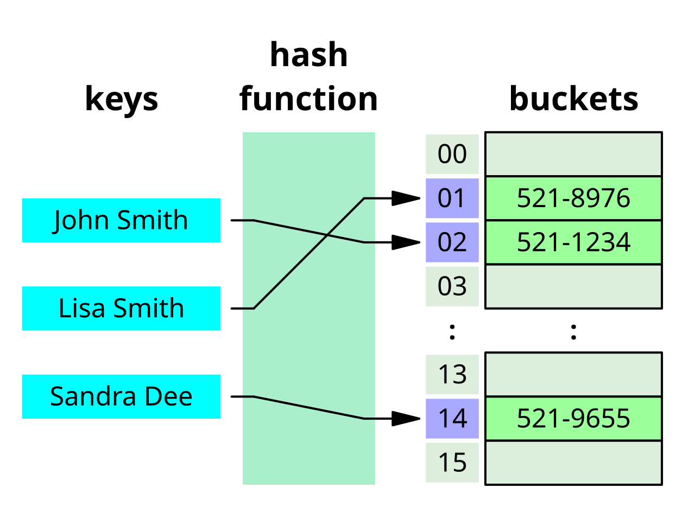

---

### 🎯 Set

```python
crew = {"Zoe", "Florence", "Jack"}
crew.add("William")
print("Zoe" in crew)  # True
```

---

### 🌲 Binary Search Tree (Simple version)

```python
class Node:
    def __init__(self, value):
        self.value = value
        self.left = self.right = None

def insert(root, value):
    if not root:
        return Node(value)
    if value < root.value:
        root.left = insert(root.left, value)
    else:
        root.right = insert(root.right, value)
    return root

root = insert(None, 50)
insert(root, 30)
insert(root, 70)
```

---

### 🔺 Heap (Min-Heap using `heapq`)

```python
import heapq

heap = []
heapq.heappush(heap, 20)
heapq.heappush(heap, 10)
heapq.heappush(heap, 30)

print(heapq.heappop(heap))  # 10
```

---

### 🔤 Trie (Prefix Tree)

```python
class TrieNode:
    def __init__(self):
        self.children = {}
        self.end_of_word = False

class Trie:
    def __init__(self):
        self.root = TrieNode()

    def insert(self, word):
        cur = self.root
        for char in word:
            if char not in cur.children:
                cur.children[char] = TrieNode()
            cur = cur.children[char]
        cur.end_of_word = True

    def search(self, word):
        cur = self.root
        for char in word:
            if char not in cur.children:
                return False
            cur = cur.children[char]
        return cur.end_of_word

trie = Trie()
trie.insert("loot")
print(trie.search("loot"))  # True
print(trie.search("loop"))  # False
```

---

### 🌌 Graph (Adjacency List)

```python
graph = {
    "Zoe": ["Florence", "Jack"],
    "Florence": ["Zoe"],
    "Jack": ["Zoe", "William"],
    "William": ["Jack"]
}

# Traverse
for node in graph:
    print(f"{node} → {graph[node]}")
```

---

May these data structures guide yer coding voyages as surely as the stars guide the Hootsforce through the abyss. ☠️🧭

``Data be power, and the smart pirate keeps it sorted.`` – Eden


## Dining philosophers problem

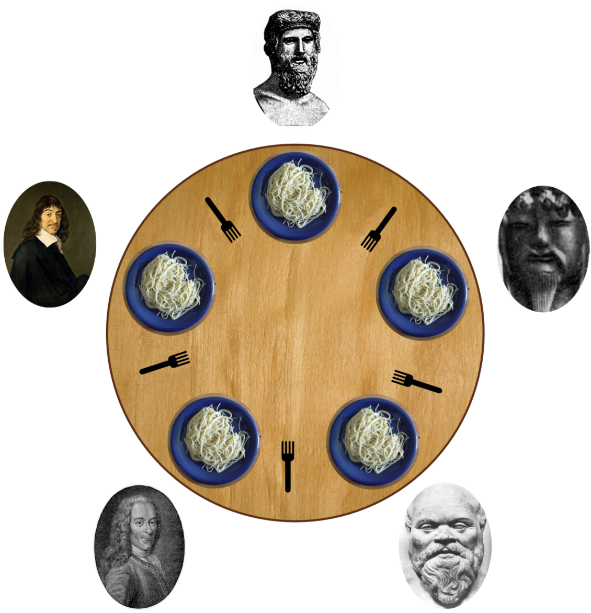

Five philosophers dine together at the same table. Each philosopher has their own plate at the table. There is a fork between each plate. The dish served is a kind of spaghetti which has to be eaten with two forks. Each philosopher can only alternately think and eat. Moreover, a philosopher can only eat their spaghetti when they have both a left and right fork. Thus two forks will only be available when their two nearest neighbors are thinking, not eating. After an individual philosopher finishes eating, they will put down both forks. The problem is how to design a regimen (a concurrent algorithm) such that any philosopher will not starve; i.e., each can forever continue to alternate between eating and thinking, assuming that no philosopher can know when others may want to eat or think (an issue of incomplete information). 

### Problems

The problem was designed to illustrate the challenges of avoiding deadlock, a system state in which no progress is possible. To see that a proper solution to this problem is not obvious, consider a proposal in which each philosopher is instructed to behave as follows:

- think unless the left fork is available; when it is, pick it up;
- think unless the right fork is available; when it is, pick it up;
- when both forks are held, eat for a fixed amount of time;
- put the left fork down;
- put the right fork down;
- repeat from the beginning.

With these instructions, the situation may arise where each philosopher holds the fork to their left; in that situation, they will all be stuck forever, waiting for the other fork to be available: it is a deadlock.

Resource starvation, mutual exclusion and livelock are other types of sequence and access problems. 

These four conditions are necessary for a deadlock to occur: mutual exclusion (no fork can be simultaneously used by multiple philosophers), resource holding (the philosophers hold a fork while waiting for the second), non-preemption (no philosopher can take a fork from another), and circular wait (each philosopher may be waiting on the philosopher to their left). A solution must negate at least one of those four conditions. In practice, negating mutual exclusion or non-preemption somehow can give a valid solution, but most theoretical treatments assume that those assumptions are non-negotiable, instead attacking resource holding or circular waiting (often both). 

### Dijkstra's solution

Dijkstra's solution negates resource holding; the philosophers atomically pick up both forks or wait, never holding exactly one fork outside of a critical section. To accomplish this, Dijkstra's solution uses one mutex, one semaphore per philosopher and one state variable per philosopher. This solution is more complex than the resource hierarchy solution

### Resource hierarchy solution

- Partial Order

### Arbitrator solution

- only allow picking up two forks at a time

---

<p style="page-break-before: always;"></p>

# 🎨 Gestaltung von grafischen Benutzerinterfaces

## 🪟 WPF Anwendungen

Windows Presentation Foundation (WPF) is a free and open-source user interface framework for Windows-based desktop applications. WPF applications are based in .NET, and are primarily developed using C# and XAML.

Originally developed by Microsoft, WPF was initially released as part of .NET Framework 3.0 in 2006. In 2018, Microsoft released WPF as open source under the MIT License. WPF's design and its layout language XAML have been adopted by multiple other UI frameworks, such as UWP, .NET MAUI, and Avalonia. 

---

### 🧱 WPF Basics

For MVVM see [MMVM WPF Chapter](#mvvm)


#### 📦 Key Components

##### 1. XAML (eXtensible Application Markup Language)
Used to define the UI declaratively.

```xml
<Window x:Class="MyApp.MainWindow"
        xmlns="http://schemas.microsoft.com/winfx/2006/xaml/presentation"
        Title="Hello WPF" Height="300" Width="400">
    <Grid>
        <Button Content="Click Me" Width="100" Height="30" Click="Button_Click"/>
    </Grid>
</Window>
```

##### 2. Code-Behind
C# code that runs logic behind the UI.

```csharp
private void Button_Click(object sender, RoutedEventArgs e)
{
    MessageBox.Show("Ahoy, Captain!");
}
```

---

#### 🧠 Key Concepts

##### 🎯 Data Binding

Linking UI elements to data sources (like objects or collections).

```xml
<TextBox Text="{Binding UserName}" />
```

##### 📦 MVVM Pattern

Model-View-ViewModel is the standard design pattern in WPF.

- **Model**: Business logic/data
- **View**: XAML UI
- **ViewModel**: Middle layer for binding and commands

---

##### 🎨 Styling and Templates

WPF supports custom styling using `<Style>` and templates for full control over UI appearance.

```xml
<Style TargetType="Button">
    <Setter Property="Background" Value="DarkSlateBlue"/>
    <Setter Property="Foreground" Value="White"/>
</Style>
```

---

#### ⚙️ Dependency Properties

Used for advanced features like animation, styling, and binding.

```csharp
public static readonly DependencyProperty MyProperty =
    DependencyProperty.Register("My", typeof(string), typeof(MyClass));
```

---

### 🌊 Animations & Media

WPF supports powerful animation tools.

```xml
<Button Name="MyButton" Content="Animate Me">
    <Button.Triggers>
        <EventTrigger RoutedEvent="Button.Click">
            <BeginStoryboard>
                <Storyboard>
                    <DoubleAnimation Storyboard.TargetProperty="Width" To="300" Duration="0:0:1"/>
                </Storyboard>
            </BeginStoryboard>
        </EventTrigger>
    </Button.Triggers>
</Button>
```

---

#### 🛠️ Common Controls

| Control      | Purpose                   |
|--------------|---------------------------|
| `TextBox`    | User text input           |
| `Button`     | Clickable action          |
| `ListView`   | Display a list of items   |
| `ComboBox`   | Dropdown selection        |
| `Grid`       | Layout control            |

---

#### 🚀 Getting Started

To build a WPF app:

1. Use Visual Studio
2. Create a **WPF App (.NET)** project
3. Design UI in XAML
4. Add logic in C#


### 🎯 Event Handling

Unlike traditional .NET event models, WPF introduces **Routed Events**, which traverse the visual tree using *Routing Strategies*.

*(A routed event is a type of event that can invoke handlers on multiple listeners in an element tree rather than just the object that raised the event. It is basically a CLR event that is supported by an instance of the Routed Event class. It is registered with the WPF event system. RoutedEvents have three main routing strategies which are as follows)*

#### 🧭 Routing Strategies

1. **Direct**  
   - Like traditional .NET events. Only the source element raises and handles it.

2. **Bubbling**  
   - Event starts from the source and **bubbles up** through parent elements. (To topmost, usually a window)

3. **Tunneling**  
   - Event starts at the root and **tunnels down** to the source.
     - event travels down the visual tree to all the children nodes until it reaches the element in which the event originated.
   - Prefixed with `Preview` (e.g., `PreviewMouseDown`)

In a WPF application, events are often implemented as a tunneling/bubbling pair. So, you'll have a preview `MouseDown` and then a `MouseDown` event.

---

#### 🧪 Example: Tunneling vs Bubbling

```xml
<StackPanel PreviewMouseDown="OnPreviewMouseDown"
            MouseDown="OnMouseDown">
    <Button Content="Click Me"/>
</StackPanel>
```

```csharp
private void OnPreviewMouseDown(object sender, MouseButtonEventArgs e)
{
    Console.WriteLine("TUNNEL: StackPanel saw the click first.");
}

private void OnMouseDown(object sender, MouseButtonEventArgs e)
{
    Console.WriteLine("BUBBLE: StackPanel saw the click after the Button.");
}
```

🌀 **Flow**:  
1. `PreviewMouseDown` on StackPanel (tunnel)  
2. `PreviewMouseDown` on Button  
3. `MouseDown` on Button  
4. `MouseDown` on StackPanel (bubble)

---

#### 📣 Raising Custom Routed Events

You can create your own events that participate in routing.

```csharp
public static readonly RoutedEvent WarpInitiatedEvent = EventManager.RegisterRoutedEvent(
    "WarpInitiated", RoutingStrategy.Bubble, typeof(RoutedEventHandler), typeof(ShipControl));

public event RoutedEventHandler WarpInitiated
{
    add { AddHandler(WarpInitiatedEvent, value); }
    remove { RemoveHandler(WarpInitiatedEvent, value); }
}

void RaiseWarp()
{
    RoutedEventArgs args = new RoutedEventArgs(WarpInitiatedEvent);
    RaiseEvent(args);
}
```

```xml
<local:ShipControl WarpInitiated="OnWarp"/>
```

---

#### 🛑 Event Handling Options

##### 1. `e.Handled = true`
Stops the routed event from traveling further.

```csharp
private void Button_PreviewMouseDown(object sender, MouseButtonEventArgs e)
{
    e.Handled = true; // Stops bubbling!
}
```

##### 2. `AddHandler` with `handledEventsToo`
Listens even if the event was already handled.

```csharp
button.AddHandler(Button.MouseDownEvent, new MouseButtonEventHandler(OnMouseDown), true);
```

---

#### 🧪 RoutedCommand & InputGesture

Commanding system also uses routed events internally.

```xml
<Button Command="ApplicationCommands.Save" CommandTarget="{Binding ElementName=TextBox1}" />
```

```csharp
CommandBindings.Add(new CommandBinding(ApplicationCommands.Save, OnSaveExecuted));

private void OnSaveExecuted(object sender, ExecutedRoutedEventArgs e)
{
    // Save logic
}
```

You can also define your own:

```csharp
public static RoutedCommand FireCannons = new RoutedCommand();

<Window.InputBindings>
    <KeyBinding Key="F" Modifiers="Control" Command="{x:Static local:CustomCommands.FireCannons}" />
</Window.InputBindings>
```

---

#### 🔧 Advanced Scenario: Routed Event for a Custom Control

```csharp
public class HullButton : Button
{
    public static readonly RoutedEvent HullBreachEvent = EventManager.RegisterRoutedEvent(
        "HullBreach", RoutingStrategy.Bubble, typeof(RoutedEventHandler), typeof(HullButton));

    public event RoutedEventHandler HullBreach
    {
        add => AddHandler(HullBreachEvent, value);
        remove => RemoveHandler(HullBreachEvent, value);
    }

    protected override void OnClick()
    {
        RaiseEvent(new RoutedEventArgs(HullBreachEvent));
    }
}
```

```xml
<local:HullButton HullBreach="OnHullBreachAlert"/>
```

---

#### 🧰 Routed Events vs .NET Events

| Feature             | Routed Events              | .NET Events          |
|---------------------|----------------------------|----------------------|
| Traversal           | Yes (bubble/tunnel/direct) | No                   |
| Handled Control     | Yes (`e.Handled`)          | No                   |
| Visual Tree Aware   | Yes                        | No                   |
| Declarative in XAML | Yes                        | Partially            |

---

#### 📍 When to Use What

- **Use Routed Events** when the action involves UI interaction across nested controls.
- **Use .NET events** for backend or logic-level communication.
- **Tunneling** is great for intercepting or validation before the actual action (like blocking mouse input on children).


### ✍️ XAML

**XAML (eXtensible Application Markup Language)** is the declarative markup language used in WPF to define UI elements, layout, styles, and data bindings.

#### 🛠️ Basic XAML Structure

```xml
<Window x:Class="MyApp.MainWindow"
        xmlns="http://schemas.microsoft.com/winfx/2006/xaml/presentation"
        Title="Main Window" Height="350" Width="525">
    <Grid>
        <TextBlock Text="Ahoy, Captain!" FontSize="20"/>
    </Grid>
</Window>
```

- `xmlns`: Defines namespaces for WPF controls.
- `x:Class`: Links the XAML to a C# code-behind file.
- Elements are hierarchical — parent containers hold child elements.

---

### 📦 WPF Container

| Container     | Description                                      | Example |
|---------------|--------------------------------------------------|---------|
| **Grid**      | Most flexible; rows & columns layout             | ```xml<br><Grid><Grid.RowDefinitions><RowDefinition/><RowDefinition/></Grid.RowDefinitions><Button Grid.Row="1" Content="Click"/></Grid>``` |
| **StackPanel**| Stacks children vertically or horizontally       | ```xml<br><StackPanel Orientation="Vertical"><TextBlock Text="Hello"/><Button Content="Click"/></StackPanel>``` |
| **DockPanel** | Aligns elements to edges (Top, Bottom, etc.) 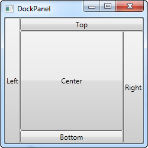    | ```xml<br><DockPanel><Button DockPanel.Dock="Top" Content="Top"/></DockPanel>``` |
| **WrapPanel** | Wraps items like text wrapping                   | ```xml<br><WrapPanel><Button Content="1"/><Button Content="2"/></WrapPanel>``` |
| **Canvas**    | Absolute positioning with X/Y                    | ```xml<br><Canvas><Button Canvas.Left="50" Canvas.Top="20" Content="Fly"/></Canvas>``` |
| **UniformGrid** | Evenly distributes cells in grid               | ```xml<br><UniformGrid Rows="2" Columns="2"><Button Content="A"/><Button Content="B"/></UniformGrid>``` |

---

### 🧩 WPF Controls

| Control       | Description                                 | Example |
|---------------|---------------------------------------------|---------|
| **TextBlock** | Displays text (non-editable)                | ```xml<br><TextBlock Text="Status: All green"/>``` |
| **TextBox**   | Editable text input                         | ```xml<br><TextBox Text="Input here" Width="200"/>``` |
| **Button**    | Clickable button                            | ```xml<br><Button Content="Fire Cannons" Click="OnFire"/>``` |
| **Label**     | Text label, often paired with input         | ```xml<br><Label Content="Username:"/>``` |
| **CheckBox**  | Toggle true/false                           | ```xml<br><CheckBox Content="Enable Shield Boost"/>``` |
| **RadioButton**| Mutually exclusive options in group       | ```xml<br><RadioButton GroupName="Mode" Content="Stealth"/>``` |
| **ComboBox**  | Dropdown list                               | ```xml<br><ComboBox><ComboBoxItem Content="Option 1"/></ComboBox>``` |
| **ListBox**   | List of selectable items                    | ```xml<br><ListBox><ListBoxItem Content="Item A"/></ListBox>``` |
| **Image**     | Displays an image                           | ```xml<br><Image Source="Assets/logo.png" Width="100"/>``` |
| **Slider**    | Numeric slider input                        | ```xml<br><Slider Minimum="0" Maximum="100" Value="50"/>``` |
| **ProgressBar**| Visual progress indicator                 | ```xml<br><ProgressBar Minimum="0" Maximum="100" Value="75"/>``` |
| **TabControl**| Tabs for multiple pages/views 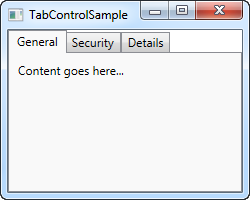              | ```xml<br><TabControl><TabItem Header="Nav"><TextBlock Text="Abyss Scan"/></TabItem></TabControl>``` |

---

## ☕ Java UI
---

### 🖼️ Java Swing

**Java Swing** is the long-standing, mature GUI toolkit for Java, built on top of AWT (Abstract Window Toolkit). It’s widely used for desktop applications with a rich set of widgets.

#### Key Points:
- Part of **javax.swing** package.
- **Lightweight** components (pure Java, not OS native).
- Uses **MVC (Model-View-Controller)** pattern internally.
- Supports **pluggable look-and-feels** (Metal, Nimbus, Windows style, etc.).
- Event-driven programming model with listeners.
- Threading: GUI operations must run on the **Event Dispatch Thread (EDT)** to avoid freezes.

#### Basic Structure:

```java
import javax.swing.*;

public class SwingDemo {
    public static void main(String[] args) {
        SwingUtilities.invokeLater(() -> {
            JFrame frame = new JFrame("Swing Example");
            frame.setDefaultCloseOperation(JFrame.EXIT_ON_CLOSE);
            JButton button = new JButton("Press me");
            button.addActionListener(e -> System.out.println("Button pressed!"));
            frame.add(button);
            frame.setSize(300, 200);
            frame.setVisible(true);
        });
    }
}
```

#### Layout Managers (crucial for UI layout):
- `BorderLayout` — divides container into N, S, E, W, Center.
- `FlowLayout` — simple left-to-right flow.
- `GridLayout` — equal-sized grid cells.
- `BoxLayout` — vertical or horizontal stacking.
- `GroupLayout` — used in GUI builders, supports complex layouts.

#### Programming Basics - A Window to the World!

``` java
import javax.swing.JFrame;

public class HelloSwingFrame {
    public static void main(String[] args) {
        JFrame f = new JFrame("A Window to the World!");
        f.setDefaultCloseOperation(JFrame.EXIT_ON_CLOSE);
        f.setSize(300, 200);
        f.setVisible(true);
    }
}
```


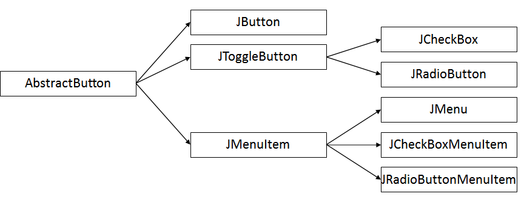

#### Events

``` java
import java.awt.event.ActionEvent;
import java.awt.event.ActionListener;
import javax.swing.JButton;
import javax.swing.JFrame;

public class ExerciseActionListener implements ActionListener {
    @Override
    public void actionPerformed(ActionEvent arg0) {
        System.out.println("You clicked: " + arg0.getActionCommand());
    }

    public static void main(String[] args) {
        JFrame jf = new JFrame("The Window to the World!");
        jf.setDefaultCloseOperation(JFrame.EXIT_ON_CLOSE);
        JButton jb = new JButton("Click Me!");
        jf.add(jb);
        
        ExerciseActionListener eal = new ExerciseActionListener();
        jb.addActionListener(eal);
        
        jf.setSize(300, 200);
        jf.pack();
        jf.setVisible(true);
    }
}
```

---

### 🌟 JavaFX

**JavaFX** is the modern, feature-rich Java UI toolkit designed to replace Swing for rich client apps.

#### Key Points:
- Part of **javafx.\*** packages.
- Hardware-accelerated graphics via **Prism** engine.
- Uses **FXML**, an XML-based UI markup language similar to XAML.
- Supports **property bindings** and **observable collections** for reactive UIs.
- Scene graph-based architecture (tree of nodes representing UI elements).
- Built-in support for **animations**, **effects**, and **media**.
- Strong separation between UI (FXML) and logic (Controller classes).
- Supports CSS-like styling for UI elements.

#### Basic Structure:

```java
import javafx.application.Application;
import javafx.scene.Scene;
import javafx.scene.control.Button;
import javafx.scene.layout.StackPane;
import javafx.stage.Stage;

public class FXDemo extends Application {
    @Override
    public void start(Stage primaryStage) {
        Button btn = new Button("Press me");
        btn.setOnAction(e -> System.out.println("Button pressed!"));
        
        StackPane root = new StackPane(btn);
        Scene scene = new Scene(root, 300, 200);
        
        primaryStage.setTitle("JavaFX Example");
        primaryStage.setScene(scene);
        primaryStage.show();
    }

    public static void main(String[] args) {
        launch(args);
    }
}
```

#### Important JavaFX Concepts:
- **Stage**: The top-level window.
- **Scene**: The container for all content inside a Stage.
- **Node**: Base class for all scene graph elements (controls, shapes, groups).
- **Properties & Bindings**: Observable variables with automatic UI updates.
- **FXML**: UI description language, loadable with `FXMLLoader`.
- **CSS Styling**: Use CSS files to style nodes (e.g., `.button { -fx-background-color: red; }`).

---

### Summary Table

| Feature                | Java Swing                         | JavaFX                              |
|------------------------|----------------------------------|-----------------------------------|
| Released               | 1997                             | 2008                              |
| UI Description         | Java code only                   | Java code + FXML (XML markup)     |
| Architecture           | Lightweight components, MVC      | Scene graph, reactive properties  |
| Graphics               | Software rendered (AWT-based)    | Hardware accelerated (Prism)      |
| Styling                | Look & Feel                      | CSS-like styling                  |
| Animation/Media        | Limited                         | Built-in rich support             |
| Threading              | Event Dispatch Thread (EDT)      | JavaFX Application Thread         |
| Learning Curve         | Moderate                        | Moderate to advanced              |


---

<p style="page-break-before: always;"></p>

# 🌐 Gestaltung von Web- und Mobilen Anwendungen

## 🧩 ASP.NET CORE

ASP.NET Core is an open-source modular web-application framework. It is a redesign of ASP.NET that unites the previously separate ASP.NET MVC and ASP.NET Web API into a single programming model. Despite being a new framework, built on a new web stack, it does have a high degree of concept compatibility with ASP.NET. The ASP.NET Core framework supports side-by-side versioning so that different applications being developed on a single machine can target different versions of ASP.NET Core. This was not possible with previous versions of ASP.NET. ASP.NET Core initially ran on both the Windows-only .NET Framework and the cross-platform .NET. However, support for the .NET Framework was dropped beginning with ASP.Net Core 3.0.

Blazor is a recent (optional) component to support WebAssembly and since version 5.0, it has dropped support for some old web browsers. While current Microsoft Edge works, the legacy version of it, i.e. "Microsoft Edge Legacy" and Internet Explorer 11 was dropped when you use Blazor.

---
### 📄 Project Templates & Structure

Create with the CLI:

``` bash
dotnet new webapp -o MyRazorApp      # Razor Pages
dotnet new mvc -o MyMvcApp           # MVC + Controllers & Views
dotnet new webapi -o MyApiApp        # REST API
dotnet new blazorserver -o BlazorSrv # Blazor Server
dotnet new blazorwasm -o BlazorWasm  # Blazor WebAssembly
```

Typical folder layout:

```
/Program.cs      ← bootstraps host, DI, middleware
/Startup.cs      ← (pre-6.0) configure services & middleware
/Pages or /Controllers & /Views
/Components       ← Blazor components or ViewComponents
/appsettings.json ← config (env-overrides in appsettings.Development.json)
/Properties/launchSettings.json
```

### 🧠 Host & Middleware Pipeline

Program.cs

``` csharp
var builder = WebApplication.CreateBuilder(args);

// 1. Register services
builder.Services.AddControllersWithViews();
builder.Services.AddDbContext<AppDb>(opts => 
  opts.UseSqlServer(builder.Configuration["ConnStr"]));
builder.Services.AddAuthentication().AddCookie();

// 2. Build host
var app = builder.Build();

// 3. Middleware pipeline
if (app.Environment.IsDevelopment())
    app.UseDeveloperExceptionPage();

app.UseHttpsRedirection();
app.UseStaticFiles();
app.UseRouting();

app.UseAuthentication();
app.UseAuthorization();

app.MapControllerRoute(
  name: "default",
  pattern: "{controller=Home}/{action=Index}/{id?}");
app.Run();

```

The middleware order is defined by the Use[Feature] method execution order when
creating the ASP.NET app.


### 🔁 Routing & Endpoints

- Conventional MVC: in `MapControllerRoute`
- Attribute Routing:

``` csharp
[Route("api/books/[action]/{id?}")]
public class BooksController : ControllerBase { … }
```
- Minimal APIs

``` csharp
app.MapGet("/ping", () => Results.Ok("pong"));
app.MapPost("/todo", (Todo t, AppDb db) => {
  db.Todos.Add(t); db.SaveChanges();
  return Results.Created($"/todo/{t.Id}", t);
});
``` 

### 🧾 Razor Pages vs. MVC vs. Blazor

| Feature      | Razor Pages       | MVC Controllers | Blazor Server/WA   |
| ------------ | ----------------- | --------------- | ------------------ |
| Use case     | Page-focused apps | Complex sites   | Interactive UIs    |
| Code-behind  | `.cshtml.cs`      | Controllers     | `.razor` + `@code` |
| Statefulness | Stateless         | Stateless       | Stateful           |
| WebAssembly  | No                | No              | Yes (WASM)         |


### 🧾 RazorPages

#### ✒️ Razor-Syntax

#### Inline

``` razor
@page "/hello"
@model HelloModel
<h1>Hello, @Model.UserName!</h1>

@if(Model.Items.Any()) {
  <ul>
    @foreach(var i in Model.Items) {
      <li>@i.Name (@i.Quantity)</li>
    }
  </ul>
} else {
  <p>No items onboard.</p>
}
```

#### Tag Helper

``` razor
<form asp-page="Create" method="post">
  <input asp-for="Title" />
  <span asp-validation-for="Title"></span>
  <button type="submit">Save</button>
</form>
```
### 🔗 Model Binding & Data Access

- Binding sources: `[FromQuery]`, `[FromRoute]`, `[FromBody]`, `[FromForm]`, `[FromServices]`
  
``` csharp
public class AppDb : DbContext
{
  public DbSet<Book> Books { get; set; }
}

// In a Controller:
public async Task<IActionResult> List([FromQuery]int page = 1)
{
  var books = await _db.Books
    .Skip((page-1)*10).Take(10).ToListAsync();
  return View(books);
}
```

#### Binding Form Data

##### Razor Page

``` razor
<form method="post">
    <label>Name:</label>
    <input type="text" asp-for="UserInput.Name" />
    <label>Age:</label>
    <input type="number" asp-for="UserInput.Age" />
    <button type="submit">Submit</button>
</form>

@if (Model.Message != null)
{
    <p>@Model.Message</p>
}
```

##### PageModel

``` csharp
public class IndexModel : PageModel
{
    [BindProperty]
    public UserInputModel UserInput { get; set; }

    public string Message { get; set; }

    public void OnPost()
    {
        Message = $"Ahoy, {UserInput.Name}! You're {UserInput.Age} years old!";
    }
}

public class UserInputModel
{
    public string Name { get; set; }
    public int Age { get; set; }
}
```

### 🧱 UserControls

#### 1️⃣ Partial View (simple include)

**Create**: `/Views/Shared/_UserCard.cshtml`

``` razor
<div class="user-card">
  <h3>@Model.Name (@Model.Role)</h3>
  <p>Crew: @Model.CrewName</p>
</div>
```

``` razor
@await Html.PartialAsync("_UserCard", Model.User)
```

#### 2️⃣ View Component (logic + view)

**Component class:** `/ViewComponents/UserCardViewComponent.cs`

``` csharp
public class UserCardViewComponent : ViewComponent
{
  public IViewComponentResult Invoke(User u) =>
    View("Default", u);
}
```

**Default view:** `/Views/Shared/Components/UserCard/Default.cshtml`

``` razor
<div class="user-card">
  <strong>@Model.Name</strong><br/>
  <small>@Model.Role</small>
</div>
``` 

**Invoke in Razor:**
``` razor
@await Component.InvokeAsync("UserCard", new { u = Model.User })
``` 

### ✅ Validation & Error Handling

- Annotations

``` csharp
public class RegisterDto 
{
  [Required, EmailAddress] public string Email { get; set; }
  [Required, MinLength(6)] public string Password { get; set; }
}
```

- Client + server validation via `<partial name="_ValidationScriptsPartial" />`
- Global error handling middleware:

``` csharp
app.UseExceptionHandler("/Home/Error");
app.UseStatusCodePagesWithReExecute("/Home/Status", "?code={0}");
```

### 🔒 Auth & Authorization

- **Authentication:** Cookies, JWT, OAuth, IdentityServer4

- **ASP.NET Core Identity:**

``` csharp
builder.Services.AddIdentity<User, Role>()
  .AddEntityFrameworkStores<AppDb>()
  .AddDefaultTokenProviders();
app.UseAuthentication();
```

- **policies**
``` csharp
services.AddAuthorization(opts => {
  opts.AddPolicy("PirateOnly", p => p.RequireClaim("Role", "Captain"));
});
[Authorize(Policy="PirateOnly")]
public IActionResult Secret() => View();
```

## ⚡ Event Handling in ASP.NET Core

Event handling in ASP.NET Core spans from simple request-based handlers in Razor/MVC to real-time hubs with SignalR and rich interactivity in Blazor. Let’s plunder each layer, Captain!

---

### 🖥️ Razor Pages & MVC Handlers

Razor Pages and MVC use _handler methods_ in the PageModel or Controller:

```csharp
// Razor Page: Pages/Tasks/Edit.cshtml.cs
public class EditModel : PageModel
{
    [BindProperty] public TaskItem Task { get; set; }

    public void OnGet(int id) 
        => Task = _db.Tasks.Find(id);

    public IActionResult OnPostSave()  // handler for <button asp-page-handler="Save">
    {
        if (!ModelState.IsValid) return Page();
        _db.Update(Task);
        _db.SaveChanges();
        return RedirectToPage("Index");
    }
}
```

``` razor
<form method="post">
  <input asp-for="Task.Name" />
  <button asp-page-handler="Save">Save</button>
</form>
```

---

## 🤖 Android

Android is an operating system based on a modified version of the Linux kernel and other open-source software, designed primarily for touchscreen-based mobile devices such as smartphones and tablets. Android has historically been developed by a consortium of developers known as the Open Handset Alliance, but its most widely used version is primarily developed by Google. First released in 2008, Android is the world's most widely used operating system; the latest version, released on October 15, 2024, is Android 15.


---

### 🚧 Architektur


#### 📱 Applications

- **Verschiedene fertige Kernanwendungen** *(z. B. Home, Browser, Telefon, Kontakte usw.)*
- **Java**
- **Android SDK nötig**
- **Java-Quelltext wird von einem Cross-Assembler für die Dalvik-VM angepasst**
  - *Ab **Android 5** wird der **Bytecode in Maschinencode** bei der **Installation der App kompiliert***
    - → **Maschinenunabhängigkeit bleibt erhalten**
    - → App muss **nicht mehr zur Laufzeit** umgewandelt werden
    - → **Bessere Performance**

#### 🧰 Application Frameworks

- **Activity Manager**
  - Kontrolliert den **Lebenszyklus der Apps**
  - Verwaltet das **Navigieren zwischen Apps**

- **Content Providers**
  - Versorgen Apps mit **gemeinsamen Daten** (z. B. Fotos, Musik-Sammlungen, Kontakte)

- **Location Manager**
  - Liefert die **Position des Geräts**

- **Notification Manager**
  - Informiert Benutzer über **signifikante Ereignisse**
  - Jeder Event besitzt eine **eindeutige ID**

- **Package Manager**
  - Verwaltet **installierte Packages**

- **Resource Manager**
  - Zur **Verwaltung und Zugriffen von Ressourcen** (z. B. Strings, Grafiken, XML-Dateien usw.)

- **Telephony Manager**
  - Zuständig für **Telefon-Services**

- **View System**
  - Komponente, die **UI-Elemente verwaltet** und **Ereignisse generiert**

- **Window Manager**
  - Zur **Verwaltung des Bildschirms**

#### 📚 Libraries (Bibliotheken)

- **FreeType**
  - Für **Bitmap** und **Fonts**

- **(Bionic) libc**
  - Angepasste und **optimierte BSD-Implementierung**

- **LibWebCore**
  - Basiert auf **WebKit** *(Web Browser Engine, auch in Google Chrome und Apple Safari verwendet)*

- **Media Framework**
  - Basiert auf **OpenCORE** von PacketVideo
  - Unterstützt: **MPEG4, H.264, MP3, AAC, AMR, JPEG, PNG**

- **OpenGL|ES**
  - Für **3D-Grafiken** auf **Embedded-Systemen**

- **SGL**
  - **2D Grafik-Engine**

- **SQLite**
  - **Schlankes, relationales Datenbanksystem**

- **SSL**
  - Für **SSL-basierte Sicherheit** bei der **Netzwerkkommunikation**

- **Surface Manager**
  - Verwaltung des **Zugriffs auf das Display-Subsystem**

#### ⚙️ Android-Runtime

- **Kernbibliotheken** für die Laufzeitumgebung  
  - Teilmenge der **Apache Harmony Java 5 Implementierung**

- **Dalvik Virtuelle Maschine (DVM)** → ab **Android Lollipop: Android-Runtime (ART)**
  - **Registerbasierte Maschine**
  - DVM: **interpretiert** Dateien im **Dalvik Executable (DEX)**-Format
  - ART: **kompiliert Bytecode bei der Installation** in **nativen Binärcode (ODEX)**  
    → **Schnellere Ausführung**

- **Jede Applikation läuft in einem separaten Prozess**  
  - Hat ihre **eigene DVM bzw. ART**

- Nutzt das **Thread-Modell** und die **Low-Memory-Verwaltung von Linux**

#### 🐧 Linux-Kernel

- Dient als **Abstraktionsschicht** zwischen der **Android-Welt** und der **Hardware**

- Stellt bereit:
  - **Sicherheitsmodell**
  - **Prozess- und Speicherverwaltung**
  - **Netzwerkstack**
  - **Treiber**

#### 🧩 App-Architektur

- Die **Android-App-Architektur** basiert auf **Komponenten**, die über sogenannte **Intents** miteinander kommunizieren.

- Eine App besteht aus einer **Sammlung von Komponenten**:
  - **Activities**
  - **Services**
  - **Content Providers**
  - **Broadcast Receivers**  
  → **Nicht alle Komponenten** müssen in jeder App enthalten sein.

- **Jede App läuft in einem eigenen Linux-Prozess**  
  - Android startet den Prozess **erst, wenn eine Komponente benötigt wird**  
  - Es gibt **keine klassische `main()`-Methode** wie in Java oder C/C++
    - Im Manifest wird eine Start-Activity festgelegt

- Komponenten einer App **teilen gemeinsame Ressourcen**, z. B.:
  - **Datenbanken**
  - **Shared Preferences**
  - **Dateisystem**

#### ⚓ Wichtige Bestandteile einer Android-App

- **Activity**  
  - Sichtbarer Teil der Anwendung zur **Interaktion mit dem Benutzer**  
  - Besitzt einen eigenen **Lebenszyklus**  
  - Eine App enthält meist **mehrere Activities**

- **Service**  
  - Läuft im **Hintergrund** (ähnlich wie Windows-Service oder Linux-Dämon)  
  - **Local Service:** Läuft im **gleichen Prozess** wie die App  
  - **Remote Service:** Läuft in einem **separaten Prozess** und kommuniziert über **Interprozesskommunikation**

- **Content Providers**  
  - Stellen **Daten für andere Apps** bereit

- **Broadcast Receivers**  
  - Empfangen **Systemereignisse** und reagieren darauf


### 🎬 Activities

Activities sind eigene Klassen die eine Seite auf der App repräsentieren.

``` java
public class MainActivity extends AppCompatActivity
{
    private Button mainLoginButton;

    @Override
    protected void onCreate(Bundle savedInstanceState)
    {
        super.onCreate(savedInstanceState);
        EdgeToEdge.enable(this);
        setContentView(R.layout.activity_main);
        ViewCompat.setOnApplyWindowInsetsListener(findViewById(R.id.main), (v, insets) -> {
            Insets systemBars = insets.getInsets(WindowInsetsCompat.Type.systemBars());
            v.setPadding(systemBars.left, systemBars.top, systemBars.right, systemBars.bottom);
            return insets;
        });

        mainLoginButton = findViewById(R.id.mainLoginButton);

        mainLoginButton.setOnClickListener(v -> {
           Intent intent = new Intent(MainActivity.this, LoginActivity.class);
           startActivity(intent);
        });
    }
}
```

In Java und XML Files geteilt.

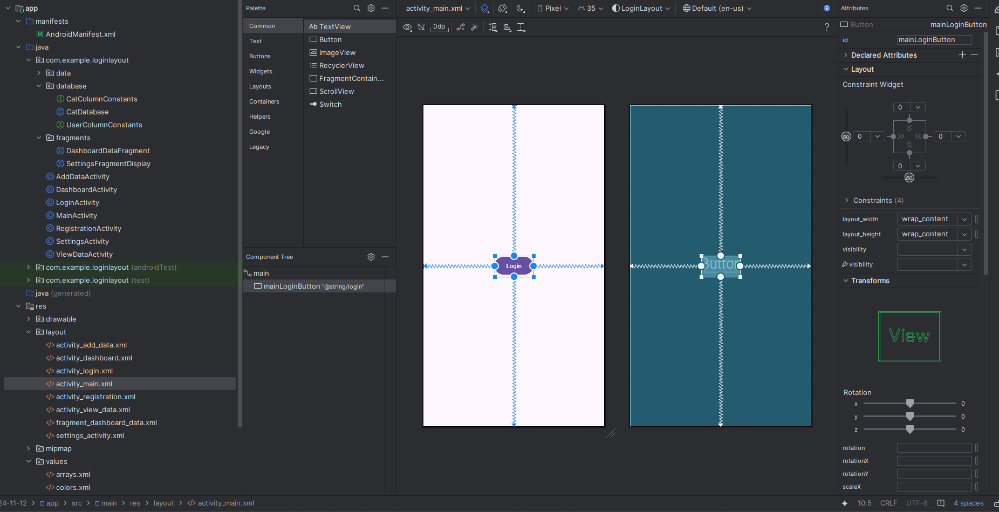

### 🛠️ Android Layouts: Deklaration und Struktur

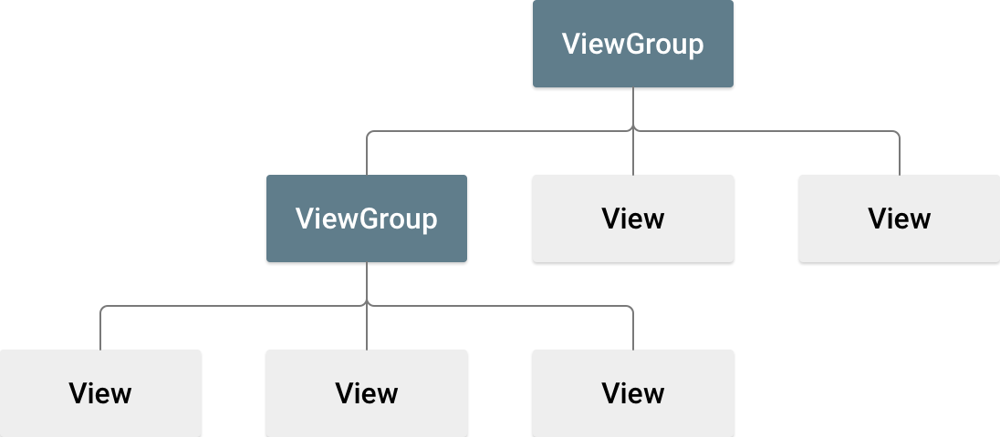


#### 🧱 Was ist ein Layout?

Ein Layout definiert die Struktur der Benutzeroberfläche (UI) deiner App, z. B. in einer Activity. Alle Elemente im Layout werden durch eine Hierarchie von `View`- und `ViewGroup`-Objekten aufgebaut:

- **`View`**: Sichtbare UI-Elemente wie `Button`, `TextView`, `ImageView`.
- **`ViewGroup`**: Unsichtbare Container, die die Struktur für `View`- und andere `ViewGroup`-Objekte festlegen, z. B. `LinearLayout`, `RelativeLayout`, `ConstraintLayout`.

#### 📝 Layout deklarieren

Layouts werden in XML-Dateien im Verzeichnis `res/layout/` gespeichert. Jede Layout-Datei muss genau ein Root-Element enthalten, das ein `View` oder `ViewGroup` ist. Beispiel:

```xml
<?xml version="1.0" encoding="utf-8"?>
<LinearLayout xmlns:android="http://schemas.android.com/apk/res/android"
              android:layout_width="match_parent"
              android:layout_height="match_parent"
              android:orientation="vertical">
    <TextView android:id="@+id/text"
              android:layout_width="wrap_content"
              android:layout_height="wrap_content"
              android:text="Hallo, ich bin ein TextView" />
    <Button android:id="@+id/button"
            android:layout_width="wrap_content"
            android:layout_height="wrap_content"
            android:text="Hallo, ich bin ein Button" />
</LinearLayout>
```

#### ⚙️ Layout in der Activity verwenden

``` kotlin
fun onCreate(savedInstanceState: Bundle) {
    super.onCreate(savedInstanceState)
    setContentView(R.layout.main_layout)
}
```

#### 🧭 Wichtige Layout-Typen

- **LinearLayout:** Ordnet Kinder in einer Richtung an (vertikal oder horizontal).

- **RelativeLayout:** Positioniert Kinder relativ zueinander oder zum Eltern-Layout.

- **ConstraintLayout:** Bietet flexible Positionierung und Größenanpassung basierend auf Constraints. Empfohlen für komplexe Layouts.

- **FrameLayout:** Zeigt ein einzelnes Element an, ideal für einfache UI-Komponenten.

- **TableLayout:** Anordnung von Kindern in Zeilen und Spalten.

- **GridLayout:** Erweitert TableLayout mit flexiblerer Zellenanordnung.

---

#### 🛠️ Layout Editor in Android Studio

Der Layout Editor ermöglicht das schnelle Erstellen von Layouts durch Ziehen von UI-Elementen in einen visuellen Design-Editor. Er bietet eine Vorschau des Layouts auf verschiedenen Android-Geräten und -Versionen und ermöglicht das dynamische Anpassen der Layoutgröße, um sicherzustellen, dass es auf verschiedenen Bildschirmgrößen richtig funktioniert.

---

#### 🔄 Layouts wiederverwenden mit `<include>`

Um Layouts effizient wiederzuverwenden, kannst du die Tags `<include>` und `<merge>` verwenden, um ein Layout in ein anderes einzubetten. Dies ermöglicht das Erstellen komplexer Layouts und das Verwalten gemeinsamer Elemente über mehrere Layouts hinweg.

---

#### 📐 Responsive/Adaptive Design

Um deine App auf verschiedenen Bildschirmgrößen, -orientierungen und -konfigurationen zu unterstützen, implementiere responsive/adaptive Layouts. Dies sorgt für eine optimierte Benutzererfahrung, unabhängig von der Gerätekonfiguration.


### 📩 Intents

Intents are messaging Objects

- Activities
- Services
- Broadcast Delivery

#### Example: Navigate to new Activity

``` java
mainLoginButton = findViewById(R.id.mainLoginButton);

mainLoginButton.setOnClickListener(v -> {
    Intent intent = new Intent(MainActivity.this, LoginActivity.class);
    startActivity(intent);
});
```

#### Intent with Data

``` java
Intent intent = new Intent(this, DashboardActivity.class);
intent.putExtra("user", user);
startActivity(intent);
```

``` java
User user;
Bundle bundle = getIntent().getExtras();

if (bundle != null)
{
    user = bundle.getParcelable("user", User.class);
}
else
{
    user = new User("empty", "empty", "empty");
}
```

### 🧱 Fragments

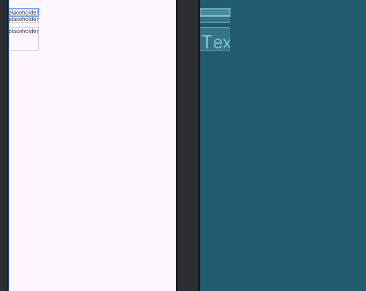


#### Put data into a fragment

``` java
dashboardDataFragment = (DashboardDataFragment) getSupportFragmentManager().findFragmentById(R.id.fragmentContainerView);
dashboardDataFragment.setUser(user);
```

#### Fragment Class

``` java
/**
 * A simple {@link Fragment} subclass.
 * Use the {@link DashboardDataFragment#newInstance} factory method to
 * create an instance of this fragment.
 */
public class DashboardDataFragment extends Fragment {

    // TODO: Rename parameter arguments, choose names that match
    // the fragment initialization parameters, e.g. ARG_ITEM_NUMBER
    private static final String ARG_PARAM1 = "param1";
    private static final String ARG_PARAM2 = "param2";

    // TODO: Rename and change types of parameters
    private String mParam1;
    private String mParam2;

    TextView dashboardUsernameText;
    TextView dashboardEmailText;
    TextView dashboardPasswordText;

    public User getUser() {
        return user;
    }

    public void setUser(User user) {
        this.user = user;
    }

    User user;

    public DashboardDataFragment() {
        // Required empty public constructor
    }

    /**
     * Use this factory method to create a new instance of
     * this fragment using the provided parameters.
     *
     * @param param1 Parameter 1.
     * @param param2 Parameter 2.
     * @return A new instance of fragment DashboardDataFragment.
     */
    // TODO: Rename and change types and number of parameters
    public static DashboardDataFragment newInstance(String param1, String param2) {
        DashboardDataFragment fragment = new DashboardDataFragment();
        Bundle args = new Bundle();
        args.putString(ARG_PARAM1, param1);
        args.putString(ARG_PARAM2, param2);
        fragment.setArguments(args);
        return fragment;
    }

    @Override
    public void onCreate(Bundle savedInstanceState) {
        super.onCreate(savedInstanceState);
        if (getArguments() != null) {
            mParam1 = getArguments().getString(ARG_PARAM1);
            mParam2 = getArguments().getString(ARG_PARAM2);
        }
    }

    @Override
    public View onCreateView(LayoutInflater inflater, ViewGroup container,
                             Bundle savedInstanceState) {
        // Inflate the layout for this fragment
        View view = inflater.inflate(R.layout.fragment_dashboard_data, container, false);

        dashboardUsernameText = view.findViewById(R.id.dashboardUsernameText);
        dashboardEmailText = view.findViewById(R.id.dashboardEmailText);
        dashboardPasswordText = view.findViewById(R.id.dashboardPasswordText);

        dashboardUsernameText.setText("Username: " + user.getUsername());
        dashboardEmailText.setText("E-Mail: " + user.getEmail());
        dashboardPasswordText.setText("Password: " + user.getPassword());


        return view;
    }
}
```

### ♻️ Lifecycle von Activity und Fragmenten


### 📜 AndroidManifest.xml

- Beschreibt die Andwendung
- **Gradle Scripts**
  - werden automatisch erzeugt, für die verschiedenen Plattformen, Abhängigkeiten.

``` xml
<?xml version="1.0" encoding="utf-8"?>
<manifest xmlns:android="http://schemas.android.com/apk/res/android"
    xmlns:tools="http://schemas.android.com/tools">

    <application
        android:allowBackup="true"
        android:dataExtractionRules="@xml/data_extraction_rules"
        android:fullBackupContent="@xml/backup_rules"
        android:icon="@mipmap/ic_launcher"
        android:label="@string/app_name"
        android:roundIcon="@mipmap/ic_launcher_round"
        android:supportsRtl="true"
        android:theme="@style/Theme.LoginLayout"
        tools:targetApi="31">
        <activity
            android:name=".ViewDataActivity"
            android:exported="false" />
        <activity
            android:name=".AddDataActivity"
            android:exported="false" />
        <activity
            android:name=".SettingsActivity"
            android:exported="false"
            android:label="@string/title_activity_settings" />
        <activity
            android:name=".DashboardActivity"
            android:exported="false" />
        <activity
            android:name=".RegistrationActivity"
            android:exported="false" />
        <activity
            android:name=".LoginActivity"
            android:exported="false" />
        <activity
            android:name=".MainActivity"
            android:exported="true">
            <intent-filter>
                <action android:name="android.intent.action.MAIN" />

                <category android:name="android.intent.category.LAUNCHER" />
            </intent-filter>
        </activity>
    </application>

</manifest>
```

- Jede Android-Anwendung benötigt eine **AndroidManifest.xml**-Datei, die wichtige Informationen enthält, wie:  
  - **Anwendungsidentität**  
  - **Name der App**  
  - **Versionsnummer**  
  - **Beschreibung der Komponenten** (Activities, Services, etc.)  
  - **Erlaubnisse** (Permissions)  

- Das **Laufzeitsystem** nutzt die Manifest-Datei, um:  
  - Die Anwendung zu **installieren** und **upzudaten**  
  - Anwendungsdetails wie **Name**, **Icon** und **Beschreibung** anzuzeigen  
  - **Erlaubnisse zu überwachen** und zu verwalten  
  - **Activities der Anwendung zu starten**  
  - Entwicklern das **Debugging** der App zu ermöglichen

#### 🆔 Applikationsidentiät

- **Paketname**  
  - Eindeutige Identifikation der App  
  - Muss **sorgfältig gewählt** werden, da er nach Veröffentlichung **nicht mehr änderbar** ist  

- **Versionscode**  
  - Wird für **Updates** verwendet  
  - Interner Wert, der beim Update erhöht wird  

- **Versionsname**  
  - Wird den **Benutzern angezeigt**  
  - Menschlich lesbar, z.B. "1.0", "2.1 Beta"  


```xml
<manifest
  xmlns:android="http://schemas.android.com/apk/res/android"
  package="de.hs_kl.tran"
  android:versionCode="1"
  android:versionName="1.0" >
```

#### ⚙️ System Requirements

- **SDK-Versionen:**  
  - **minSdkVersion:** Kleinster unterstützter API-Level (Mindestanforderung)  
  - **targetSdkVersion** *(optional):* Optimal unterstützter API-Level (für Kompatibilität)  
  - **maxSdkVersion** *(optional):* Größter unterstützter API-Level (Begrenzung)  

- **Anwendungsdetails:**  
  - **Name** und **Icon** für die Anzeige  
  - Optionale **Beschreibung**  
  - **Debugging** kann ein- oder ausgeschaltet werden  


```xml
<application
  android:icon="@drawable/ic_launcher"
  android:label="@string/app_name"
  android:description="@string/app_desc"
  android:debuggable="true" >
```
#### 🧩 Plattform Requirements

- **Externe Bibliotheken:**  
  - Standardmäßig sind folgende Pakete enthalten:  
    - `android.app`  
    - `android.content`  
    - `android.view`  
    - `android.widget`  
  - Wenn die App spezielle Pakete braucht (z.B. Google Maps), muss die passende Bibliothek eingebunden und angegeben werden.  

```xml
<application ...>
  ...
  <uses-library android:name="com.google.android.maps" />
  ...
</application>
```

#### 🔐 Erlaubnisse (Permissions)

- Android-Anwendungen haben **standardmäßig keinen Zugriff** auf geschützte Ressourcen anderer Apps oder Systemfunktionen.

- **Zugriffe müssen explizit angefragt werden**, und der Benutzer muss **bei der Installation zustimmen**.

- Geforderte Erlaubnisse werden in der **Manifest-Datei** angegeben. Beispiel:

```xml
<activity
    android:name=".ManifestDemoActivity"
    android:label="@string/app_name" >
    <intent-filter>
        <action android:name="android.intent.action.MAIN" />
        <category android:name="android.intent.category.LAUNCHER" />
    </intent-filter>
</activity>

<permission android:name="android.permission.CAMERA" />
<permission android:name="android.permission.READ_CONTACTS" />
<permission android:name="android.permission.WRITE_CONTACTS" />
```

#### 📋 Activities und andere Komponenten registrieren

- **Liste von Komponenten:**  
  - Activities  
  - Services  
  - Content Providers  
  - Broadcast Receivers  

- **Wichtig:** Alle Komponenten **müssen registriert** sein, sonst werden sie nicht gestartet!  

- **Activities, die nur innerhalb der App verwendet werden:**  
  - Haben eine einfache Beschreibung  
  - Der Punkt vor dem Namen kann entfallen, er zeigt nur, dass die Activity zum Paket gehört  

- **Components (Activities, Services, Broadcast Receivers), die von anderen Apps oder vom System gestartet werden sollen:**  
  - Benötigen zusätzliche Angaben im Block `<intent-filter> ... </intent-filter>` (kommt später noch)  

-  Eine Activity muss als Eintrittspunkt der Anwendung definiert werden.
  

``` xml
<activity
    android:name=".ManifestDemoActivity"
    android:label="@string/app_name" >
    <intent-filter>
        <action android:name="android.intent.action.MAIN" />
        <category android:name="android.intent.category.LAUNCHER" />
    </intent-filter>
</activity>
```
### 🎨 Ressourcen

- Zum Programm gehören auch **Grafiken, Icons, Klangdateien, Videos, Texte in verschiedenen Sprachen**.  
- **Farbdefinitionen, Menüeinträge, Listen, Layouts usw.** werden in Android häufig **nicht im Code definiert**, sondern in **XML als Ressourcen** hinterlegt.


#### 🗂️ Ordnerstruktur für Ressourcen

- **Alle Ressourcen liegen in einem Unterordner von `/res`**.  
- Für **Ordner- und Dateinamen** darf nur **Kleinschreibung oder Unterstrich** verwendet werden  
  (Ausnahme: **Länderkürzel** wie z.B. DE, US).  
- **Verschiedene Ressourcen müssen in verschiedenen Unterordnern liegen**.  
- Mit Ausnahme vom Ordner **`assets`** dürfen andere Unterordner **keinen Unterordner** beinhalten.

#### 🔑 Zugriff auf Ressourcen

- Ressourcen (Ausnahme: Daten in **`assets`**) werden **kompiliert** und können über **ID angesprochen** werden.

Es gibt **3 Möglichkeiten**, auf Ressourcen zuzugreifen:  
- **per Referenz innerhalb der Ressourcendefinition**  
- **per Referenz im Code**  
- **per Direktzugriff im Code**

---

##### 🏷️ Referenz innerhalb der Ressourcendefinition

Zugriff mit dem **@-Zeichen** über einen Ressourcenschlüssel der Form:  
`@[package:]ressourcenart/ressourcenname`

Beispiel in der Manifest-Datei:  
```xml
<application
  android:debuggable="true"
  android:description="@string/app_desc"
  android:icon="@drawable/ic_launcher"
  android:label="@string/app_name"
  android:theme="@android:style/Theme.Light" >
```

##### 💻 Referenz innerhalb des Java-Codes

Zugriff über Konstanten aus `R.java`.
**Vorsicht**: Konsistenz (richtige ID für das richtige Objekt) kann erst zur Laufzeit geprüft werden – Absturz möglich!


##### 📲 Direktzugriff innerhalb des Java-Codes

Zugriff über `getResources()` und `R.java`, zum Beispiel:

```java
String title = getResources().getString(R.layout.absolute_layout);
Drawable logo = getResources().getDrawable(R.drawable.robot);
```

#### Ressource Folder

- **values**
  - einfache werte
- **drawable**
  - komplexe formen
  - Bilder
- **raw**
  - rohe daten
    - videos
    - XML, dass nicht kompiliert werden soll
  
#### 📂 Der `assets`-Ordner

Der **`assets`-Ordner** wird **selten verwendet**. Hier können **Ressourcen aller Art** abgelegt werden.

##### Eigenschaften des `assets`-Ordners

- **variable Ordnerstruktur**  
- **keine Indizierung der Ressourcen**  
- Zugriff nur über den **Dateipfad** (man öffnet dafür einen **InputStream**) 

``` java
InputStream f = null;

try
{
    f = getAssets().open("/data/text.txt");
}
catch (IOException ex) {}
```

- Ressourcen werden **nicht vor-kompiliert**

### 🤖 What is ADB?

**ADB** stands for **Android Debug Bridge**.  

It's a **command-line tool** that lets you communicate with and control an Android device (emulator or physical device) from your computer.

---

#### Key Features of ADB

- **Install and debug apps** directly on your device  
- Access **device shell** to run commands  
- Transfer files between your computer and the device  
- View device logs and system info  
- Control the device remotely (like rebooting, installing updates)

---

ADB is essential for **Android development and troubleshooting** — your go-to pirate tool for navigating the Android seas! ⚓


### 🛠️ Android-Workflow (Installation Android Studio)

#### Neues Projekt erstellen

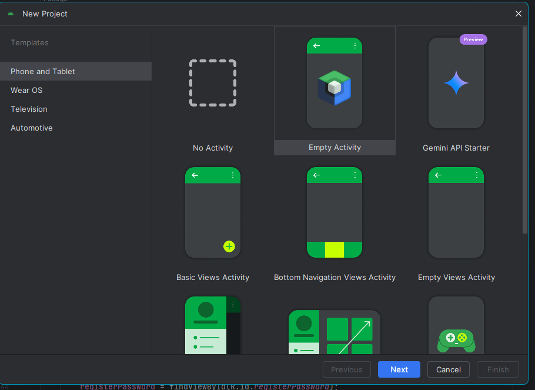


#### Projektstruktur

- **java**
  - Erstellte Klassen
- **res**
  - Ressourcen, wie zb
    - Strings
    - Grafiken
    - Layouts
    - ...


#### 🛰️ AVD — Android Virtual Device

- **What it is:**  
  AVD is an **emulator configuration** that simulates a real Android device on your computer.

- **Purpose:**  
  Allows developers to **test and debug Android apps** without needing physical hardware.

- **Features:**  
  - Emulates various device types (phones, tablets, TVs, wearables)  
  - Supports different Android versions and system images  
  - Configurable hardware profiles (RAM, CPU, screen size, resolution, sensors)  
  - Network and GPS simulation  
  - Snapshot support for quick booting

- **Usage:**  
  Run your app inside the AVD from Android Studio or command line to simulate how it behaves on different devices and Android versions.

- **Why it matters:**  
  Saves time and credits by avoiding the need for multiple physical test devices, essential for compatibility testing across the vast Android ecosystem.


---

<p style="page-break-before: always;"></p>

# 🌐 Netzwerk und Webprogrammierung

## 🧑‍🤝‍🧑 Client - Server Konzept
---


## 🌐 ASP.NET Core API
---

### 📡 RestAPI

### ⚙️ WebServer Configuration

### 🧪 API Testen

#### 🧰 Postman

#### 🧭 Swagger

---

## 🔌 Sockets
---

sdsds

---

## 🧵 Threads
---

### 🧠 Threading in C#

#### 🔄 Synchronisation

#### ⏳ Tasks

### ☕ Threading in Java

---

<p style="page-break-before: always;"></p>

# 💾 Konzepte moderner Datenspeicherung

## 🏗️ Entity Framework
---

### 🧩 Basics

### 🔍 LINQ

### 🧠 Lambda

### 📚 Collections

### 🧰 Generics

### ⚔️ .NET vs .NET CORE

---

## 📦 Serialisierung
---

<p style="page-break-before: always;"></p>

# 🏛️ Softwarearchitektur und Design Patterns

## 🧠 Design Patterns
---

### ⚙️ C#

### ☕ Java

### 📱 Android

---

## 🧭 MVVM WPF

WPF is kinda cringe ngl

---

### MVVM 

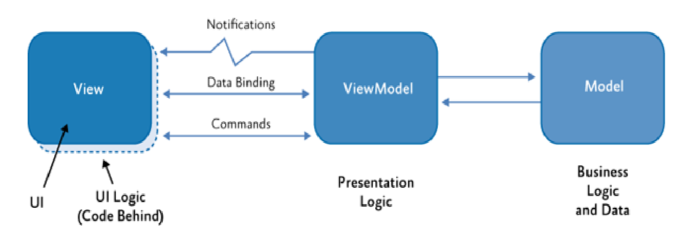

### View

- Visual Element
- View Model
  - Data Context
- Controls
  - Data Bound to Properties and Commands in the View Model
- Code Behind
  - Only UI Logic

### ViewModel

- non visual
- presentation logic
- independent of view and model
- doesnt reference the view
- properties and commands
- **INotifyPropertyChanged** / **INotifyCollectionChanged**
- view interaction

### Model

- non-visual 
- business logic
- application data
- no reference on the view or viewmodel
- used with sql, xml or other data stuff

### Example


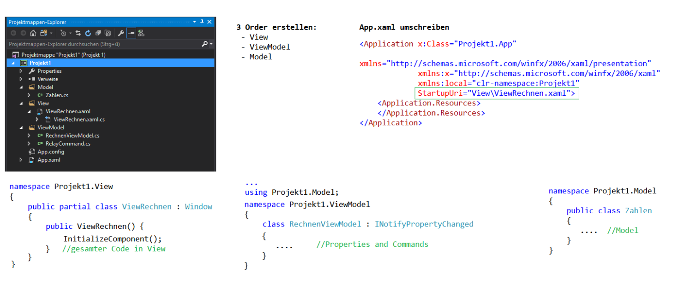

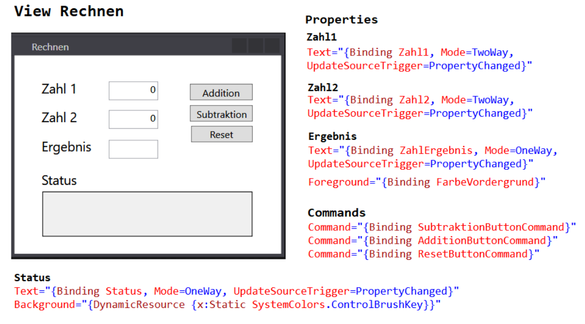


---

## 🏗️ MVC
---

---

## 📱 Android
---

## 🏗️ 3 Schichten Architektur

